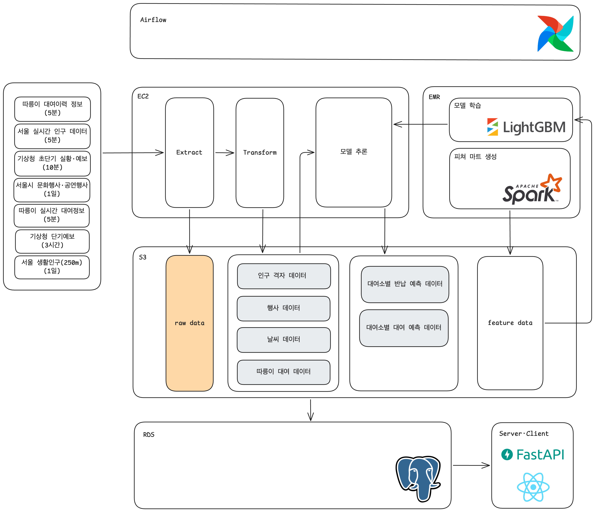

# 따릉이 재배치 우선순위 대시보드

> 따릉이 대여 이력과 실시간 도시 데이터로 대여소별 수요를 예측하고, 재배치 작업을 지원하는 실시간 대시보드

**소프티어 부트캠프 8기 Data Engineering 2팀 최종 프로젝트**

---

## 목차

1. [프로젝트 개요](#1-프로젝트-개요)
2. [데이터셋](#2-데이터셋)
3. [아키텍처](#3-아키텍처)
4. [디렉토리 구조](#4-디렉토리-구조)
5. [팀원 소개](#5-팀원-소개)

---

## 1. 프로젝트 개요

**소프티어 부트캠프 8기 Data Engineering 2팀 최종 프로젝트**로, 따릉이 대여 이력과 실시간 도시 데이터를 활용해 대여소별 수요를 예측하고, 재배치 작업의 우선순위를 제시하는 실시간 대시보드입니다.

### 대상 사용자

**서울시 시설관리공단 교통사업본부 공공자전거운영처**의 따릉이 재배치 운영·관리 담당자

### 문제

현재는 이미 발생한 품절을 뒤늦게 메우는 **사후 대응 구조**입니다. 그래서 앞으로의 수급 불균형에 미리 대응하지 못합니다.

- 어떤 대여소는 자전거가 없어 대여할 수 없습니다.
- 어떤 대여소는 반납할 자리가 없습니다.
- 제한된 인력을 어디에 먼저 투입할지 판단할 근거가 부족합니다.

### 해결 방법

대여소별 향후 대여/반납량을 예측하고, 이를 기준으로 재배치가 시급한 대여소의 우선순위를 알려줍니다.

> **사후 대응이 아니라, 예측 기반의 선제적 재배치**가 목표입니다.

---

## 2. 데이터셋

| 데이터셋 | 제공처 | 링크 |
| --- | --- | --- |
| 서울시 공공자전거 따릉이 대여이력 정보 | 서울 열린데이터광장 | [바로가기](https://data.seoul.go.kr/dataList/OA-15182/F/1/datasetView.do) |
| 서울 실시간 인구 데이터 | 서울 열린데이터광장 | [바로가기](https://data.seoul.go.kr/dataList/OA-21778/F/1/datasetView.do) |
| 서울시 공공자전거 따릉이 실시간 대여정보 | 서울 열린데이터광장 | [바로가기](https://data.seoul.go.kr/dataList/OA-15493/A/1/datasetView.do) |
| 기상청 기상기후데이터 | 기상청 API 허브 | [바로가기](https://apihub.kma.go.kr/) |
| 서울시 문화행사 정보 | 서울 열린데이터광장 | [바로가기](https://data.seoul.go.kr/dataList/OA-15486/S/1/datasetView.do?tab=A) |
| 서울시 체육시설 공연행사 정보 | 서울 열린데이터광장 | [바로가기](https://data.seoul.go.kr/dataList/OA-15497/A/1/datasetView.do) |

---

## 3. 아키텍처

### 기술 스택

| 구분 | 기술 |
| --- | --- |
| **워크플로우 관리** | Apache Airflow |
| **스토리지** | AWS RDS (PostgreSQL), AWS S3 |
| **서버** | FastAPI |
| **클라이언트** | React, Leaflet (지도) |
| **연산** | EMR Serverless, EC2 |

---

## 4. 디렉토리 구조

## 전체 디렉토리 구조

> 디렉토리 구조는 추후 업데이트 예정

---

## 5. 팀원 소개

<table>
  <tr>
    <td align="center">
      <a href="https://github.com/zerossin">
         
        <b>김민수</b>
      </a>
    </td>
    <td align="center">
      <a href="https://github.com/dragonjin520">
         
        <b>김용진(Albert)</b>
      </a>
    </td>
    <td align="center">
      <a href="https://github.com/R2TURN0">
         
        <b>문종민</b>
      </a>
    </td>
    <td align="center">
      <a href="https://github.com/vysryoo">
         
        <b>유용선</b>
      </a>
    </td>
  </tr>
</table>
