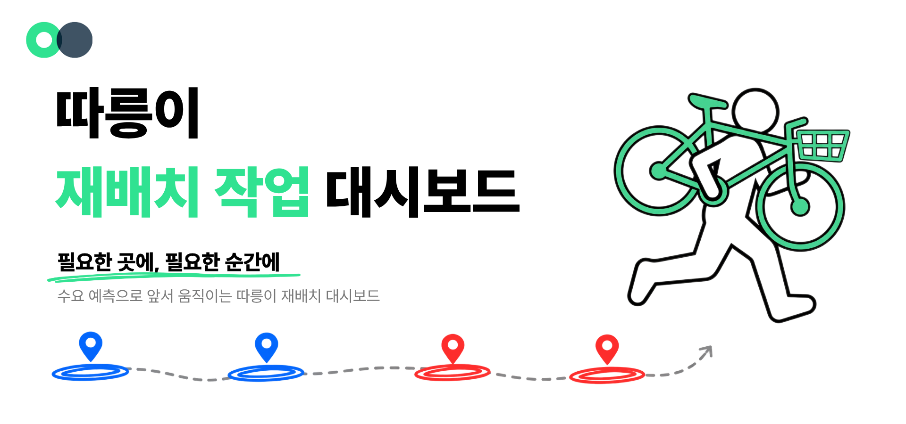

# 따릉이 재배치 작업 대시보드
  > 따릉이 대여 이력과 실시간 인구 및 날씨 데이터를 기반으로 대여소별 수요·재고를 예측하고, 재배치 우선순위와 이동 경로를 제공하는 운영 대시보드

**소프티어 부트캠프 8기 Data Engineering 2팀 최종 프로젝트**

<p align="center">
  
</p>

<div align="center">

[](http://54.116.106.151/)

</div>

---

## 목차

1. [프로젝트 개요](#1-프로젝트-개요)
2. [데이터 파이프라인](#2-데이터-파이프라인)
3. [기술적 도전과 해결](#3-기술적-도전과-해결)
4. [데이터셋](#4-데이터셋)
5. [시스템 아키텍처](#5-시스템-아키텍처)
6. [기술 스택](#6-기술-스택)
7. [Airflow 워크플로](#7-airflow-워크플로)
8. [로컬 실행](#8-로컬-실행)
9. [테스트](#9-테스트)
10. [디렉터리 구조](#10-디렉터리-구조)
11. [기타 문서](#11-기타-문서)
12. [회의록](#12-회의록)
13. [팀원](#13-팀원)

---

## 1. 프로젝트 개요

### 배경

#### 수요 쏠림에 따른 자전거 불균형

> **어떤 대여소는 0대, 어떤 대여소는 117대  
자전거는 있지만 필요한 곳에 없습니다.**

따릉이는 서울 전역 2,774개 대여소로 성장했지만, 시간대와 지역에 따른 수요 쏠림으로 품절과 과다 거치가 동시에 발생합니다. 2025년에는 자전거가 한 대도 없는 대여소가 94곳으로 확인됐습니다. [[뉴시스, 2024](https://www.newsis.com/view/NISX20241108_0002951902)] [[뉴시스, 2025](https://mobile.newsis.com/view_amp.html?ar_id=NISX20250709_0003245347)]

#### 인력 기반 수동 재배치 방식

> **배송 인력 130명이 자전거 4만 5,000대의 균형을 맞추고 있습니다.**

담당자는 24시간 대여소 현황을 확인하며 자전거를 직접 싣고 옮깁니다. 그러나 제한된 인력으로는 실시간 요청에 즉시 대응하기 어렵고, 일부 대여소의 재배치는 2~3일 간격으로 이루어집니다. [[경향신문, 2017](https://v.daum.net/v/L5wOWYLZO0)] [[미디어오늘, 2020](https://www.mediatoday.co.kr/news/articleView.html?idxno=206065)] [[뉴시스, 2025](https://mobile.newsis.com/view_amp.html?ar_id=NISX20250709_0003245347)]

### 기존 방식의 한계

> **현재 재고를 보고 움직이면, 도착했을 때는 이미 수요가 바뀌어 있습니다.**

- **사후 대응**: 현재 거치율만으로는 몇 시간 뒤의 품절과 포화를 미리 알기 어렵습니다. [[경향신문, 2017](https://v.daum.net/v/L5wOWYLZO0)]
- **수동 판단**: 회수지, 공급지와 방문 순서가 담당자의 경험에 의존합니다.
- **제한된 자원**: 자전거는 늘었지만 배송·정비 인력은 충분히 늘지 못했습니다. [[한국경제, 2023](https://www.hankyung.com/article/2023053115641)]
- **데이터 오차**: 비정상 반납으로 앱의 재고와 실제 위치가 다를 수 있습니다. [[뉴시스, 2024](https://www.newsis.com/view/NISX20241108_0002951902)]

### 프로젝트 목표

현재 재고를 표시하는 데 그치지 않고, 대여·반납 수요와 향후 재고를 예측하여 **사후 대응 중심의 운영을 예측 기반의 선제적 재배치로 전환**합니다. 이를 통해 담당자가 제한된 차량과 인력을 더 시급한 대여소에 먼저 투입할 수 있도록 의사결정 근거와 실행 가능한 작업 경로를 제공합니다.

### 대상 사용자

서울시 공공자전거 따릉이의 재배치 운영·관리 담당자

### 솔루션

실시간 따릉이 재고와 인구 및 날씨 데이터를 수집하여, 대여·반납 수요를 예측한 뒤, 그 결과를 재배치 우선순위와 작업 경로로 제공합니다.

1. **실시간 데이터 제공**: 따릉이 재고·대여이력과 날씨·생활인구·행사 데이터를 5분 단위로 수집하고, 지도에서 대여소별 현재 자전거 수와 거치 가능 수를 실시간으로 제공합니다.
2. **대여·반납 수요 및 재고 예측**: 대여소별 대여·반납 예측 모델의 결과를 결합하여, 현재 재고를 반영한 시간대별 예상 재고 변화를 계산합니다.
3. **위험 감지 및 긴급도 산정**: 현재 상태와 예측 결과를 결합해 품절·포화 예상 시점과 위험까지 남은 시간을 파악하고, 계산한 긴급도 점수를 기반으로 작업 우선순위를 제공합니다.
4. **실행 가능한 재배치 경로 생성**: 공급·회수 필요 수량, 차량 적재량과 이미 배차된 작업을 고려해 방문 순서와 상차·하차 수량을 포함한 작업 경로를 제안합니다.
5. **통합 운영 화면 및 상태 관리**: 지도, 우선순위 목록, 예측 그래프와 작업 경로를 한 화면에서 확인하고, 작업의 배차·완료·취소·복원 등 전체 운영 상태를 관리합니다.
6. **모델 수명주기 관리 및 지속적 운영**: 자동화된 데이터 파이프라인과 MLflow를 통해 실험과 모델을 추적하고, 월별 성능 평가 결과에 따라 모델을 재학습합니다.

### 기대효과

| 관점 | 기대효과 |
| --- | --- |
| **시민** | 품절과 반납 공간 부족 가능성을 낮춰 원하는 장소에서 자전거를 이용할 가능성을 높입니다. |
| **운영 담당자** | 경험에만 의존하던 판단을 데이터 기반 우선순위로 보완하고, 상황 파악부터 작업 결정까지 걸리는 시간을 줄입니다. |
| **재배치 작업** | 시급도, 필요 수량과 이동 경로를 함께 제공해 제한된 차량과 인력을 중요한 작업에 집중할 수 있습니다. |
| **운영 조직** | 작업 상태와 예측 근거를 일관된 데이터로 관리하여 재배치 정책을 평가하고 개선할 기반을 마련합니다. |
| **시스템 운영** | 자동 수집·검증·추론·모니터링을 통해 반복 업무를 줄이고 데이터와 모델의 최신성을 유지합니다. |

> **데이터 기반의 선제적 의사결정을 지원하여 실무자의 업무 부담을 줄이고, 한정된 인력과 장비로 최적의 재배치 효율을 달성하고자 합니다.**

## 2. 데이터 파이프라인

### 데이터 흐름


| 계층 | 역할 |
| --- | --- |
| **Bronze** | 외부 API 응답 원본과 수집 manifest를 보존합니다. |
| **Silver** | 스키마·품질 규칙을 통과한 정규화 데이터를 저장합니다. |
| **Archive** | 학습과 재처리에 사용할 일 단위 이력을 구성합니다. |
| **Gold** | 대여소, 예측, 긴급도, 작업 경로 등 서비스 조회용 데이터를 PostGIS에 게시합니다. |

## 3. 기술적 도전과 해결

파이프라인을 만들며 마주친 문제와 그 해결 과정을 주제별로 정리했습니다.

| 문서 | 다룬 문제 |
| --- | --- |
| [원천 데이터의 한계를 어떻게 보완할 것인가](docs/readme/01-data-imputation.md) | 대여이력은 반납 기준으로 쌓여 뒤늦게 도착하고, 생활인구는 4일 지연되며, 실시간 인구는 121개 지점에만 있습니다 |
| [소스마다 다른 스키마를 어떻게 일관된 정책으로 수집할 것인가](docs/readme/02-source-adapter.md) | 소스마다 스키마와 결측 표기가 달라, 소스가 늘 때마다 검증 코드에 분기가 쌓입니다 |
| [데이터 품질을 어떻게 관리할 것인가](docs/readme/03-quality-gate.md) | 누락되거나 오염된 배치가 그대로 흘러가면 하위 서비스 전체의 신뢰도가 무너집니다 |
| [5분 안에 수집부터 재배치 경로까지 어떻게 완성할 것인가](docs/readme/04-fetch-strategy.md) | 5분마다 바뀌는 재고를 다음 실행 전에 재배치 경로로 완성해야 합니다 |
| [예측을 어떻게 실행 가능한 재배치 작업으로 바꿀 것인가](docs/readme/05-rebalancing-decision.md) | 예측값을 지금 몇 대를 어디서 가져와 어디로 옮길지까지 실행 가능한 작업으로 바꿔야 합니다 |
| [갱신 주기가 다른 데이터를 어떻게 한 시점의 결과로 게시할 것인가](docs/readme/06-consistent-publication.md) | 처리 중 기준정보나 모델이 바뀌어도 서로 다른 시점의 결과가 한 화면에 섞이면 안 됩니다 |

## 4. 데이터셋

| 데이터셋 | 제공처 | 활용 |
| --- | --- | --- |
| [공공자전거 대여이력](https://data.seoul.go.kr/dataList/OA-15182/F/1/datasetView.do) | 서울 열린데이터광장 | 대여·반납 학습 및 실시간 이력 보강 |
| [공공자전거 실시간 대여정보](https://data.seoul.go.kr/dataList/OA-15493/A/1/datasetView.do) | 서울 열린데이터광장 | 대여소별 현재 재고 |
| [서울 실시간 인구 데이터](https://data.seoul.go.kr/dataList/OA-21778/F/1/datasetView.do) | 서울 열린데이터광장 | 실시간 생활인구 특성 |
| [자치구별 생활인구(250m)](https://data.seoul.go.kr/dataList/OA-23019/S/1/datasetView.do) | 서울 열린데이터광장 | 격자별 생활인구 기준값 |
| [기상청 API 허브](https://apihub.kma.go.kr/) | 기상청 | 초단기 실황·예보 및 단기예보 |
| [서울시 문화행사 정보](https://data.seoul.go.kr/dataList/OA-15486/S/1/datasetView.do?tab=A) | 서울 열린데이터광장 | 운영 화면의 주변 행사 정보 |
| [서울시 체육시설 공연행사 정보](https://data.seoul.go.kr/dataList/OA-15497/A/1/datasetView.do) | 서울 열린데이터광장 | 운영 화면의 공연·행사 정보 |

외부 API를 직접 수집하려면 서울 열린데이터광장의 `SEOUL_OPENAPI_KEY`와 기상청 API 허브의 `KMA_APIHUB_KEY`가 필요합니다.

## 5. 시스템 아키텍처


| 구분 | 구성 요소 | 주요 역할 |
| --- | --- | --- |
| **오케스트레이션** | Airflow | 데이터 파이프라인(수집, 정규화, 보정, 추론, Gold 게시, 재배치 경로 생성) 관리 |
| **데이터 계층** | S3, RDS (PostgreSQL/PostGIS) | 데이터 레이크(S3) 및 서비스 조회용 공간 데이터베이스(RDS) |
| **데이터 처리 및 학습** | EMR Classic, 학습용 EC2 | 대규모 특징(Feature) 생성(일회성 EMR) 및 예측 모델 학습(학습용 EC2) |
| **애플리케이션 서빙** | 상시 운영 EC2 | Airflow(스케줄링), MLflow(모델 추적), FastAPI(백엔드) 및 웹 서비스 실행 |


## 6. 기술 스택

| 영역 | 기술 |
| --- | --- |
| **오케스트레이션** |   |
| **수집·가공** |     |
| **머신러닝** |    |
| **저장소** |     |
| **백엔드** |  |
| **프론트엔드** |     |
| **AWS 인프라** |       |
| **IaC·개발 도구** |      |

## 7. Airflow 워크플로

모든 스케줄은 `Asia/Seoul` 기준이며 `catchup=False`로 동작합니다.

| DAG | 스케줄 | 역할 |
| --- | --- | --- |
| `realtime_tick` | 매 5분 | 실시간 수집 및 재배치 경로 생성 (End-to-End) |
| `daily_population_and_events` | 매일 03:00 | 생활인구 및 행사 데이터 일간 갱신 |
| `station_master` | 매일 03:04 | 대여소 마스터 정보 갱신 |
| `daily_compaction` | 매일 04:30 | 데이터 누락 보완 및 일 단위 압축 보관 (Archive) |
| `monthly_retrain_rental` | 매월 1일 03:00 | 대여 예측 모델 평가 및 재학습 |
| `monthly_retrain_return` | 매월 1일 06:00 | 반납 예측 모델 평가 및 재학습 |

> 💡 **참고**: `realtime_tick`은 5분 주기로 실행되는 핵심 단일 DAG입니다. 수집 주기가 긴 외부 API(날씨 등)는 자체적인 **Freshness Gate**를 통해 이전 성공 시각을 확인하여 불필요한 중복 호출을 차단합니다.

## 8. 로컬 실행

### 사전 요구사항

- Docker Desktop과 Docker Compose
- `make`
- Python 프로젝트를 직접 실행할 경우 [uv](https://docs.astral.sh/uv/)
- 프론트엔드를 단독 실행할 경우 Node.js 20 이상

### 전체 스택 시작

```bash
git clone <repository-url>
cd DE_team2-GangnamguUmBokDong
make bootstrap
```

최초 실행 시 `make bootstrap`은 `.env.example`을 `.env`로 복사합니다. 필수 API 키가 비어 있으면 서비스를 기동하지 않고 중단하므로, 생성된 `.env`에 `SEOUL_OPENAPI_KEY`와 `KMA_APIHUB_KEY`를 입력한 뒤 `make bootstrap`을 다시 실행하세요.

| 서비스 | 기본 주소 |
| --- | --- |
| 대시보드 | http://localhost:5173 |
| FastAPI | http://localhost:8000 |
| Airflow | http://localhost:8081 |
| MLflow | http://localhost:5000 |
| MinIO Console | http://localhost:9001 |
| PostgreSQL | `localhost:5433` |

Airflow 기본 사용자명은 `.env`의 `AIRFLOW_ADMIN_USER`이며, 최초 생성된 비밀번호는 웹서버 로그에서 확인할 수 있습니다.

```bash
make ps       # 서비스 상태
make logs     # 전체 로그
make down     # 서비스 종료
make up       # 기존 환경 재기동
```

Apple Silicon에서는 Makefile이 PostGIS용 `linux/amd64` override를 자동 적용합니다. 세부 설정과 기존 볼륨 주의사항은 [개발 환경 가이드](docs/getting-started.md)를 참고하세요.

### 개별 Python 프로젝트 설치

이 저장소는 하나의 uv workspace가 아니라 컴포넌트별 독립 프로젝트로 구성됩니다.

```bash
make sync-all

# 또는 필요한 프로젝트만 설치
cd collector
uv sync
uv run python main.py --help
```

## 9. 테스트

```bash
make lint       # 전체 Python 프로젝트 Ruff 검사
make test       # 로컬 테스트 모음
make test-ci    # CI와 동일한 테스트 모음
make e2e-smoke  # 실행 중인 로컬 스택의 실시간 E2E smoke test
```

프론트엔드만 검증하려면 `apps/web`에서 `npm ci`, `npm test`, `npm run build`를 실행합니다.

## 10. 디렉터리 구조

```text
.
├── airflow/            # DAG, 공통 설정, 태스크 빌더와 콜백
├── apps/
│   ├── api/            # Gold PostGIS 조회용 FastAPI
│   └── web/            # React 운영 대시보드
├── collector/          # 외부 API 수집, 검증, Bronze/Silver 저장
├── normalizer/         # 실시간 인구·대여소 데이터 정규화
├── nowcaster/          # 생활인구 추정과 백필
├── ml/
│   ├── feature_engine/ # Spark 기반 학습 특징 생성
│   ├── inference/      # 대여·반납 수요 추론
│   └── training/       # 모델 학습·평가·챔피언 게시
├── loader/             # Silver/예측 결과의 Gold 게시
├── rebalance/          # 긴급도 계산과 재배치 경로 생성
├── libs/               # 공통 도메인 및 ML 계약 라이브러리
├── ops/                # Compose, 배포, DB 초기화와 운영 스크립트
├── terraform/          # AWS 인프라 IaC
├── docs/               # 설계, 운영, ADR과 데이터 계약 문서
├── models/             # 로컬 개발용 초기 모델 산출물
├── Makefile            # 개발·검증·배포 명령 진입점
└── .env.example        # 로컬 환경변수 예시
```

## 11. 기타 문서

- [개발 환경 및 로컬 실행](docs/getting-started.md)
- [Airflow 데이터 흐름](docs/airflow/explain.md)
- [Gold publication contract](docs/gold/publication-contract-v1.md)
- [Gold PostGIS ERD](docs/gold/target-erd.md)
- [MLflow 설정](docs/ml/MLFLOW_SETUP.md)
- [프론트엔드 구성](apps/web/README.md)
- [아키텍처 결정 기록](docs/adr/)

## 12. 회의록

프로젝트 기간 동안 팀원 전원이 진행 상황과 이슈를 공유하고,  
**매일 빠짐없이 회의록을 작성하여 의사결정과 작업 과정을 기록했습니다.**

회의에서는 다음 내용을 중심으로 논의했습니다.

- 전날 작업 결과와 오늘의 작업 계획
- 데이터 파이프라인 및 모델 개발 진행 상황
- 발생한 문제와 해결 방법
- 주요 의사결정과 담당 업무
- 다음 회의까지의 Action Item

👉 [전체 데일리 회의록 확인하기](./docs/daily-meeting/)


## 13. 팀원

<table>
  <tr>
    <td align="center"><a href="https://github.com/zerossin"><br /><b>김민수</b></a></td>
    <td align="center"><a href="https://github.com/dragonjin520"><br /><b>김용진(Albert)</b></a></td>
    <td align="center"><a href="https://github.com/R2TURN0"><br /><b>문종민</b></a></td>
    <td align="center"><a href="https://github.com/vysryoo"><br /><b>유용선</b></a></td>
  </tr>
</table>
