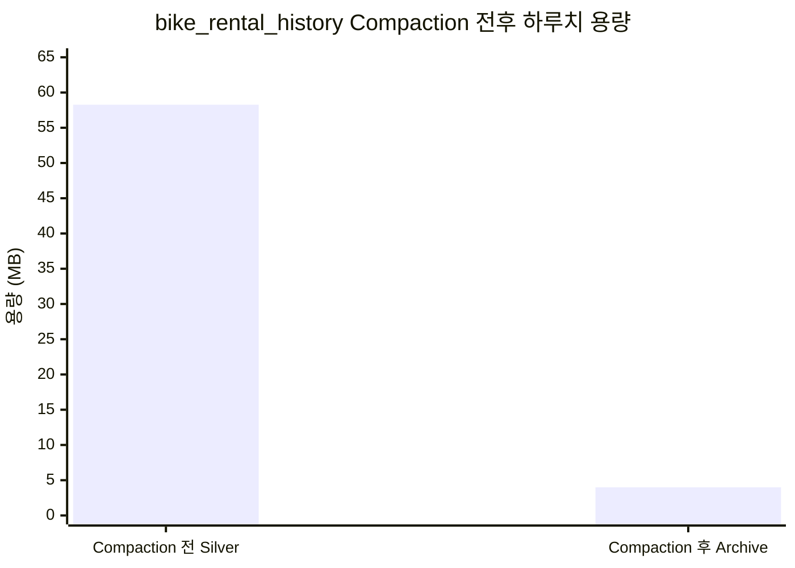

# 5분 단위 데이터를 장기적으로 활용하기 위한 Compaction

## Compaction이 필요한 이유

실시간 파이프라인은 5분마다 실행됩니다. 하나의 source만 보더라도 하루에 최대 288개의 Silver window가 생기며, correction이나 재수집이 발생하면 같은 logical time 아래 여러 immutable revision이 함께 남습니다. Compaction의 직접 입력은 Hot Bronze가 아니라 manifest가 선택한 authoritative Silver이므로, 필요성을 설명할 때도 Silver의 객체 수와 용량을 기준으로 보는 것이 정확합니다.

### 실제 S3 Silver를 기준으로 본 누적 규모

2026-08-24 23시의 `bike_rental_history` Silver를 S3에서 확인한 결과, 23:00부터 23:55까지 12개 window에 각각 2개의 content-addressed Parquet revision이 존재했습니다.

| 수집 window | 최초 저장 revision | 후속 revision | 전체 Silver 크기 |
|---|---:|---:|---:|
| 23:00 | 245.3KB | 297.8KB | 543.1KB |
| 23:05 | 8.1KB | 177.8KB | 185.9KB |
| 23:10 | 21.2KB | 184.1KB | 205.3KB |
| 23:15 | 35.5KB | 188.9KB | 224.4KB |
| 23:20 | 54.4KB | 191.5KB | 245.9KB |
| 23:25 | 69.5KB | 193.9KB | 263.4KB |
| 23:30 | 86.6KB | 195.8KB | 282.4KB |
| 23:35 | 100.1KB | 197.6KB | 297.7KB |
| 23:40 | 115.0KB | 198.7KB | 313.7KB |
| 23:45 | 128.2KB | 200.0KB | 328.2KB |
| 23:50 | 141.5KB | 200.7KB | 342.2KB |
| 23:55 | 154.2KB | 201.2KB | 355.4KB |
| **23시 합계** | **1,159.6KB** | **2,428.0KB** | **3,587.6KB, 약 3.59MB** |

---
같은 23시 분포가 계속된다고 환산하면 다음과 같습니다.

| 기간 | 저장된 전체 Silver | authority Silver 입력 | 전체 Silver 객체 수 |
|---|---:|---:|---:|
| 1시간 실측 | 3.59MB | 2.43MB | 24개 |
| 1일 환산 | 86.10MB | 58.27MB | 576개 |
| 1주일 환산 | 602.72MB | 407.90MB | 4,032개 |
| 30일 환산 | 2.58GB | 1.75GB | 17,280개 |
| 1년 환산 | 31.43GB | 21.27GB | 210,240개 |

5분마다 작은 Silver가 생기고 revision까지 누적되므로, 장기 학습과 날짜 단위 재처리에서 매번 수백 개 객체와 revision chain을 직접 읽는 구조는 비효율적입니다.

## Archive

따라서 일별 `daily_compaction` DAG가 5분·시간 단위 Silver를 source와 날짜 단위의 Archive Parquet으로 통합합니다.

### 실제 Archive와 비교한 Compaction 효과

같은 `bike_rental_history` source의 Silver 환산값과 2026-08-24 Archive 실측값을 비교하면 다음과 같습니다.

- Compaction 전 authoritative Silver 환산: 약 58.27MB, 288개 객체
- Compaction 후 Archive 실측: 4.0MB, 1개 객체
- 일 단위 조회용 데이터 크기: 약 54.27MB 감소, 약 93.1% 감소
- 일 단위 조회 객체 수: 288개에서 1개로 감소, 약 99.65% 감소

왼쪽 막대는 2026-08-24 23시의 후속 Silver revision 실측 합계를 하루로 환산한 58.27MB이고, 오른쪽 막대는 같은 날짜의 Archive 실측값 4.0MB입니다. Compaction 이후 하루치 학습·재처리 데이터의 표현 크기는 약 54.27MB, 93.1% 감소합니다.

일주일 단위로 보면 authoritative Silver는 약 407.90MB와 2,016개 객체로 환산되는 반면, 완성된 Archive가 하루 평균 4.0MB라고 가정하면 약 28MB와 7개 객체로 조회할 수 있습니다. 이 기준에서 일주일 조회용 데이터 크기는 약 93.1%, 객체 수는 약 99.65% 줄어듭니다.

이 비교가 보여주는 Compaction의 직접적인 효과는 학습·재처리 시 하루 288개의 Silver를 읽는 대신 날짜별 Archive 하나를 읽게 되어 **조회 대상 객체 수와 정제 데이터 표현 크기가 크게 줄어드는 것**입니다.
 
 
## 30일이 지난 non-authority Silver를 정리하는 GC

오래된 non-authority를 무기한 유지하면 추론이나 Archive에는 사용하지 않는 중복 정제 데이터가 계속 누적됩니다.
따라서 **최신 authority로 선택되지 않은 Silver revision**은 30일 뒤 삭제합니다. Archive는 날짜별 학습·재처리 데이터로 계속 보존하고, 현재 authority가 가리키는 Silver도 생성 시각과 관계없이 유지합니다. correction 등으로 더 이상 authority가 아니게 된 Silver만 객체 생성 후 30일의 유예 기간이 지난 뒤 GC 대상으로 분류합니다.

30일의 유예 기간을 두는 이유는 correction 직후의 비교·검증과 장애 조사를 위해 이전 revision을 즉시 없애지 않기 위해서입니다.

### 삭제 전 안전 조건

Silver GC는 보존 기간이 지났다는 이유만으로 파일을 바로 삭제하지 않습니다. 다음 조건을 모두 확인합니다.

- Cold Bronze manifest가 존재하고 `verified=true`인가?
- manifest가 가리키는 실제 Cold 객체가 존재하는가?
- Archive가 필요한 source라면 Archive manifest와 객체가 존재하는가?
- Archive의 `silver_signature`가 현재 authority 조합과 일치하는가?
- Silver 객체가 현재 authority key에 포함되지 않고 생성 후 30일이 지났는가?

조건을 하나라도 만족하지 않으면 GC는 삭제하지 않고 `skipped`로 종료합니다. 따라서 최신 authority를 실수로 지우거나, Archive 또는 원본 보존이 끝나기 전에 복구 재료를 먼저 지우지 않습니다. 삭제 대상 key와 크기, 유지한 authority key, 복구에 사용할 Cold key는 `_silver_gc_manifest`에도 기록됩니다.

### 어느 정도의 저장 용량을 줄이는가

2026-08-24 23시 Silver 실측에서 최초 저장 revision 12개의 합계는 1,159.6KB, window당 평균은 약 96.6KB였습니다. 후속 revision이 authority로 선택됐다고 가정하면 이 최초 revision들이 non-authority GC 후보가 됩니다.

아래 표는 같은 non-authority 발생 빈도와 크기 분포가 계속된다고 환산한 값입니다. 한 window에 correction이 여러 번 발생할 수도 있으므로 상한값은 아니며, 실제 절감량은 manifest가 확정한 non-authority revision 수와 각 Parquet 크기에 따라 달라집니다.

| 기간 | 정리 대상 non-authority 객체 | 추정 Silver 용량 |
|---|---:|---:|
| 1일 | 288개 | 약 27.83MB |
| 30일 유예 구간 | 8,640개 | 약 834.91MB |
| 1년 동안 GC가 없을 때 | 105,120개 | 약 10.16GB |
| 1년 운영 후 GC로 정리 가능한 31~365일분 | 96,480개 | 약 9.32GB |

따라서 이 시나리오에서는 1년 시점에 non-authority Silver가 약 10.16GB까지 누적되는 대신 최근 30일분인 약 834.91MB만 남습니다. 약 9.32GB와 96,480개 객체의 누적을 피하며, non-authority 계층 기준 약 91.8%를 줄이는 효과입니다.

### Silver를 삭제해도 Cold Bronze에서 복원 가능

GC 이후에도 원본이 사라지는 것은 아닙니다. 검증된 Cold Bronze에는 날짜별 Hot Bronze revision의 원본 gzip bytes와 window·revision·part key가 함께 남습니다. 과거 Source Snapshot manifest도 immutable 감사 기록으로 유지되므로 어떤 logical time과 revision을 복원해야 하는지 추적할 수 있습니다.

복원이 필요하면 Cold manifest가 가리키는 exact object와 checksum을 확인하고, 필요한 window와 revision의 원본 bytes를 꺼낸 뒤 정규화와 품질 검증을 다시 수행해 Silver를 재생성할 수 있습니다. 즉, GC된 과거 Silver URI 자체는 더 이상 직접 읽을 수 없지만, **Cold Bronze 원본을 기준으로 동일한 변환 과정을 다시 실행할 수 있는 복구 경로**는 유지됩니다.

Hot Bronze에도 별도의 30일 Lifecycle을 적용할 수 있지만, 이는 Cold checksum과 row count 검증을 통과해 `cold_compacted=true`가 붙은 객체에만 적용됩니다. non-authority Silver GC와 Hot Bronze Lifecycle 모두 “Cold Bronze 복구본이 검증된 뒤 삭제한다”는 같은 안전 원칙을 따릅니다.

## 전체 Compaction 흐름

    `5분·시간 단위 Hot Bronze와 Silver 누적`
    → `window별 SUCCEEDED/PARTIAL/FAILED 판정`
    → `Manifest 기반 authoritative Silver 선택`
    → `입력 checksum·row count·schema 검증`
    → `날짜별 Archive Parquet과 manifest 생성`
    → `Hot Bronze revision을 날짜별 Cold Bronze로 통합`
    → `Cold checksum·row count 검증 후 verified 확정`
    → `Archive·Cold 검증 후 30일 지난 non-authority Silver만 GC`
    → `실패·누락·correction 날짜는 recovery sweep에서 다시 처리`

# 3. Hot/Cold Bronze
## Hot Bronze

Hot Bronze는 외부 API에서 받은 원본을 window와 revision 단위로 즉시 보존하는 계층입니다.

주요 목적은 다음과 같습니다.

- 외부 API 응답 원본 보존
- 수집·검증 오류 발생 시 원인 분석
- Silver 또는 Archive 재생성
- correction과 backfill 시 기존 응답과 변경 내용 비교

원본을 mutable 파일 하나에 계속 덮어쓰지 않고 immutable revision으로 저장합니다. 같은 logical time을 재수집했을 때 내용이 동일하면 기존 authority를 재사용하고, 실제 내용이 달라졌을 때만 새로운 correction revision이 생깁니다.

Hot Bronze는 빠른 재처리와 진단에 유리하지만 5분 단위 원본이 계속 쌓이므로 영구적으로 그대로 유지하기에는 객체 수가 많습니다. 그래서 일정 시간이 지난 원본은 Cold Bronze로 묶어 장기 보존합니다.

## Cold Bronze

Cold Bronze는 날짜별 Hot Bronze revision을 하나의 장기 보존 객체로 통합한 계층입니다. Archive가 정제된 학습·재처리 데이터라면, Cold Bronze는 외부 API 원본을 복구하기 위한 장기 보존 데이터입니다.

Cold Bronze Compaction은 `_cold_pending` marker를 기준으로 아직 장기 보존이 끝나지 않은 날짜를 찾습니다. 특정 실행이 실패하더라도 pending 상태가 남기 때문에 다음 실행의 `--recover-pending` 과정에서 다시 처리할 수 있습니다.

Cold 객체를 썼다는 사실만으로 보존이 완료됐다고 판단하지 않습니다.

1. 날짜별 Hot Bronze revision을 읽어 Cold 객체를 생성합니다.
2. 생성된 객체를 다시 읽습니다.
3. SHA-256 checksum이 생성 시 계산한 값과 같은지 검증합니다.
4. Cold 객체의 row count가 입력 object 수와 일치하는지 검증합니다.
5. 모든 검증을 통과한 경우에만 manifest에 `verified=true`를 기록합니다.
6. 검증된 Hot Bronze 객체에만 `cold_compacted=true` 태그를 적용합니다.

따라서 Cold 쓰기가 중간에 실패하거나 결과가 손상된 경우 Hot Bronze가 장기 보존 완료로 잘못 처리되지 않습니다.

| 계층 | 보존 내용 | 주요 사용 목적 |
|---|---|---|
| Hot Bronze | 5분·시간 단위 외부 API 원본 revision | 빠른 장애 분석과 단기 재처리 |
| Cold Bronze | 날짜별로 통합하고 검증한 원본 | 장기 원본 복구와 감사 |
| Silver | 품질 검증을 통과한 운영 데이터. 최신 authority는 유지하고 오래된 non-authority revision은 조건부 정리 | 추론과 Archive 입력 |
| Archive | 날짜별로 통합한 검증 데이터 | 모델 학습, 재현과 대규모 재처리 |

## Authority: 어떤 데이터를 정답으로 사용할 것인가

Compaction에서 가장 중요한 것은 파일을 합치는 것보다 **동일한 logical time에 여러 파일과 revision이 있을 때 무엇을 정답으로 선택할지 결정하는 것**입니다.

### 데이터 상태

Collector 결과는 다음 상태로 구분합니다.

| 상태 | 의미 | Authority 처리 |
|---|---|---|
| `SUCCEEDED` | 예상 범위와 품질 기준을 모두 충족 | 새로운 정상 authority로 사용 가능 |
| `PARTIAL` | 일부 조각·행이 누락됐지만 허용 기준 이내 | 진단과 복구를 위해 보존하지만 기본적으로 완전한 authority로 승격하지 않음 |
| `FAILED` | 누락·오류가 허용 기준을 초과하거나 수집 완료 불가 | authority로 사용하지 않음 |

### Manifest를 기준으로 정확한 revision 선택

Compaction은 S3 prefix에서 파일 이름이나 `LastModified`만 보고 최신 파일을 선택하지 않습니다. Source snapshot manifest가 가리키는 exact Silver URI, SHA-256, logical time과 revision을 기준으로 입력을 선택합니다.

이를 통해 다음 문제를 방지합니다.

- 실패한 재실행에서 만들어진 중간 파일 사용
- 같은 logical time의 기존 revision과 correction revision 혼용
- `PARTIAL` 결과가 이전 `SUCCEEDED` authority를 덮어쓰는 문제
- 파일 생성 시각만 최신인 비권위 객체 선택

선택한 immutable Silver bytes와 row count를 다시 검증한 뒤 Archive 스키마로 읽습니다. 검증에 실패하면 Archive와 manifest를 게시하지 않으므로, 불완전한 새 Archive가 기존 정상 Archive를 대체하지 않습니다.

### 입력 signature로 변경 여부 판단

날짜별로 선택된 Silver authority 조합을 signature로 관리합니다. 이전 Archive manifest의 `silver_signature`와 현재 입력 signature가 같다면 같은 내용을 다시 쓸 필요가 없으므로 `skipped`로 처리합니다.

반대로 correction으로 authoritative Silver가 변경되면 signature도 달라집니다. recovery sweep은 이를 감지해 해당 날짜의 Archive를 다시 생성합니다. 따라서 DAG 실행 여부가 아니라 실제 authoritative 입력의 변경 여부를 기준으로 재압축할 수 있습니다.

## Manifest에서 최신 Authority를 판단해 Serving plan을 만드는 과정

Manifest 기반 선택은 Compaction뿐 아니라 실시간 추론 입력을 준비할 때도 사용합니다. 핵심은 S3에 가장 늦게 생성된 파일을 최신 데이터로 간주하지 않고, **요청한 logical time을 기준으로 사용할 수 있는 authority를 선택한 뒤 그 입력을 Serving plan에 고정하는 것**입니다.

### 1. 요청 시각과 source별 선택 정책 결정

`prepare_serving_plan`은 현재 5분 tick의 logical time을 기준으로 source별 입력을 조회합니다.

- 대여소 실시간 상태는 현재 logical time과 정확히 일치하는 `exact_window`를 요구합니다.
- 대여소 Master는 설정된 lookback 안에서 기준 시각 이전의 최신 authority를 선택합니다.
- 단기예보는 최대 24시간 lookback 안에서 최신 authority를 선택합니다.
- 초단기예보는 최대 6시간 lookback 안에서 최신 authority를 선택합니다.

즉, source의 성격에 따라 현재 시각과 정확히 일치해야 하는 데이터와 일정 범위 안에서 이전 정상값을 허용하는 데이터를 구분합니다.

### 2. Manifest revision chain에서 사용할 Authority 선택

같은 logical time에 최초 수집과 correction revision이 함께 존재할 수 있습니다. Source catalog는 manifest revision chain을 확인하고, 상태와 계약 검증을 통과한 authoritative revision을 선택합니다.

선택 과정에서는 다음을 확인합니다.

- manifest의 source ID와 logical time이 요청 조건과 일치하는가?
- 상태가 downstream authority로 사용할 수 있는 `SUCCEEDED`인가?
- manifest가 가리키는 exact Silver URI가 존재하는가?
- URI에 기록된 SHA-256과 실제 Parquet bytes가 일치하는가?
- manifest의 row count와 실제 Parquet row count가 일치하는가?
- 허용된 lookback 범위를 벗어나지 않았는가?

이 검증을 통해 생성 시각만 최신인 실패 파일, 완결되지 않은 `PARTIAL`, 손상된 Silver와 오래된 revision이 추론 입력으로 선택되는 것을 방지합니다.

### 3. 선택 결과의 freshness 기록

선택한 manifest의 logical time이 요청 시각과 같으면 `CURRENT`, 이전 시각이면 `STALE`로 기록합니다. 데이터 완전성 상태인 `SUCCEEDED/PARTIAL/FAILED`와 시간적 freshness인 `CURRENT/STALE`을 분리해 관리합니다.

예를 들어 이전 시각의 날씨라도 품질 검증을 통과했다면 `SUCCEEDED + STALE`로 선택할 수 있습니다. 반대로 현재 시각의 데이터라도 부분 성공이라면 `PARTIAL + CURRENT`라는 이유만으로 정상 추론 authority가 되지 않습니다.

### 4. 선택한 입력을 immutable Serving plan에 고정

검증을 통과한 source를 찾은 뒤에는 입력을 다시 동적으로 조회하지 않습니다. Serving plan에 source별 manifest URI와 SHA-256, logical time, revision과 필요한 dependency를 기록해 이번 추론이 사용할 입력을 고정합니다.

이렇게 고정하는 이유는 Serving plan 생성 이후 correction이나 다음 tick의 신규 데이터가 들어오더라도 실행 중인 추론의 입력 조합이 바뀌지 않게 하기 위해서입니다. 추론 시작 시점과 Gold 게시 시점 사이에 서로 다른 revision이 섞이는 것을 막고, 동일한 plan으로 같은 입력을 다시 읽을 수 있게 합니다.

### 5. 추론과 Gold 게시가 동일한 plan을 사용

Airflow의 `run_inference` 태스크는 `prepare_serving_plan`이 반환한 plan URI와 SHA를 전달받아 고정된 입력으로 추론합니다. 이후 `finalize_serving_release`도 같은 plan과 inference 결과를 사용해 release를 확정합니다.

전체 흐름은 다음과 같습니다.

    `현재 5분 logical time 결정`
    → `source별 exact 또는 bounded lookback 정책 적용`
    → `manifest revision chain에서 SUCCEEDED authority 선택`
    → `Silver URI·SHA·row count 검증`
    → `CURRENT 또는 STALE freshness 기록`
    → `선택한 manifest와 dependency를 Serving plan에 고정`
    → `동일한 plan으로 inference 실행`
    → `plan과 inference 결과를 검증해 Gold release 확정`

이를 통해 “가장 최신처럼 보이는 파일”이 아니라 **검증된 최신 authority의 일관된 조합**으로 추론과 게시를 수행합니다.
