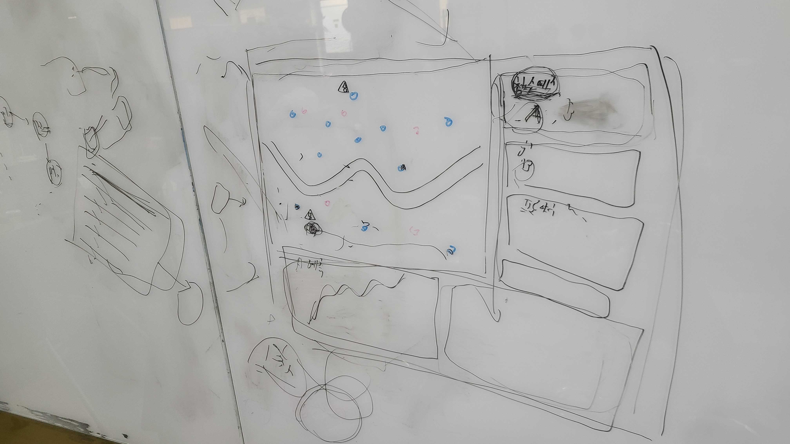

## 1. 기술 조사 및 기술 스택 결정
서버 / 클라이언트: React, FastAPI, Leaflet(지도)

스토리지: PostgreSQL, S3

오케스트레이션 툴: Airflow

연산: ECS / Lambda / EC2(Spark)

 

## 2. 프로젝트 요구사항 정리
대시보드 요구사항 정리

좌측 상단 — 서울시 지도. 대여소 상태(잔여 자전거 수 등),  경고 표시(작업이 필요한 대여소, 클릭 시 추천 이동 대상 대여소 표시)

우측 상단 — 재배치 작업 큐. 긴급도 순 정렬

좌측 하단 — 클릭한 대여소의 향후 12시간 수요 예측 그래프

우측 하단 — 클릭한 대여소의 상세 정보 및 수요에 영향을 줄 수 있는 주변 이벤트·사유

 

## 3. 내일 진행할 일
실제 데이터를 보고 어떻게 진행될지 아키텍처 그려보기

아키텍처 흐름에서 어떤 데이터 사용할지 예상해보기

카프카를 쓸 정도로 대규모의 시스템은 뭐가 있을지 생각해보기

어떤 데이터 넣고 어떤 출력 얻을지 생각하기

어떤 모델로 학습할지 결정하기

인구수와 따릉이 상관관계 찾기 - 상관관계 계수, 바형 그래프 등등