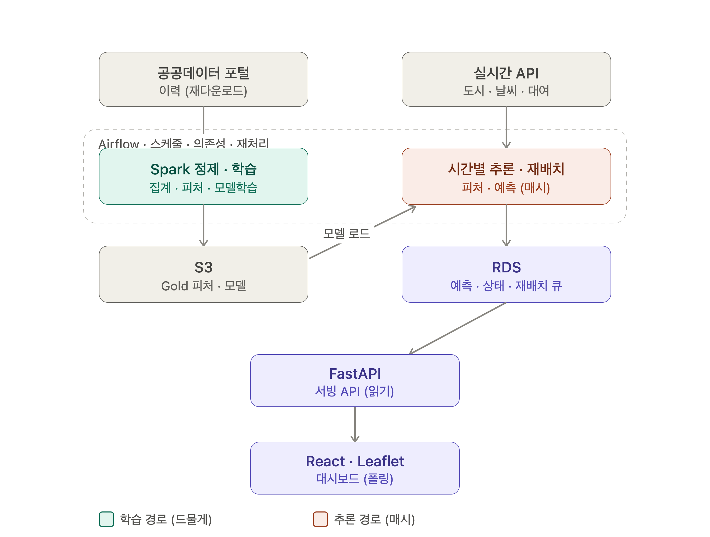

## 1. 오늘 할일
실제 데이터를 보고 어떻게 진행될지 아키텍처 그려보기

아키텍처 흐름에서 어떤 데이터 사용될지 예상해보기

카프카를 쓸 정도로 대규모의 시스템은 뭐가 있을지 생각해보기

어떤 데이터 넣고 어떤 출력 얻을지

어떤 모델로 학습할지 결정

인구수와 따릉이 상관관계 찾기 - 상관관계 계수, 바형 그래프 등등

 

## 2. 새로운 논의
실시간 인구데이터

121곳의 커버 범위가 30%밖에 안된다.

행정동 인구데이터

인구 예측 모델 학습 필요 (행정동 단위 → 250m 반경으로 쪼개기)

이용거리 계산해서 소모한 칼로리, 절약한 대중교통 비용 표시 (신규 아이디어)

잔여 자전거 0개로 자주 떨어지는 취약지역 분석

자전거 대여/반납 지점과 지도api 연결

    이동한 루트 계산하고 이를 통해 자전거가 자주 다닌 길 분석

    자전거 사고 자주 일어난 지역 분석

    자전거 도로를 건설해야하는 지점 도출

비콘의 범위가 넓어서 반대편에서 반납하는 문제

 

## 3. 아키텍쳐 그림
용선

 

용진

        [외부 데이터]
        ├─ bikeList
        ├─ citydata_ppltn
        ├─ 날씨 API
        └─ citydata 행사
                │
                ▼
        [Airflow]
        스케줄·의존성·재시도 관리
                │
                ▼
        [Lambda Collectors]
        API 호출·검증·수집시각 추가
                │
                ▼
        [S3 Raw]
        원본 JSON/XML
                │
                ▼
        [Spark DataFrame]
        ├─ 스키마 정제
        ├─ 시간 정렬
        ├─ 대여소-핫스팟 매핑
        ├─ 대여소-날씨 격자 매핑
        ├─ 행사 거리 계산
        └─ 모델 Feature 생성
                │
                ▼
        [S3 Silver / Feature]
                │
                ├─────────────────────┐
                ▼                     ▼
        [EC2 모델 추론]         [Spark 규칙 기반 계산]
        대여·반납량 예측          수요 위험 점수 계산
                │                     │
                └──────────┬──────────┘
                        ▼
                [운영 판단 후처리]
                예상 잔여량·공급량·회수량
                        │
                        ▼
            [S3 Gold + RDS PostgreSQL]
                        │
                        ▼
                    [FastAPI]
                        │
                        ▼
                [React + Leaflet]
        end

민수

 

종민

ttareungi_architecture_airflow_no_kafka.png
 

가라데이터 만들어도 됨 
→ 자전거별 이동경로 GPS 데이터 생성해서 써도 될듯? 서울시에선 어차피 갖고있는 데이터일테니

 

4. 학습 모델 관련
1. 논의 목적
따릉이 수요예측 모델이 예측값만 생성하는 데서 끝나지 않고, 이후 수집되는 실제 데이터와 비교하여 모델 성능을 지속적으로 평가하고 재학습 여부를 판단하는 시스템 로직을 추가한다.

2. 핵심 결정
모델이 정확도를 업데이트.

수요 예측
→ 예측 결과 저장
→ 실제값 수집
→ 예측값과 실제값 비교
→ 성능 지표 계산 
→ 재학습 필요 여부 판단
→ 후보 모델 재학습
→ 기존 모델과 비교
→ 더 우수한 모델만 운영에 반영

3. 예측 대상과 실제값
모델은 대여소별 향후 12시간 이후의 대여량과 반납량을 예측한다.
예측 시간이 지난 뒤 실제 대여·반납 건수를 수집하여 비교 후 모델 성능 점수를 계산한다.

4. 모델 성능 지표
수요예측 모델은 회귀 지표와 운영 지표를 함께 평가한다.

지표

용도

MAE

평균적으로 몇 건의 오차가 발생했는지 확인

RMSE

큰 예측 오류에 더 높은 패널티 부여

WAPE

전체 실제 수요 대비 총예측 오차 평가

운영 성능 지표
지표

용도

부족 위험 Precision

부족으로 예측한 대여소 중 실제 부족이 발생한 비율

부족 위험 Recall

실제 부족 대여소 중 모델이 사전에 탐지한 비율

과잉 위험 Precision

회수가 필요하다고 예측한 대여소의 정확도

과잉 위험 Recall

실제 거치대 부족 대여소 탐지율

5. 예측 이력 저장
모든 예측 결과에는 모델 버전과 예측 기준 시각을 기록한다.

6. 모델 평가 결과 저장
실제값이 확보되면 Airflow 평가 작업이 예측값과 실제값을 조인하여 성능을 계산한다.

7. 재학습 판단 기준
한 번의 예측 오류만으로 모델을 재학습하지 않는다. 일정 기간의 누적 성능을 기준으로 판단한다.

8. 재학습 및 모델 교체 방식
성능이 떨어졌다고 운영 모델을 즉시 교체하지 않는다.

- Champion–Challenger 방식
Champion: 현재 운영 중인 모델

Challenger: 새롭게 학습한 후보 모델

동일한 검증 데이터에서 두 모델을 비교한다.

 

5. 아키텍처 그림
 

제목 없는 다이어그램.drawio.png
 

스크린샷 2026-07-29 오후 3.38.55.png
 

6. 최종 성과 측정

시뮬레이션 데이터를 만들어서, 배치 업무 효율화 측면에서 우리 시스템의 효율성을 파악하고
이를 최종 발표에 반영한다.

 

 

7. 계획
 

[해올 일]
Jira 사용법 익히고, 작업을 어떤 단위로 나눌지 생각해오기

[할 일]
인구와 따릉이 수요 사이의 상관 관계 분석

 

 