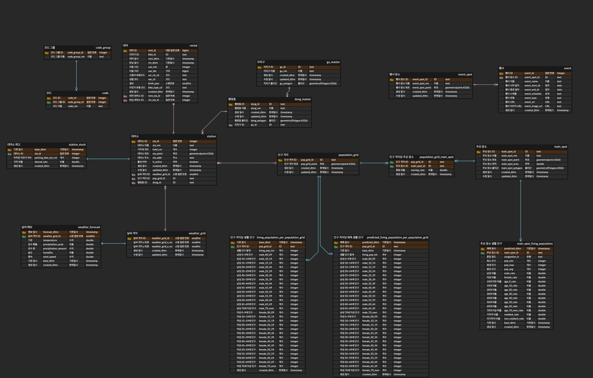

## 1. 오늘 할일

오전에는 개인 과제

2시까지 허들로 출근

모델 선정

ERD 구현한 대로, 요구사항 맞춰서 ETL 파이프라인 각자 파트 구현

## 2. 모델 선정하기

LightGBM

- 모델 공부 필요함

- 어떤 파라미터 넣을지, 어떻게 학습시킬지

- ETL 파이프라인에서 나온 결과물을 모델에 입력 → 일단 각자 파트 ETL 수집 코드 구현

Feast

- 데이터를 ML에 쓰기 쉽게 메타데이터 관리해주는 툴

- 적용 방안

Great Expectation

- 품질검사 툴

- 데이터품질검사 주기랑 방식 등

## 3. ERD 토대로 ETL 파이프라인 구현

각자 맡은 영역을 ERD그림 기준으로 ETL 파이프라인 구현해보기

airflow의 세부 폴더가 나눠져 있는데, pipeline에 기본 파이썬 코드 작성, dags에는 해당 파일들 조합해서 구현함

DAG 파일 안에 파이썬 함수 넣어서 적용

Airflow DAG 안에서 Lambda 호출, 그 안에 파이썬 코드들

airflow에서 DAG 실패하면 다시 전 단계로 돌아가는 기능을 사용하려면 supervisor airflow 필요

- 기존 : 정제 실패 → 다시 수집으로 돌아가기

- 변경 : 돌아가지 말고 실패하고 종료

    - 로그 + 알람

- 이전으로 돌아가는 것은 안되고 그 task를 다시 하는 것은 된다.

- 수집 실패 → 2번 재시도

- 정제 실패 → 알림 후 종료 → 기존 수집한 데이터로 다시 시도

나중에 정제 실패 재시도를 자동화할 목적이 생기면 supervisor 검토

## 4. 각자 맡을 파트 정해보기

날씨 - 종민

주요 인구 - 용진

인구 격자 - 민수

- 주요인구와 인구격자 계산 과정 필요

    - silver를 저장하고 한번 더 가공 필요

    - 일단 1차 저장 먼저, 계산은 내일

- 인구 예측 정보는 계속 쌓으면서 저장

    - 정확히 예측했는지, 우리가 정한 주기가 맞는지 확인용.

대여소 - 용선

각자 만든 코드는 사제 깃헙에 브랜치 새로 파서 저장

후에 같이 리뷰하면서 합쳐보기

https://github.com/vysryoo/GangnamguUmBokDong.git 

코드, 코드 그룹 사전 만들기

- 각자가 맡은 분야의 코드가 필요하면 사전에 등재

우리가 사용하는 4일 지연 데이터에 대해 현직자들에게 질문

- 관리, 저장 방법 등

## 5. 내일까지 해 올 일

개인 과제

각자 영역 ETL 데이터 수집 파이프라인 구현 해오기