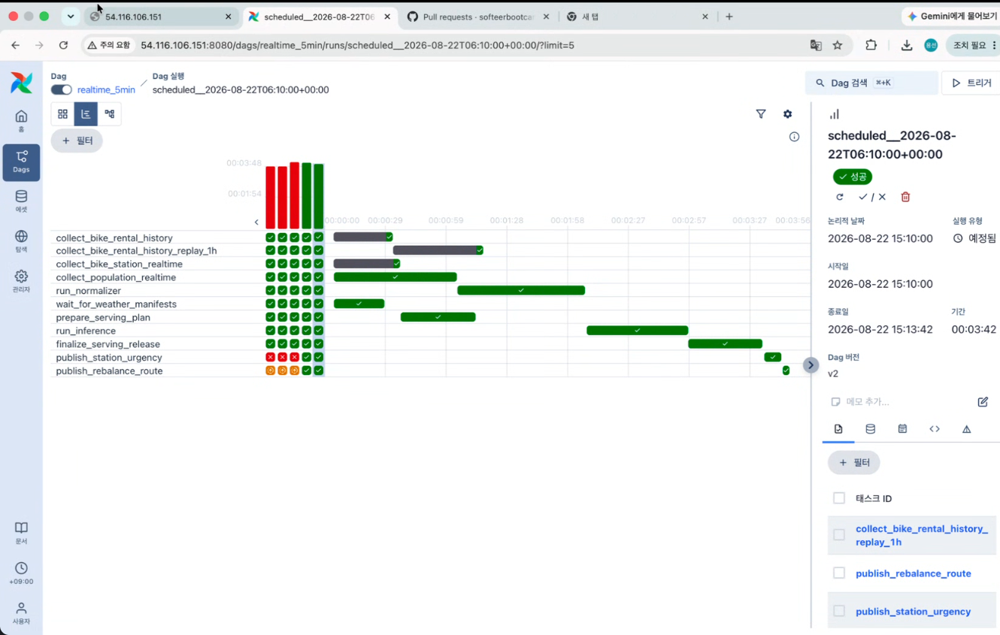

## 1. 남은 일

PR 리뷰 후 머지하기

### 5분 dag 최적화 

실시간 인구(population_realtime) 65초

런 노멀라이저(run_normalizer) 65초

프리페어링 서빙 플랜(prepare_serving_plan) 40초

추론(run_inference) 50초

파이널라이즈 서빙 릴리즈(finalize_serving_release) 30초

station_urgency 10초

전체 약 3분 40초

모델 학습

github CICD 작업용 등록

### 최종 결과물(화면에 보여지는 데이터) 고가용성 확보

어떤 경우에도 작동은 계속 되도록 폴백 준비

추론이나 수집 등 파이프라인 중간에서 문제생겨도 airflow 알림으로만 상태 표시하고 작동은 되도록

### 작업 알고리즘

공급은 3대 이상씩? 짜잘짜잘한거 줄이기wkrd

회수 대여소가 1개씩인데 점검 필요

대여소 총 개 수 살짝 줄이기

### ui 개선 사항

작업 센터는 지도 위에, 드롭다운으로

승인 대기 ↔︎ 작업중, 완료, 취소 컴포넌트 분리 (클릭하면 옆으로 넘어가도록)

지도에서 경로 색깔 좀더 연하게 → 선택하면 색깔 들어가게?

날씨 정보 추가 ← 날씨 이미 잇음

아래쪽에 대여소 목록에 스크롤바가 대여소 목록과 겹침

대여소 상세 → 대여소 정보 UI 개선

로고 변경

### ip접속 가능하게 바꾸기

