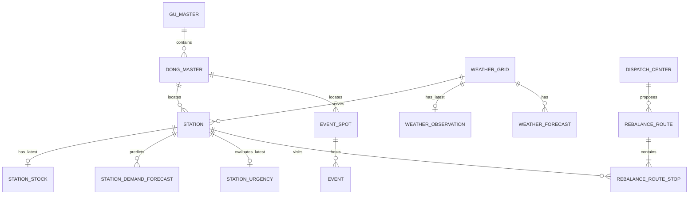

# Gold 목표 ERD

## 범위

이 문서는 #129의 목표 물리 모델을 정의한다. `de-project`의 확정 ERD를 공통 도메인
기준으로 사용하되, 현재 서비스가 실제로 서빙하는 데이터만 Gold에 둔다.



## 공통 규칙

- 모든 Point와 MultiPolygon의 SRID는 4326이다.
- `created_dttm`과 `updated_dttm`은 서비스 도메인 시각이 아니라 DB 관리
  메타데이터다.
- FK 컬럼에는 B-tree 인덱스를, 공간 검색 컬럼에는 GiST 인덱스를 둔다.
- 실수로 잘못된 SRID가 들어오지 않도록 컬럼 타입에서 geometry 종류와 SRID를
  제한한다.
- 코드 컬럼은 허용값 CHECK 또는 공통 enum 정책 중 구현 단계에서 한 방식으로
  통일한다.

## 테이블 정의

### gu_master

서울 자치구 공간 마스터다.

| 컬럼 | 타입 | 제약 |
| --- | --- | --- |
| `gu_id` | `TEXT` | PK, 행정구역 공식 코드 |
| `gu_nm` | `TEXT` | NOT NULL, UNIQUE |
| `gu_polygon` | `geometry(MultiPolygon, 4326)` | NOT NULL |
| `created_dttm` | `TIMESTAMPTZ` | NOT NULL, DEFAULT now() |
| `updated_dttm` | `TIMESTAMPTZ` | NOT NULL, DEFAULT now() |

인덱스: `GIST (gu_polygon)`.

### dong_master

서울 행정동 공간 마스터다.

| 컬럼 | 타입 | 제약 |
| --- | --- | --- |
| `dong_id` | `TEXT` | PK, 행정동 공식 코드 |
| `gu_id` | `TEXT` | NOT NULL, FK → `gu_master.gu_id` |
| `dong_nm` | `TEXT` | NOT NULL |
| `dong_polygon` | `geometry(MultiPolygon, 4326)` | NOT NULL |
| `created_dttm` | `TIMESTAMPTZ` | NOT NULL, DEFAULT now() |
| `updated_dttm` | `TIMESTAMPTZ` | NOT NULL, DEFAULT now() |

제약: `UNIQUE (gu_id, dong_nm)`. 인덱스: `GIST (dong_polygon)`, `BTREE (gu_id)`.

### weather_grid

기상청 격자 마스터다. 원본 격자 번호와 대표 WGS84 좌표를 한 번만 저장한다.

| 컬럼 | 타입 | 제약 |
| --- | --- | --- |
| `weather_grid_id` | `SMALLINT` | PK, identity |
| `weather_grid_x_no` | `SMALLINT` | NOT NULL |
| `weather_grid_y_no` | `SMALLINT` | NOT NULL |
| `weather_grid_point` | `geometry(Point, 4326)` | NOT NULL |
| `created_dttm` | `TIMESTAMPTZ` | NOT NULL, DEFAULT now() |
| `updated_dttm` | `TIMESTAMPTZ` | NOT NULL, DEFAULT now() |

제약: `UNIQUE (weather_grid_x_no, weather_grid_y_no)`. 인덱스:
`GIST (weather_grid_point)`.

### station

따릉이 대여소 마스터다.

| 컬럼 | 타입 | 제약 |
| --- | --- | --- |
| `sta_id` | `TEXT` | PK, 원천 대여소 ID |
| `sta_nm` | `TEXT` | NOT NULL |
| `sta_addr` | `TEXT` | NULL 허용 |
| `hold_cnt` | `INTEGER` | NOT NULL, `>= 0` |
| `sta_point` | `geometry(Point, 4326)` | NOT NULL |
| `is_active` | `BOOLEAN` | NOT NULL, DEFAULT true |
| `weather_grid_id` | `SMALLINT` | NOT NULL, FK → `weather_grid` |
| `dong_id` | `TEXT` | NOT NULL, FK → `dong_master` |
| `created_dttm` | `TIMESTAMPTZ` | NOT NULL, DEFAULT now() |
| `updated_dttm` | `TIMESTAMPTZ` | NOT NULL, DEFAULT now() |

인덱스: `GIST (sta_point)`, `BTREE (weather_grid_id)`, `BTREE (dong_id)`.
`sta_point`와 `dong_polygon`, `weather_grid_id`의 공간 정합성은 마스터 적재 검증에서
확인한다.

### station_stock

대여소별 최신 재고다. 이력은 S3 Silver에 보존한다.

| 컬럼 | 타입 | 제약 |
| --- | --- | --- |
| `sta_id` | `TEXT` | PK, FK → `station.sta_id` |
| `base_dttm` | `TIMESTAMPTZ` | NOT NULL |
| `parking_bike_tot_cnt` | `INTEGER` | NOT NULL, `>= 0` |
| `updated_dttm` | `TIMESTAMPTZ` | NOT NULL, DEFAULT now() |

upsert는 새 `base_dttm`이 저장값 이상일 때만 갱신한다.

### station_demand_forecast

대여소 수요 예측값이다. 현재 `forecast_points`의 목적을 이름에 드러낸다.

| 컬럼 | 타입 | 제약 |
| --- | --- | --- |
| `sta_id` | `TEXT` | FK → `station.sta_id` |
| `predicted_dttm` | `TIMESTAMPTZ` | 예측 대상 일시 |
| `predicted_rent_cnt` | `INTEGER` | NOT NULL, `>= 0` |
| `predicted_rtn_cnt` | `INTEGER` | NOT NULL, `>= 0` |
| `base_dttm` | `TIMESTAMPTZ` | NOT NULL, 예측 배치 기준 일시 |
| `created_dttm` | `TIMESTAMPTZ` | NOT NULL, DEFAULT now() |
| `updated_dttm` | `TIMESTAMPTZ` | NOT NULL, DEFAULT now() |

PK: `(sta_id, predicted_dttm)`. 새 `base_dttm`이 저장값 이상일 때만 갱신한다.
인덱스: `BTREE (predicted_dttm)`.

### weather_observation

기상청 격자별 최신 초단기실황이다.

| 컬럼 | 타입 | 제약 |
| --- | --- | --- |
| `weather_grid_id` | `SMALLINT` | PK, FK → `weather_grid` |
| `base_dttm` | `TIMESTAMPTZ` | NOT NULL, 관측 기준 일시 |
| `temperature` | `DOUBLE PRECISION` | 섭씨 |
| `humidity` | `DOUBLE PRECISION` | %, `0..100` |
| `wind_speed` | `DOUBLE PRECISION` | m/s, `>= 0` |
| `precipitation_amount` | `DOUBLE PRECISION` | mm, `>= 0` |
| `precipitation_type_cd` | `SMALLINT` | 기상청 PTY 코드 |
| `updated_dttm` | `TIMESTAMPTZ` | NOT NULL, DEFAULT now() |

upsert는 새 `base_dttm`이 저장값 이상일 때만 갱신한다.

### weather_forecast

기상청 단기·초단기예보를 같은 논리 구조로 저장한다.

| 컬럼 | 타입 | 제약 |
| --- | --- | --- |
| `weather_grid_id` | `SMALLINT` | FK → `weather_grid` |
| `forecast_dttm` | `TIMESTAMPTZ` | 예보 대상 일시 |
| `base_dttm` | `TIMESTAMPTZ` | NOT NULL, 기상청 발표 기준 일시 |
| `sky_condition_cd` | `SMALLINT` | 기상청 SKY 코드 |
| `precipitation_type_cd` | `SMALLINT` | 기상청 PTY 코드 |
| `temperature` | `DOUBLE PRECISION` | 섭씨 |
| `precipitation_prob` | `DOUBLE PRECISION` | %, `0..100` |
| `precipitation_amount` | `DOUBLE PRECISION` | mm, `>= 0` |
| `humidity` | `DOUBLE PRECISION` | %, `0..100` |
| `wind_speed` | `DOUBLE PRECISION` | m/s, `>= 0` |
| `created_dttm` | `TIMESTAMPTZ` | NOT NULL, DEFAULT now() |
| `updated_dttm` | `TIMESTAMPTZ` | NOT NULL, DEFAULT now() |

PK: `(weather_grid_id, forecast_dttm)`. 새 `base_dttm`이 저장값 이상일 때만
갱신한다. 인덱스: `BTREE (forecast_dttm)`.

### event_spot

행사 장소의 공간 마스터다.

| 컬럼 | 타입 | 제약 |
| --- | --- | --- |
| `event_spot_id` | `TEXT` | PK, 원천 시설 ID 또는 안정적인 파생 ID |
| `event_spot_nm` | `TEXT` | NOT NULL |
| `event_spot_point` | `geometry(Point, 4326)` | 좌표 미제공 원천은 NULL 허용 |
| `dong_id` | `TEXT` | NULL 허용, FK → `dong_master` |
| `created_dttm` | `TIMESTAMPTZ` | NOT NULL, DEFAULT now() |
| `updated_dttm` | `TIMESTAMPTZ` | NOT NULL, DEFAULT now() |

좌표가 있는 행에 부분 인덱스 `GIST (event_spot_point)`와
`GIST ((event_spot_point::geography))`를 둔다. `dong_id`에는 B-tree 인덱스를 둔다.
좌표가 없는 행사는 보존하지만 인근 행사 검색에서는 제외한다.

### event

문화·공연 행사 정보다.

| 컬럼 | 타입 | 제약 |
| --- | --- | --- |
| `event_id` | `TEXT` | PK, 원천 ID 또는 안정적인 파생 ID |
| `event_spot_id` | `TEXT` | NOT NULL, FK → `event_spot` |
| `event_name` | `TEXT` | NOT NULL |
| `event_type` | `TEXT` | NULL 허용 |
| `event_start_dt` | `DATE` | NOT NULL |
| `event_end_dt` | `DATE` | NOT NULL, 시작일 이상 |
| `event_schedule` | `TEXT` | NULL 허용 |
| `is_free` | `BOOLEAN` | 판별 가능할 때만 값 설정 |
| `event_fee_info` | `TEXT` | 원천 요금 안내 보존 |
| `event_url` | `TEXT` | NULL 허용 |
| `event_image_url` | `TEXT` | NULL 허용 |
| `created_dttm` | `TIMESTAMPTZ` | NOT NULL, DEFAULT now() |
| `updated_dttm` | `TIMESTAMPTZ` | NOT NULL, DEFAULT now() |

인덱스: `BTREE (event_spot_id)`, `BTREE (event_end_dt)`.

### station_urgency

대여소별 최신 재배치 긴급도 계산 결과다.

| 컬럼 | 타입 | 제약 |
| --- | --- | --- |
| `sta_id` | `TEXT` | PK, FK → `station.sta_id` |
| `base_dttm` | `TIMESTAMPTZ` | NOT NULL, 계산 배치 기준 일시 |
| `urgency_score` | `DOUBLE PRECISION` | NOT NULL |
| `critical_remaining_min` | `INTEGER` | NOT NULL, `>= 0` |
| `rebalance_action_type_cd` | `TEXT` | `normal`, `supply_needed`, `retrieval_needed` |
| `rebalance_bike_cnt` | `INTEGER` | NOT NULL, `>= 0` |
| `updated_dttm` | `TIMESTAMPTZ` | NOT NULL, DEFAULT now() |

upsert는 새 `base_dttm`이 저장값 이상일 때만 갱신한다.

### dispatch_center

재배치 차량이 출발하는 배차 센터 공간 마스터다.

| 컬럼 | 타입 | 제약 |
| --- | --- | --- |
| `dispatch_center_id` | `SMALLINT` | PK, identity |
| `dispatch_center_nm` | `TEXT` | NOT NULL, UNIQUE |
| `dispatch_center_point` | `geometry(Point, 4326)` | NOT NULL |
| `is_active` | `BOOLEAN` | NOT NULL, DEFAULT true |
| `created_dttm` | `TIMESTAMPTZ` | NOT NULL, DEFAULT now() |
| `updated_dttm` | `TIMESTAMPTZ` | NOT NULL, DEFAULT now() |

인덱스: `GIST (dispatch_center_point)`.

### rebalance_route

배차 센터별 재배치 실행 단위다.

| 컬럼 | 타입 | 제약 |
| --- | --- | --- |
| `route_id` | `UUID` | PK |
| `dispatch_center_id` | `SMALLINT` | NOT NULL, FK → `dispatch_center` |
| `route_status_cd` | `TEXT` | `proposed`, `dispatched`, `completed`, `cancelled` |
| `proposed_dttm` | `TIMESTAMPTZ` | NOT NULL |
| `dispatched_dttm` | `TIMESTAMPTZ` | NULL 허용 |
| `completed_dttm` | `TIMESTAMPTZ` | NULL 허용 |
| `created_dttm` | `TIMESTAMPTZ` | NOT NULL, DEFAULT now() |
| `updated_dttm` | `TIMESTAMPTZ` | NOT NULL, DEFAULT now() |

인덱스: `BTREE (dispatch_center_id, route_status_cd)`, `BTREE (proposed_dttm)`.

### rebalance_route_stop

재배치 경로의 순서별 대여소 작업이다.

| 컬럼 | 타입 | 제약 |
| --- | --- | --- |
| `route_id` | `UUID` | FK → `rebalance_route.route_id` |
| `visit_no` | `SMALLINT` | 1부터 시작 |
| `sta_id` | `TEXT` | NOT NULL, FK → `station.sta_id` |
| `rebalance_action_type_cd` | `TEXT` | `pickup`, `dropoff` |
| `bike_cnt` | `INTEGER` | NOT NULL, `> 0` |
| `created_dttm` | `TIMESTAMPTZ` | NOT NULL, DEFAULT now() |

PK: `(route_id, visit_no)`. 인덱스: `BTREE (sta_id)`.

## 현행 테이블 전환표

| 현행 | 목표 | 처리 |
| --- | --- | --- |
| 없음 | `gu_master` | 신규. 공식 코드·경계 원천 적재 |
| 없음 | `dong_master` | 신규. 공식 코드·경계 원천 적재 |
| 없음 | `weather_grid` | 신규. 반복 격자 번호 정규화 |
| `stations` | `station` | 단수형 전환, `lat/lon` → `sta_point`, `gu` 제거, 격자·행정동 FK 적용 |
| `station_stock` | `station_stock` | `observed_at` → `base_dttm`, #138의 최신 1건 정책 적용 |
| `forecast_points` | `station_demand_forecast` | 목적이 드러나는 이름, `batch_run_at` → `base_dttm`, `return` → `rtn` |
| `weather_current` | `weather_observation` | `nx/ny/gu` 제거 후 격자 FK, 날씨 표준어 적용 |
| `weather_forecast` | `weather_forecast` | 격자 FK, 날씨 표준어, `updated_at` 의미 교정 |
| `cultural_events` | `event` + `event_spot` | 행사·장소 분리, `lat/lon` → Point, 날짜·요금 의미 교정 |
| `station_urgency` | `station_urgency` | `batch_run_at` → `base_dttm`, 분·코드·수량 표준어 적용 |
| 없음 | `dispatch_center` | 코드 상수의 11개 센터를 공간 마스터로 승격 |
| `rebalance_routes` | `rebalance_route` | 단수형, `region` → 센터 FK, 상태·일시 표준어 적용 |
| `rebalance_route_stops` | `rebalance_route_stop` | 단수형, 방문순서·작업유형 표준어 적용 |

## 공간 조회 기준

### 인근 행사

```sql
SELECT e.*,
       ST_Distance(es.event_spot_point::geography, s.sta_point::geography) AS distance_m
  FROM station s
  JOIN event_spot es
    ON ST_DWithin(es.event_spot_point::geography, s.sta_point::geography, :radius_m)
  JOIN event e ON e.event_spot_id = es.event_spot_id
 WHERE s.sta_id = :sta_id
   AND e.event_end_dt >= :today
 ORDER BY distance_m;
```

### 행정동 귀속 검증

경계선 위의 점도 포함하도록 `ST_Covers(dong_polygon, point)`를 사용한다. 적재 시
계산한 `dong_id`와 공간 연산 결과가 다르면 적재 실패 또는 검수 대상으로 기록한다.

## 제외 및 보류

- `population_grid`, 생활인구, 주요장소, 대여이력은 Silver/S3 및 ML 입력으로 이미
  역할이 분리되어 있고 현재 API가 Gold에서 읽지 않는다. Gold 소비 요구가 생기기
  전에는 추가하지 않는다.
- `lat`/`lon`, `gu_nm`, 격자 X/Y처럼 FK나 공간 컬럼에서 얻을 수 있는 값은 서비스
  편의를 이유로 중복 저장하지 않는다.
- 운영 전이므로 구 스키마를 위한 운영 migration chain을 만들지 않는다. 목표 SQL을
  첫 운영 베이스라인으로 사용한다.
