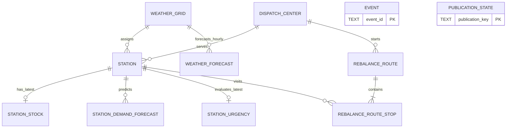
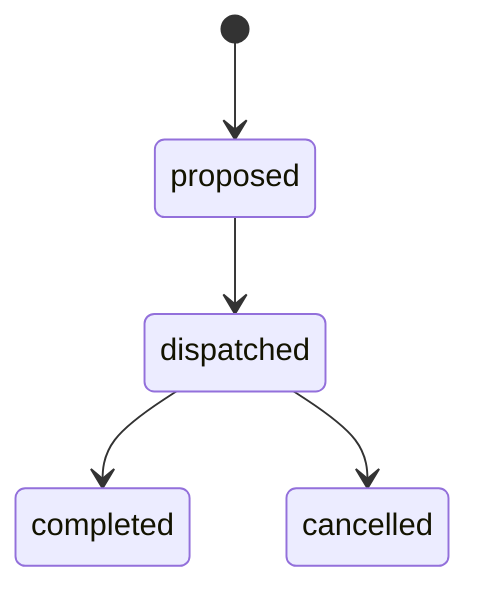

# Gold 목표 ERD

## 목적과 범위

이 문서는 #129의 최초 운영 Gold 물리 모델을 정의한다. Gold RDS는 원천을 그대로
복제하는 저장소가 아니라 대시보드 API와 재배치 운영이 읽는 최신 serving
projection이다. 원천 응답, 발표 revision, 학습·추론 피처와 대용량 이력은 S3
Bronze/Silver가 소유한다.

소비 쿼리에서 역산한 `public` 서빙 범위는 다음 10개 테이블이다.

1. `weather_grid`
2. `dispatch_center`
3. `station`
4. `station_stock`
5. `station_demand_forecast`
6. `weather_forecast`
7. `event`
8. `station_urgency`
9. `rebalance_route`
10. `rebalance_route_stop`

별도 `gold_meta` schema에는 서빙 projection의 최신 version과 정상 EMPTY를 기억하는
`publication_state` 제어 테이블 하나만 둔다. API는 이 테이블을 읽지 않는다.



`event`와 `station`은 FK로 연결하지 않는다. 두 Point 사이의 거리 조건으로 현재
요청에 가까운 행사만 찾는다. 대여소의 배차 센터는 게시 시 가장 가까운 활성 센터를
결정해 `station.dispatch_center_id`에 물리화한다.

## 한 행의 의미와 생명주기

| 테이블 | 한 행의 의미 | PK/UK와 FK | 보존·게시 계약 |
| --- | --- | --- | --- |
| `weather_grid` | 기상청 LCC 격자 하나 | PK `weather_grid_id`, UK X/Y | 두 예보 source가 공유하는 34개 seed를 원자 게시하고 ID를 재사용하지 않음 |
| `dispatch_center` | 재배치 라우팅 기준점 하나 | PK `dispatch_center_id`, UK 명칭 | seed 전체를 원자 게시하고 참조 중인 센터는 삭제 대신 비활성화 |
| `station` | 서빙 품질 조건을 통과해 한 번 발행된 대여소 하나 | PK `sta_id`; FK 격자·센터 | 완전 snapshot의 서로 다른 3개 window에서 연속 serving-invalid면 비활성화, FK 이력을 위해 행 보존 |
| `station_stock` | 대여소별 최신 재고 한 건 | PK/FK `sta_id` | 과거 관측을 거부하고 최신 한 행만 유지 |
| `station_demand_forecast` | 최신 완전 예측 snapshot의 대여소·1시간 구간 종료시각 한 건 | PK `(sta_id, predicted_dttm)`; FK `sta_id` | 활성 Gold·두 모델 공통 지원 대여소 × `base+1..12h` 전체를 한 transaction으로 교체 |
| `weather_forecast` | 격자·정시별 resolver가 선택한 대시보드 날씨 한 건 | PK `(weather_grid_id, forecast_dttm)`; FK 격자 | 활성 station 격자 × 다음 13개 정시 buffer를 교체하고 API는 미래 12개 제공 |
| `event` | 유효한 Point를 가진 한 source의 행사 일정 하나 | PK `event_id`, UK source/source ID | source별 현재·예정 완전 snapshot만 reconcile |
| `station_urgency` | 대여소별 최신 재배치 판단 한 건 | PK/FK `sta_id` | 완전한 최신 urgency snapshot 전체를 교체 |
| `rebalance_route` | 배차 센터에서 출발하는 차량 회차 하나 | PK UUID `route_id`; FK 센터 | 성공 batch마다 `proposed`만 원자 교체하고 실행·종료 이력은 보존 |
| `rebalance_route_stop` | 경로의 연속된 방문 순서 하나 | PK `(route_id, visit_no)`; FK route·station | 부모와 함께 게시·보존하며 제안 route 삭제 시 cascade |
| `gold_meta.publication_state` | publication key별 마지막 commit version 한 건 | PK `publication_key`; 도메인 FK 없음 | target과 같은 transaction에서 전진만 허용, 삭제 금지 |

전체 컬럼·nullable·단위는 [data-dictionary.md](data-dictionary.md), 실행 가능한 타입과
제약은 [target-schema.sql](target-schema.sql)을 기준으로 한다.

## 공통 물리 규칙

- 업무 일시는 유한하고 offset이 있는 `TIMESTAMPTZ`로 입력한다. PostgreSQL은 같은 instant로
  저장하고 API가 필요할 때 KST로 표시한다.
- 행사 시작·종료일과 센터 좌표 검증일처럼 시각이 없는 업무 달력 값만 `DATE`다. 오늘은
  `(CURRENT_TIMESTAMP AT TIME ZONE 'Asia/Seoul')::date`로 판정하며 무한대 날짜는 금지한다.
- 모든 Point는 `geometry(Point, 4326)`이며 X=경도, Y=위도다. 위도·경도를 별도
  영속 컬럼으로 중복 저장하지 않는다.
- 미터 거리 계산은 Point를 `geography`로 변환하고, 같은 표현식에 GiST 인덱스를 둔다.
- FK는 별도 명시가 없으면 `ON UPDATE RESTRICT ON DELETE RESTRICT`다. route가 삭제될
  때 stop만 `ON DELETE CASCADE`다.
- `created_dttm`과 `updated_dttm`은 DB가 소유한다. UPDATE trigger는 생성 시각을
  보존하고 갱신 시각만 바꾼다.
- DDL의 타입·CHECK·FK는 행 단위 무결성을 지킨다. snapshot 완전성, 최신성, source
  우선순위와 원자 교체는 publisher가 staging 검증과 transaction으로 지킨다.
- 부분 수집, 품질 게이트 실패, 과거 snapshot은 현재 Gold를 바꾸거나 삭제하는 근거가
  될 수 없다.
- 모든 publication은 불변 manifest를 만들고 `gold_meta.claim_publication()`으로
  `(logical_dttm, revision_no, fingerprint)`를 판정한다. 정상 EMPTY도 row count 0인
  watermark로 남긴다.
- logical time과 관측·계산·발표·제안 시각은 DB 시각보다 5분을 넘게 미래일 수 없다.
  API freshness도 과거 cutoff와 `now+5분` 상한을 함께 검사한다.
- lock 순서는 topology `(129,1)` 다음 route-operation `(129,2)`, 그 다음 정렬한
  publication key다. station·grid·center write는 exclusive, weather·route 검증은
  topology shared, route publisher와 API 상태 전이는 같은 route lock을 쓴다. DML lock은
  BEFORE STATEMENT trigger가 row lock보다 먼저 잡고, row trigger에서 역순으로 얻지 않는다.
- 여러 projection을 한 transaction에서 바꾸면 관련 publication key도 정렬해 모두 claim한다.
  center/grid 변경으로 station FK가 바뀌면 center/grid와 station state를 함께 전진시키고,
  새 active grid나 model-supported station의 downstream coverage가 없으면 함께 게시하거나
  활성화를 미룬다.
- topology·support는 잠근 선행 publication state tuple로 식별하고, route coverage를 포함한
  정확한 JSON/EWKB·SHA·UUID byte 계약은
  [publication-contract-v1.md](publication-contract-v1.md)를 producer와 publisher가 함께 쓴다.

## 기준 차원과 대여소

### `weather_grid`

단기·초단기예보 설정에 공통으로 존재하는 서울 34개 `(nx, ny)`만 둔다.
`weather_grid_id`는 `{weather_grid_x_no}_{weather_grid_y_no}` 형식의 안정 자연키다.
두 source의 격자 집합이 같고 중복이 없음을 seed 전에 검증한다.

격자 Polygon이나 대표 Point는 현재 조회 계약이 없고 공식 원천도 아니므로 만들지
않는다. station Point를 공통 LCC 변환 함수에 넣어 얻은 X/Y가 이 seed에 있을 때만
`station.weather_grid_id`를 정한다.

### `dispatch_center`

현재 11개 센터는 공식 관할구역이 아니라 가장 가까운 라우팅 기준점이다. seed 순서와
무관한 영문 slug ID, 표시명, Point, 활성 여부, 정확도 등급, 좌표 출처와 검증일을 함께
버전 관리한다. API와 route producer는 Python 상수나 독자 계산 대신 이 테이블과
`station.dispatch_center_id`를 유일한 기준으로 사용한다.

최초 값은 [dispatch-center-seed.yaml](dispatch-center-seed.yaml)에 원천 commit/file hash,
EPSG·좌표 순서와 함께 고정한다. 10개는 landmark 근사, 영남은 행정동 중심 근사이며 현장
검증값이 아니므로 `location_verified_dt`는 null이다. 이 한계를 품질 코드로 노출한 채
라우팅 그룹 기준점으로만 사용한다.

활성 station의 센터는 활성 센터만 후보로 두고 정확한 geography 거리, 안정 ID
순으로 결정한다. 같은 거리일 때도 결과가 seed 순서에 따라 바뀌지 않는다.

```sql
SELECT s.sta_id,
       (
           SELECT dc.dispatch_center_id
             FROM dispatch_center AS dc
            WHERE dc.is_active
            ORDER BY ST_Distance(
                         dc.dispatch_center_point::geography,
                         s.sta_point::geography
                     ),
                     dc.dispatch_center_id
            LIMIT 1
       ) AS dispatch_center_id
  FROM station_stage AS s;
```

station Point, 센터 Point 또는 활성 상태가 바뀌면 모든 활성 station을 staging에서 다시
배정한다. 누락이 0건임을 확인한 뒤 센터 seed와 station FK를 하나의 릴리스
transaction에서 반영한다. DB의 지연 trigger는 활성 station이 비활성 센터를 가리키거나,
활성 station을 둔 센터가 비활성화되는 것을 commit 시 거부한다.

### `station`

처음 발행하는 활성 station은 다음 조건을 모두 만족해야 한다.

1. 완전한 `bike_station_master` snapshot에 `ST-숫자` ID와 비어 있지 않은 `ADDR1`이
   있다.
2. 같은 ID가 완전한 `bike_station_realtime` snapshot에 있고 이름과 `rackTotCnt > 0`을
   가진다.
3. master Point를 우선한다. master Point가 무효일 때만 유효한 realtime Point로
   fallback하고 `sta_point_source_cd`에 그 사실을 남긴다.
4. 공통 LCC 변환 결과가 존재하는 `weather_grid`를 가리킨다.
5. 위 결정 규칙으로 정확히 한 활성 `dispatch_center`를 가리킨다.

주소를 이름으로 복제하거나 두 source 좌표를 평균내지 않는다. 불완전 행은 일부 컬럼을
NULL로 채워 게시하지 않고 Silver/serving-rejection에 남긴다. 이미 발행된 station은
일시적인 source 누락으로 삭제하지 않는다. 검증된 완전 realtime snapshot의 서로 다른
`window_start` 세 개에서 연속으로 보이지 않거나, 보이더라도 표시명이 비었거나
`rackTotCnt`가 null/0 이하라 serving-invalid일 때 `is_active=false`로 바꾼다. 같은
window의 더 높은 correction revision은 그 window의 판정만 교체하며 횟수를 추가하지
않는다. `PARTIAL`·실패 실행은 세지 않고, serving-valid로 재등장하면 즉시 활성화 후보가 된다.
route 이력 FK를 위해 station 행 자체는 보존한다.

완전 master에서 기존 ID가 빠지거나 주소·Point가 일시적으로 무효여도 realtime이
serving-valid이면 마지막 검증 master 속성과 `master_base_dttm`을 유지한다. master/realtime
또는 기존 Gold/new master Point의 geography `ST_Distance`가 100m를 초과하면 자동
갱신하지 않고 review 후 명시적 correction revision과 immutable relocation approval
artifact로만 반영한다. 정확히 100m는 자동 허용 범위다. 신규 station은 유효한 master
주소가 필수다.

최신 authoritative realtime window 최대 3개와 prior station projection은
[publication-contract-v1.md](publication-contract-v1.md)의 immutable input으로 남긴다.
publisher는 station publication lock 안에서 이 identity를 다시 확인해 3-window 상태와
주소·Point LKG 판단을 같은 입력으로 재현하며 별도 mutable counter를 두지 않는다.

inactive→active 후보의 grid에는 이미 13시간 weather coverage가 있어야 한다. 두 model이
지원하는 후보는 같은 anchor demand projection에도 포함해 함께 활성화하거나 다음 demand
publication까지 미룬다. model 미지원 후보는 활성화할 수 있고 demand row 부재가 명시적
404 근거가 된다. downstream publisher는 topology shared lock으로 이 판정을 고정한다.

서울시 station 원천이 업무 대상 identity를 소유한다. publisher는 Point의 SRID·non-empty·
안전 bounding box를 검증하지만 화면이 쓰지 않는 자치구 Polygon을 필수 master나 게시
탈락 조건으로 만들지 않는다. 출처 미상의 로컬 경계는 품질 비교용일 뿐 fingerprint가 아니다.

### `station_stock`

대여소별 최신 재고만 둔다. 일반 publication은 현재 행보다 기준시각이 엄격히 새로운
관측만 반영하고, 같거나 과거인 관측은 무시한다.

```sql
ON CONFLICT (sta_id) DO UPDATE
SET base_dttm = EXCLUDED.base_dttm,
    parking_bike_tot_cnt = EXCLUDED.parking_bike_tot_cnt
WHERE EXCLUDED.base_dttm > station_stock.base_dttm;
```

예외는 같은 logical time의 더 큰 correction revision을 `claim_publication()`이 승인한
경우뿐이다. 이때만 equal-base authoritative snapshot 값으로 교체한다. exact same version은
target과 state 모두 no-op이다.

활성 station의 완전 snapshot을 같은 transaction에서 게시한다. 재고가 정원보다 큰
실제 관측은 허용하며, 과거 재고 이력은 Silver가 소유한다. 현재 5분 수집 주기에서
API는 `now-10분 <= base_dttm <= now+5분` 범위 밖 재고를 노출하지 않는다.
Authoritative realtime window는 `station`과 `station_stock` state를 함께 claim해 한
transaction에서 게시하고 관측 행의 `station.last_seen_dttm = station_stock.base_dttm`을
보장한다. API도 이 동등성을 join 조건으로 사용해 새 정원과 이전 재고를 섞지 않는다.
parking 값이 없는 active identity는 current station 목록에 나오지 않는다.

## 예측과 시간별 날씨

### `station_demand_forecast`

RDS에는 예측 이력을 쌓지 않고 최신 완전 snapshot만 둔다. 기대 station은 publication
시점의 `active Gold station ∩ rental 모델 지원 ID ∩ return 모델 지원 ID`다. 한 manifest는
두 모델 version, 지원집합 digest, station publication dependency, 공통 `base_dttm`, 기대·실제 행 수,
12개 horizon과 artifact checksum을 증명한다. 일부 실패 parquet을 정식 key에 먼저 쓰는
현행 흐름은 게시 자격이 없다.

publisher는 topology shared lock으로 active/support 집합을 고정한다. model-supported
station의 활성화는 이 projection에 같은 transaction/release로 포함하거나 다음 완전
publication까지 미루므로, active station에 row가 없으면 model 미지원이라는 404 계약이
모호해지지 않는다.

모델의 horizon `h=1` row가 가진 target은 첫 1시간 구간의 시작인 `base_dttm`이다. Gold는
차트와 urgency가 누적값을 놓는 **구간 종료시각**을 저장하므로 `h=1..12`를
`predicted_dttm = base_dttm + h시간`으로 변환한다. 원천 target이
`base+(h-1)시간`인지도 검사한다. 따라서 DDL은 `predicted_dttm > base_dttm`이고, 각
station에는 정확히 `base+1..12h` 12행이 있어야 한다. 검증 후 기존 projection과
watermark를 같은 transaction에서 전부 교체한다. 행별 upsert나 서로 다른
`base_dttm`·horizon 혼합은 금지한다.

모델 float64 수량은 finite·0 이상을 확인한 뒤 IEEE-754 `roundTiesToEven`으로 정수화한다.
Python `round(x)`와 같은 규칙이며 PostgreSQL `round(numeric)`으로 바꾸지 않는다. inference,
publisher와 urgency가 같은 publisher version에서 동일 규칙을 사용한다.

API는 현재시각 뒤의 행을 `predicted_dttm` 순서로 읽고
`predicted_rtn_cnt AS predicted_return_cnt`로 반환한다. 예측 재고와 화면
`action_type`은 최신 재고에서 순차 계산하는 API 파생값이며 DB 중복 컬럼이 아니다.
첫 값은 같은 `base_dttm`의 stock이고 각 정시에
`max(0, 이전 재고 + predicted_rtn_cnt - predicted_rent_cnt)`를 적용하며 정원 상한은 두지
않는다. 각 정수 결과가 `points[].predicted_bikes`이며 DB에는 중복 저장하지 않는다.
공통 scoring config의 `SUPPLY_LOW_STOCK_RATIO * hold_cnt` 이하이면
`supply_needed`, `hold_cnt` 이상이면 `retrieval_needed`, 나머지는 `normal`이다.
모델 미지원 active station의 forecast endpoint는 `404 forecast_not_available`을 내고
`station_stock.base_dttm`이 예측 `base_dttm`과 정확히 같지 않으면
`503 stock_forecast_not_aligned`를 내고, 예측 base가 `now-10분..now+5분` 밖이면
`503 forecast_not_ready`를 낸다. Web은 빈 차트를 계산하지 않고 “예측 미지원”
또는 “갱신 중” placeholder를 표시한다. 새 station 요청을 시작할 때 이전 station의
forecast state를 먼저 지운다. `/status`는 실제
published `base_dttm`만 반환하며 projection이 없으면 `503 forecast_not_ready`를 내고
현재시각을 최신 batch처럼 위장하지 않는다. status 요청 실패 때 Web도 이전 성공 시각을
현재값처럼 유지하지 않는다.

### `weather_forecast` resolver

Gold에는 단기·초단기 제품별 행이나 발표 이력을 저장하지 않는다. 하나의 resolver가
두 source의 최신 완전 Silver snapshot을 함께 읽어 다음 13개 정시 buffer의 승자 한
행을 고른다. 마지막 한 시각은 정각 rollover 중에도 API가 미래 12개를 유지하기 위한
서빙 여유분이다.

게시 실행시각을 `run_dttm`이라 할 때 첫 대상은 그 시각보다 뒤의 첫 정시이고, 범위는
`first_forecast_dttm`부터 13시간 미만이다. 기대 키는
`활성 station의 distinct weather_grid × 13개 forecast_dttm`이다. 사용하지 않는
격자의 예보를 채우기 위해 게시 전체를 실패시키지 않는다.

각 `(weather_grid_id, forecast_dttm)`의 선택 규칙은 다음과 같다.

1. source 내부에서 그 **정확한 대상 정시**와 일치하는 후보 중 가장 최신
   `base_dttm` 발표만 남긴다.
2. 정규화된 `temperature`, `sky_condition_cd`, `precipitation_type_cd`가 모두 있고
   DDL 범위·코드 검사를 통과해야 유효한 후보로 본다.
3. 유효한 `ultra_short` 후보 행 전체가 있으면 선택한다. 없을 때만 같은 키의 유효한
   `short_term` 후보 행 전체로 fallback한다.
4. `precipitation_prob`, `precipitation_amount`, `humidity`, `wind_speed`는 source가
   제공하고 검증을 통과한 경우 함께 싣되, 두 제품의 컬럼을 섞어 한 행을 만들지 않는다.
5. 선택한 제품과 발표시각을 `source_product_cd`, `base_dttm`에 남긴다.

기대 키 중 하나라도 승자가 없으면 게시 전체를 중단하고 기존 projection을 유지한다.
완전한 staging만 기존 13시간 projection과 watermark를 한 transaction으로 교체한다.
publisher는 topology shared lock 안에서 활성 격자 fingerprint와 입력 manifest가 여전히
최신인지 다시 확인한다. 두 source loader가
같은 Gold 테이블에 독립 upsert하거나 일부 격자만 먼저 노출하는 방식은 금지한다.

대여소의 향후 12시간 날씨 조회는 이미 물리화한 격자 FK를 사용한다. API는 미래 12행이
아니거나 반환 12행의 `min(updated_dttm)`이 `now-45분..now+5분` 범위 밖이면 일부 결과 대신
`503 weather_not_ready`를 반환한다.

```sql
WITH horizon AS (
    SELECT date_trunc('hour', CAST(:now AS TIMESTAMPTZ)) + INTERVAL '1 hour'
               AS first_forecast_dttm
)
SELECT wf.forecast_dttm,
       wf.temperature,
       wf.sky_condition_cd,
       wf.precipitation_type_cd,
       wf.precipitation_prob,
       wf.precipitation_amount,
       wf.humidity,
       wf.wind_speed
  FROM station AS s
  JOIN weather_forecast AS wf USING (weather_grid_id)
 CROSS JOIN horizon AS h
 WHERE s.sta_id = :sta_id
   AND s.is_active
   AND wf.forecast_dttm >= h.first_forecast_dttm
   AND wf.forecast_dttm < h.first_forecast_dttm + INTERVAL '12 hours'
 ORDER BY wf.forecast_dttm;
```

## 행사

### `event`

장소를 독립적으로 조회·관리하는 소비자가 없으므로 행사와 장소를 한 행에 평탄화한다.
대시보드가 실제 쓰는 행사 ID, 이름, 장소명, Point, 시작·종료일과 source lineage만
저장한다. 유형, 무료 여부, 일정 안내, 요금 원문, 상세 URL, 이미지 URL은 Gold와 API
계약에서 제외하고 원천 Silver에 보존한다.

- 공연의 `source_event_id`는 source 내 유일성이 검증된 `SCH_SEQ`다.
- 공식 ID가 없는 문화행사는 문자열을 Unicode NFC·trim·연속 공백 한 칸으로 만들고,
  선택적 빈 장소는 null, 날짜는 ISO `YYYY-MM-DD`로 만든다. `[행사명, 장소명, 시작일,
  종료일]`을 명시적 null과 함께 RFC 8785 UTF-8 JSON 배열로 직렬화하고
  `v1:{SHA-256}`을 source ID로 사용한다. non-ASCII escape와 회귀값은
  [source-target-mapping.md](source-target-mapping.md)의 cultural v1 계약을 따른다.
- `event_id`는 `{event_source_cd}:{source_event_id}`다. source 간 자동 병합은 하지
  않는다.
- 문화행사는 source가 보고한 유효 Point만, 공연은 시설 코드로 검수된 좌표 seed를
  찾은 경우만 게시한다. Point 없는 행사는 정상 원천 행이어도 Silver에만 남는다.
- `event_point_source_cd`와 `location_accuracy_cd`는 좌표가 source 보고인지 검수된
  근사치인지 함께 밝힌다.

공연 좌표 입력은 `stadium-coordinates-v1`(git `5432a84`, SHA-256
`0e0c047bd08f77e82bbccda969c0e726af6998ceaa92979081506cb2140a969b`)을 사용하고 exact
asset identity를 performance manifest에 넣는다. seed 코드와 원천 시설명이 다르면 source
snapshot을 거부하고, 미등재 코드는 Silver-only다. seed 변경은 새 version의 performance
event correction/reconcile이다.

source별 완전 snapshot을 따로 staging하고 `event_end_dt >= KST 오늘`인 현재·예정
행사만 게시한다. 완전 snapshot이 아닐 때는 upsert나 삭제를 하지 않는다. 식별 필드
수정으로 문화행사 ID가 바뀌거나 원천에서 행사가 사라지면 같은 source transaction에서
이전 행을 reconcile한다. 날짜를 파싱할 수 없거나 종료일이 시작일보다 앞서거나 snapshot
KST 날짜보다 2년을 넘는 행은 Silver/quarantine에 남긴다.

한 snapshot에서 같은 canonical ID가 두 번 나오면 모든 Gold payload가 동일한 경우만
결정적으로 한 행으로 dedupe한다. Point·날짜·표시값 중 하나라도 다르면 임의 승자를
고르지 않고 source snapshot 전체를 거부해 quarantine 지표로 남긴다. source가 실제로
0건이거나 필터 후 serving 행이 0건인 정상 EMPTY도 source별 watermark를 전진시켜 이전
행을 모두 정리한다.

API는 source 관측이 `now-36시간..now+5분`인 행만 노출해 일일 수집 중단 시 변경·취소 전
행사를 무기한 LKG로 보여주지 않는다.

인근 행사 조회는 별도 위·경도나 Python Haversine 계산 대신 Point geography와 같은
표현식의 GiST 인덱스를 사용한다. 먼저 active station 존재를 확인해 missing/inactive면
404를 반환하고, 유효 station의 행사 0건만 빈 `events` 배열로 구분한다.

```sql
SELECT e.event_id,
       e.event_name AS title,
       e.event_spot_nm AS place,
       e.event_start_dt AS start_date,
       e.event_end_dt AS end_date,
       ST_Y(e.event_point) AS lat,
       ST_X(e.event_point) AS lon,
       ST_Distance(e.event_point::geography, s.sta_point::geography) / 1000.0
           AS distance_km
  FROM station AS s
  JOIN event AS e
    ON ST_DWithin(
           e.event_point::geography,
           s.sta_point::geography,
           :radius_m
       )
 WHERE s.sta_id = :sta_id
   AND s.is_active
   AND e.event_end_dt >= (CURRENT_TIMESTAMP AT TIME ZONE 'Asia/Seoul')::date
   AND e.last_seen_dttm BETWEEN :now - INTERVAL '36 hours'
                            AND :now + INTERVAL '5 minutes'
 ORDER BY distance_km, e.event_id;
```

## 긴급도와 재배치 경로

### `station_urgency`

완전한 계산 batch의 대여소별 최신 한 행만 둔다. producer는 topology shared lock에서
Gold active station의 ID·정원·Point·센터를 읽고 S3에서 exact-anchor stock history와
완전 prediction을 읽는다. 기대 집합은 `active station ∩ anchor와
정확히 같은 재고 관측이 있는 station ∩ 게시된 demand forecast 지원 station`이다.
입력 stock·prediction manifest와 station publication dependency, 기대·실제 집합 digest를 success
manifest에 남기고 기대 집합 전체를 교체한다. `urgency_score`는 0..100,
`critical_remaining_min`은 0 이상이며 판단 코드는 `normal`, `supply_needed`,
`retrieval_needed`다. 과거 logical time과 exact same version은 no-op이다. 같은 anchor의
더 큰 correction revision은 corrected 입력으로 projection 전체를 다시 교체한다.

publisher는 동일 anchor의 `station_stock` publication이 Gold에 commit됐음을 확인한다.
API도 urgency와 stock을 `sta_id` 및 같은 `base_dttm`으로 inner join해 `/stations`에서 stale
stock 때문에 사라진 대여소를 alert로 노출하지 않는다. 같은 anchor stock 또는 station
topology가 correction된 뒤에는 `urgency.updated_dttm`이 두 target의 `updated_dttm` 이상인
재계산 결과만 노출한다. 그 전에는 옛 score를 fail-closed로 숨긴다.

대시보드가 읽는 score·남은 분·판단 코드만 RDS에 둔다. route producer가 쓰는 이동
수량은 urgency parquet가 소유하며 RDS에 중복 저장하지 않는다. API는 freshness cutoff를
적용하고 `rebalance_need_type_cd AS action_type`,
`critical_remaining_min AS minutes_until_critical`로 반환한다. 센터명은 station에
물리화된 FK로 join한다. `/alerts`는 publication 뒤 비활성화된 대여소가 남지 않도록
`station.is_active`와 `dispatch_center.is_active`를 모두 필터링하고
`urgency_score DESC, sta_id ASC`로 정렬한다. Web이 첫 행을 기본 선택하므로 동률까지
결정적이어야 한다.

### `rebalance_route` / `rebalance_route_stop`

route는 생성될 때 반드시 활성 센터를 참조하는 `proposed` 상태여야 한다. 허용 상태
전이는 다음뿐이다.



route ID·센터·제안 일시는 불변이고, 상태 전이 없이 lifecycle 일시를 바꿀 수 없다.
`dispatched`, `completed`, `cancelled` 상태의 stop은 수정할 수 없고 해당 route도 삭제할
수 없다. `proposed` route의 stop만 삽입·수정·삭제할 수 있으며, route 삭제 시 stop이
cascade된다.

한 계산 batch의 route와 stop은 하나의 aggregate로 게시한다.

1. 두 산출물의 route ID 집합, 활성 센터, `pickup`/`dropoff`, 양수 수량을 staging에서
   검증한다. 모든 stop station은 active이고 header와 같은 `dispatch_center_id`여야 한다.
2. 각 route에 stop이 하나 이상 있고 `visit_no`가 중복 없이 1..N으로 이어지는지
   검증한다.
3. 차량 초기 적재량은 0이다. visit 순서대로 pickup은 더하고 dropoff는 빼며 모든 중간
   적재량이 manifest의 `0..TRUCK_CAPACITY`인지 검증한다. DB는 과거 경로 호환을 위해
   마지막 양수 잔량을 허용한다. 다만 `route-v2`의 새 proposed 작업은 pickup·dropoff 합계가
   같아 마지막 적재량이 0이며, pickup·dropoff를 모두 포함한 2~8개 대여소로 제한한다.
   활성 센터별 proposed 작업은 최대 3개이고 제한 밖 수요는 다음 batch 후보로 남긴다.
4. 한 transaction에서 기존 `proposed` route만 삭제하고 새 헤더를 모두
   `proposed`로 삽입한 뒤 모든 stop을 삽입한다.
5. 지연 constraint trigger가 commit 시 각 route의 1..N stop을 다시 검사한다. 실패하면
   헤더와 stop을 모두 rollback한다.
6. 빈 계산 batch는 기존 `proposed`를 비우는 유효 결과다. 실행·완료 이력은
   publisher가 수정하지 않는다.

urgency `retrieval_needed`는 차량 `pickup`, `supply_needed`는 `dropoff`로만 바꾸며
`normal`과 `bike_qty<=0`은 route 후보에서 제외한다.

header·stop 객체는 두 URI·byte SHA-256·행 수, urgency artifact hash,
truck capacity·작업 단위 config version, topology dependency와 계산 시 읽은 route coverage를
가진 성공 manifest 하나로 묶는다. route ID는 같은 logical time·revision·정렬된 센터·route ordinal에서
고정 namespace `d0d59897-9e72-541f-bb05-bd3d113c2639`의 UUIDv5로 결정한다. UUID name의
canonical JSON bytes와 회귀 UUID는
[publication-contract-v1.md](publication-contract-v1.md), center/candidate/distance 동률 정렬은
[source-target-mapping.md](source-target-mapping.md)에 고정해 같은 입력 재실행이 같은
aggregate를 만든다. publisher는 topology shared
뒤 route-operation lock을 잡고 현재 dependency와 coverage를 다시 계산한다. 하나라도 다르면
stale 계산을 게시하지 않고 재계산한다. coverage는 dispatched 전부와 urgency가 사용한
stock anchor 뒤에 완료되어 아직 후속 stock에 반영되지 않은 completed route의 ID·상태·
lifecycle·정렬 stop action/count를 포함한다.
route가 직접 고정한 station·demand·stock publication tuple은 urgency publication input의
동명 tuple과도 같아야 한다. 새 upstream correction 뒤 urgency 재게시 전에는 fail-closed한다.

route·stop DML은 BEFORE STATEMENT trigger가 tuple lock보다 먼저 topology shared→route
operation lock을 잡는다. API 상태 UPDATE도 같은 순서를 사용하고 dispatch 직전에 활성
센터와 모든 active/same-center stop을 다시 확인하므로 이 검증 뒤 commit 전 topology나
dispatch가 끼어들 수 없다. row trigger가 tuple lock 뒤 advisory lock을 잡는 방식은 금지한다.

station 비활성화·센터 변경·센터 비활성화 transaction은 topology lock/statement를 먼저
실행하고 영향 proposed aggregate를 같은 transaction에서 삭제해야 한다. 지연 제약은 inactive/cross-center stop이나 비활성 센터의 proposed route를
commit에서 거부한다. terminal route가 보존하는 업무 이력은 station ID·작업·수량과 상태
시각이다. 화면의 station 명칭·Point는 현재 master를 join하므로 실행 당시 지도 모습을
재현하는 계약은 아니며, 필요하면 S3 route manifest의 topology input으로 감사한다.

API도 route 헤더와 stop을 한 SQL statement 또는 한 read transaction에서 읽어 서로
다른 snapshot을 조합하지 않는다. PostgreSQL UUID는 JSON 문자열 계약에 맞게 출력할
때 `route_id::text`로 cast하고, 문자열 배열 입력은 명시적으로 `uuid[]`로 cast한다.
목록은 선택적 센터명과 `proposed|dispatched|completed|cancelled` status만 필터로 허용하고 기본
`limit=100`, 최대 `500`, `offset>=0`으로 제한한다. 페이지 순서는
`proposed_dttm DESC, route_id ASC`로 고정한다. 상태 변경은 expected status를 WHERE에 넣은
guarded UPDATE와 같은 transaction의 aggregate 재조회로 처리하고, 없는 ID는 404,
expected status 불일치는 409로 반환한다. route path parameter는 FastAPI `UUID` 타입으로
DB cast 전에 검증해 malformed ID를 422로 반환하고 응답 UUID는 문자열로 직렬화한다.

```sql
SELECT rs.route_id::text AS route_id,
       rs.visit_no AS visit_order,
       rs.sta_id,
       st.sta_nm,
       ST_Y(st.sta_point) AS lat,
       ST_X(st.sta_point) AS lon,
       rs.route_action_type_cd AS action,
       rs.bike_cnt
  FROM rebalance_route_stop AS rs
  JOIN station AS st USING (sta_id)
 WHERE rs.route_id = ANY(CAST(:route_ids AS UUID[]))
 ORDER BY rs.route_id, rs.visit_no;
```

route 헤더는 `dispatch_center`를 join해 다음 alias를 같은 snapshot에서 반환한다.

```sql
SELECT r.route_id::text AS route_id,
       dc.dispatch_center_nm AS region,
       r.route_status_cd AS status,
       r.proposed_dttm AS proposed_at,
       r.dispatched_dttm AS dispatched_at,
       r.completed_dttm AS completed_at,
       r.cancelled_dttm AS cancelled_at
  FROM rebalance_route AS r
  JOIN dispatch_center AS dc USING (dispatch_center_id)
 WHERE r.route_id = CAST(:route_id AS UUID);
```

## API alias와 계약 변경

DB 표준명과 외부 응답명은 다음처럼 한 번만 변환한다.

| DB 값·식 | API 응답 | 비고 |
| --- | --- | --- |
| `ST_Y(station.sta_point)` / `ST_X(...)` | `lat` / `lon` | 좌표 중복 저장 없음 |
| `station_stock.parking_bike_tot_cnt::double precision / station.hold_cnt` | `shared_rate` | 보통 0..1인 비율, 정원 초과 관측이면 1을 넘을 수 있음 |
| `dispatch_center.dispatch_center_nm` | `region` | station의 물리화된 센터 FK로 join |
| `predicted_rtn_cnt` | `predicted_return_cnt` | 수요 예측 응답명 유지 |
| `rebalance_need_type_cd` | `action_type` | urgency 판단 코드 |
| `critical_remaining_min` | `minutes_until_critical` | 분 단위 |
| `route_id::text` | `route_id` | Pydantic `str`·JSON 문자열 계약 |
| `route_status_cd` | `status` | route 상태 |
| route lifecycle `_dttm` | `proposed_at`, `dispatched_at`, `completed_at`, `cancelled_at` | 외부 명칭만 `_at` 유지 |
| `visit_no` | `visit_order` | 1부터 시작 |
| `route_action_type_cd` | `action` | 차량 작업 코드 |
| `event_name`, `event_spot_nm` | `title`, `place` | 장소명은 nullable |
| 행사 `DATE` | `start_date`, `end_date` | 둘 다 non-null |
| Point geography 거리 | `distance_km` | km로 변환해 API에서 소수 둘째 자리 반올림 |
| API nearby radius config | `radius_km` | DB 컬럼이 아니며 조회 반경과 station 중심 지도 원에 같은 값 사용 |

#129 전환에서는 아래 필드를 DB, Pydantic, TypeScript 계약에서 함께 제거한다. 운영 공개
전이므로 의미 없는 빈 문자열이나 항상 NULL인 호환 필드를 남기지 않는다.

- 대여소 응답의 `gu`
- 행사 응답의 `category`
- 행사 응답의 `is_free`
- 항상 빈 배열이고 producer가 없는 forecast `reasons`
- 도달·조회 API가 없는 route `cancelled` 상태와 `cancelled_at`; 취소 기능 이슈에서
  endpoint·응답·전이 규칙을 함께 추가한다.

대여소 기본 조회는 활성 station·`station.last_seen_dttm=stock.base_dttm`인
`now-10분..now+5분` stock·센터를 join해 Point의 `lat/lon`, 센터명의
`region`, 계산된 `shared_rate`를 반환한다. `/regions`도 활성
`dispatch_center`의 명칭과 Point만 읽는다. API와 Web의 타입 변경은 같은 구현 PR에서
적용한다.

시간별 날씨는 `GET /stations/{sta_id}/weather?hours=12`에서 제공한다. 응답은 `sta_id`와
정시 오름차순 `points`이며 각 point는 필수 `forecast_dttm`, `temperature`,
`sky_condition_cd`, `precipitation_type_cd`와 nullable `precipitation_prob`,
`precipitation_amount`, `humidity`, `wind_speed`를 가진다. station이 없거나 inactive면
404, 신선한 미래 12행이 완전하지 않으면 `503 weather_not_ready`다.

Web은 요청 실패 시 마지막 성공값을 현재값처럼 유지하지 않는다. station·alert 폴링 실패는
이전 배열을 지우고 오류 상태를 표시하며, station 목록에서 선택 ID가 사라지면 선택과
forecast/detail도 해제한다. station을 바꾸거나 forecast·detail·events·weather 요청이 실패·만료되면
이전 station의 결과를 즉시 지운다. 행사 검색 반경 원은 행사 Point가 아니라 실제 검색
중심인 선택 station Point에 그린다. event source가 최신 EMPTY인지 오래된 EMPTY인지는
행이 없어 API가 구별하지 않으며 둘 다 빈 배열이다. 36시간 규칙은 남아 있는 stale 행의
비노출 규칙이고 source health endpoint는 이번 Gold 계약 범위가 아니다.

## 현행 전환과 제외 범위

| 현행 | 목표 | 결론 |
| --- | --- | --- |
| `stations` | `station` + `weather_grid` + `dispatch_center` | Point 단일 좌표와 두 FK, 행정구 필드 제거 |
| 재고 이력형 `station_stock` | `station_stock` | station별 최신 한 행과 `base_dttm` guard |
| `forecast_points` | `station_demand_forecast` | 최신 완전 snapshot, 표준명과 12시간 horizon |
| 제품별 `weather_forecast` | `weather_forecast` | resolver가 고른 격자·정시당 한 행 |
| `cultural_events` | 평탄한 `event` | Point 필수, 지도 표시 최소 필드만 유지 |
| `station_urgency` | `station_urgency` | 최신 판단만 유지, route 수량 제외 |
| `core.regions` 상수 | `dispatch_center` + station FK | DB를 유일한 센터·배정 기준으로 전환 |
| `rebalance_routes` / `_stops` | `rebalance_route` / `_stop` | UUID, 상태 제약, 원자 aggregate |

Gold에서 의도적으로 제외하는 데이터는 다음과 같다.

- 자치구·행정동 master와 station 행정구 FK: 화면 표시·필터·집계 소비자가 없다.
- 기상 실황과 observation, 제품별 발표 이력: 대시보드는 선택된 1시간 예보만 읽는다.
- 독립 행사 장소 master: 장소 단독 소비자가 없어 event에 평탄화했다.
- 행사 유형·무료 여부·요금·URL·이미지 등 미사용 필드: Silver가 보존한다.
- 대여·재고 이력, 생활인구·250m 격자·POI, 모델 피처: 학습·재현용 Silver 데이터다.
- 날씨 격자 Polygon, 배차 권역 Polygon: 현재 공식 원천과 소비 쿼리가 없다.

제외한 데이터를 나중에 Gold에 추가하려면 먼저 소비자, 쿼리 grain, 최신성, 보존기간을
정의하고 별도 이슈에서 스키마를 확장한다.

## 최초 publication 순서

1. 비어 있는 PostgreSQL 16 DB에서 PostGIS extension과 baseline DDL을 한
   transaction으로 적용한다.
2. `weather_grid`, `dispatch_center` seed 전체를 검증·게시한다.
3. 완전한 master/realtime 결합 station 후보와 stock·demand·weather를 target 밖 staging에
   모두 준비한다. active station을 아직 commit하지 않는다.
4. 관련 publication key를 정렬해 claim한 한 bootstrap transaction에서 station·stock,
   완전 demand와 13시간 weather를 넣고 dependency가 완전한 station만 active로 commit한다.
   model 공통 지원 집합이 0이면 demand EMPTY watermark를 기록한다.
5. Point가 유효한 `event`를 source별 완전 snapshot으로 reconcile한다.
6. 최신 완전 `station_urgency`를 게시한다.
7. `rebalance_route`와 `rebalance_route_stop`을 한 aggregate transaction으로 게시한다.

이 순서는 FK와 serving 계약의 의존성을 정의할 뿐 운영 배포를 지시하지 않는다.
