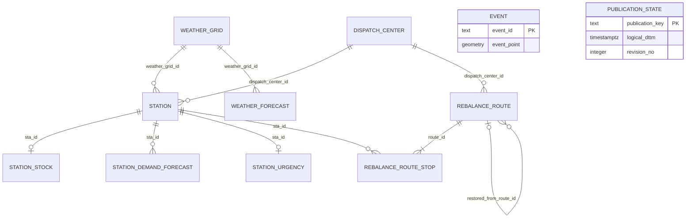

# Gold/PostGIS ERD

> 상태: 현재 계약<br>
> 코드 확인일: 2026-08-24

Gold는 API와 재배치 운영이 읽는 최신 serving projection이다. 원천·학습 이력은 S3 Bronze/Silver가 소유한다. 물리 type, constraint와 index의 최종 기준은 `target-schema.sql`이다.

## 전체 관계



`event`는 station과 FK로 연결하지 않는다. API가 두 Point 사이의 거리로 주변 행사를 찾는다. `gold_meta.publication_state`도 도메인 FK가 없는 publication watermark다.

## Table grain과 key

| Table | 한 행의 의미 | PK·주요 UK | 생명주기 |
| --- | --- | --- | --- |
| `weather_grid` | 기상청 격자 하나 | PK `weather_grid_id`, UK `(x_no, y_no)` | 34개 seed를 게시하며 ID 재사용 금지 |
| `dispatch_center` | 재배치 차량의 기준점 하나 | PK `dispatch_center_id`, UK 명칭 | 참조 중이면 삭제 대신 비활성화 |
| `station` | Gold에 한 번 게시된 따릉이 대여소 | PK `sta_id` | source에서 사라져도 즉시 삭제하지 않고 활성 상태 관리 |
| `station_stock` | station별 최신 재고 snapshot | PK/FK `sta_id` | 이력 없이 최신 한 행 유지 |
| `station_demand_forecast` | station·예측시각별 대여/반납량 | PK `(sta_id, predicted_dttm)` | 최신 완전 12시간 projection으로 교체 |
| `weather_forecast` | 격자·정시별 선택된 예보 | PK `(weather_grid_id, forecast_dttm)` | resolver 결과로 교체 |
| `event` | source가 식별한 행사 일정 하나 | PK `event_id`, UK `(source, source_event_id)` | source별 snapshot reconcile |
| `station_urgency` | station별 최신 재배치 판단 | PK/FK `sta_id` | 최신 완전 snapshot으로 교체 |
| `rebalance_route` | 센터에서 출발하는 작업 회차 하나 | PK UUID `route_id` | 새 제안은 교체, 실행·종료 이력은 보존 |
| `rebalance_route_stop` | route의 방문 순서 하나 | PK `(route_id, visit_no)` | parent와 함께 게시·보존 |
| `gold_meta.publication_state` | publication key의 마지막 commit | PK `publication_key` | 전진만 허용하며 삭제 금지 |

## 기준정보와 Station

### `weather_grid`

`weather_grid_id`는 `<x>_<y>` 형식이며 두 숫자와 일치해야 한다. Loader가 세 weather source YAML의 격자 집합이 동일한지 확인해 canonical 34개 seed를 생성한다. 격자를 바꾸려면 weather YAML, seed 생성 코드와 station mapping을 함께 변경해야 한다.

### `dispatch_center`

센터는 ID·명칭·Point와 좌표 정확도 metadata를 가진다. 현재 seed는 `dispatch-center-seed.yaml`이다. 허용 정확도는 `verified_site`, `landmark_approximation`, `administrative_centroid`다. 근사 좌표는 현장 검증 좌표와 같은 품질로 해석하지 않는다.

### `station`

Station ID는 `ST-<number>` 형식이다. 이름, 주소, 거치대 수, Point, weather grid, dispatch center와 source 기준시각을 물리화한다.

- 좌표는 master를 우선하고 필요할 때 realtime fallback을 사용한다.
- `sta_point_source_cd`가 좌표 출처를 나타낸다.
- 담당 센터는 활성 센터 중 거리 기준으로 결정해 FK로 저장한다.
- weather grid와 dispatch center가 준비되지 않으면 게시할 수 없다.
- serving 대상에서 빠져도 FK 이력을 위해 즉시 삭제하지 않는다.

## 최신 재고와 예측

### `station_stock`

Station마다 현재 재고 한 행만 가진다. `base_dttm`은 관측 기준시각이며 자전거 수는 0 이상이다. 재고 이력은 Gold가 아니라 Silver·Archive가 소유한다.

### `station_demand_forecast`

한 행은 `base_dttm`에서 계산한 특정 station의 한 시간 구간 대여·반납 예측이다.

- `predicted_dttm > base_dttm`
- 대여·반납 예측값은 0 이상의 정수
- 현재 release는 station별 미래 1~12시간을 요구
- API는 같은 base의 stock과 결합해 예상 재고 계산

PK에 `base_dttm`이 없는 이유는 Gold가 예측 이력을 보존하지 않고 현재 target projection만 제공하기 때문이다.

### `weather_forecast`

한 행은 weather grid의 정시 `forecast_dttm`에 대해 resolver가 선택한 예보다.

- `source_product_cd`: `ultra_short` 또는 `short_term`
- `forecast_dttm`은 정시이며 `base_dttm`보다 미래
- `sky_condition_cd`: `clear`, `mostly_cloudy`, `cloudy`
- 강수 형태 allowlist는 source product별로 다름
- 강수확률·강수량·습도·풍속은 nullable

제품별 원본과 발표 revision은 Silver가 보존하며 Gold에는 격자·시각별 한 행만 둔다.

## 행사

`event_id`는 `<event_source_cd>:<source_event_id>`다.

| Source | 식별·Point 계약 |
| --- | --- |
| `cultural_event` | canonical 입력의 `v1:<sha256>` ID와 source reported Point |
| `performance_event` | source ID와 curated stadium Point, `approximate` 정확도 |

행사는 시작·종료일을 `DATE`로 저장한다. API는 station과 event Point를 `geography`로 변환해 미터 거리를 계산한다. 장소 자체의 독립 소비자가 없어 `event_spot` table은 두지 않는다.

## 긴급도와 재배치

### `station_urgency`

Station별 최신 판단 한 행이다.

- `urgency_score`: 0~100
- `critical_remaining_min`: 0 이상의 분
- `rebalance_need_type_cd`: `normal`, `supply_needed`, `retrieval_needed`

같은 release의 station, stock, demand를 입력으로 사용하며 다른 base를 섞지 않는다.

### `rebalance_route`

```text
proposed → dispatched ─┬→ completed
                       └→ cancelled
```

| 상태 | 필수 시각 |
| --- | --- |
| `proposed` | `proposed_dttm` |
| `dispatched` | 위 + `dispatched_dttm` |
| `completed` | 위 + `completed_dttm` |
| `cancelled` | 위 + `cancelled_dttm` |

완료·취소 route는 `dismissed_dttm`으로 목록에서 숨길 수 있다. 현재 restore API는 취소된
동일 route를 `dispatched`로 되돌리고 ID와 stop을 보존한다. `restored_from_route_id` self
FK와 open-child unique index는 과거 복제형 복원 행의 lineage와 무결성을 위한 호환
계약이며 자기 자신을 참조할 수 없다.

### `rebalance_route_stop`

- `visit_no`는 1부터 시작하는 방문 순서다.
- action은 `pickup` 또는 `dropoff`다.
- `bike_cnt`는 양수다.
- parent route 삭제 시 cascade되지만 station 삭제는 제한한다.

새 publication은 proposed route와 stop을 원자적으로 게시한다. 이미 실행·완료·취소된 route는 새 제안 batch가 지우지 않는다.

## Publication state

허용 key는 다음과 같다.

```text
weather_grid
dispatch_center
station
station_stock
station_demand_forecast
weather_forecast
event:cultural_event
event:performance_event
station_urgency
rebalance_route
```

Version은 `(logical_dttm, revision_no)`로 비교한다.

- 과거 version: stale no-op
- 같은 version·fingerprint: replay no-op
- 같은 logical time의 변경: 더 큰 revision 필요
- 더 새로운 logical time: revision 0부터 시작
- target mutation과 state update: 같은 DB transaction

정상 EMPTY도 row count 0의 state를 남겨 과거 artifact가 이전 row를 되살리지 못하게 한다.

## 공통 물리 규칙

- 업무 일시는 timezone-aware `TIMESTAMPTZ`이며 무한대 값을 거부한다.
- 행사일과 좌표 검증일처럼 시각이 없는 값만 `DATE`다.
- Point는 `geometry(Point, 4326)`, X=경도, Y=위도다.
- 미터 거리는 `geography` cast를 사용한다.
- 공간 조회에는 GiST index를 둔다.
- FK는 기본적으로 update/delete를 제한하고 route→stop만 delete cascade다.
- `created_dttm`, `updated_dttm`은 DB trigger가 관리한다.
- 주요 업무 시각은 DB 현재시각보다 5분 넘게 미래일 수 없다.
- Public schema와 `gold_meta`의 기본 `PUBLIC` 권한은 회수한다.

## 원자 게시 경계

| Publication | 함께 일치해야 하는 projection |
| --- | --- |
| 기준정보 | weather grid 또는 dispatch center seed 전체 |
| Realtime serving | station, stock, demand, weather의 같은 plan·base |
| 행사 | source별 event snapshot |
| 긴급도 | station별 urgency snapshot |
| 경로 | proposed route header와 모든 stop |

Publisher는 S3 output과 manifest를 완성하고 dependency를 검증한 뒤 DB transaction을 시작한다. 검증이나 constraint가 실패하면 target과 publication state를 모두 rollback한다.

## 새 환경의 게시 순서

```text
1. target-schema.sql 적용
2. weather_grid seed 게시
3. dispatch_center seed 게시
4. station master·realtime authority 준비
5. rental/return model serving release 준비
6. realtime serving release 게시
7. station_urgency 게시
8. rebalance_route 게시
9. source별 event 게시
```

## 코드 기준 위치

- DDL: `docs/gold/target-schema.sql`
- Column 정의: `docs/gold/data-dictionary.md`
- Source lineage: `docs/gold/source-target-mapping.md`
- Publication bytes: `docs/gold/publication-contract-v1.md`
- Publisher: `loader/gold/`
- API query: `apps/api/queries.py`
- DDL 검증: `docs/gold/target-schema-validation.sql`
- 통합 테스트: `loader/tests/test_gold_*_integration.py`
