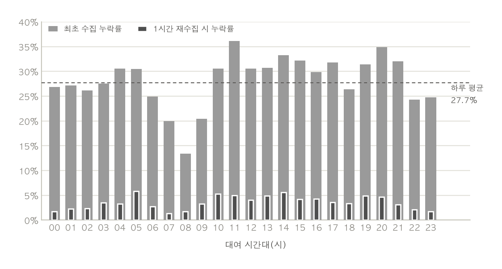
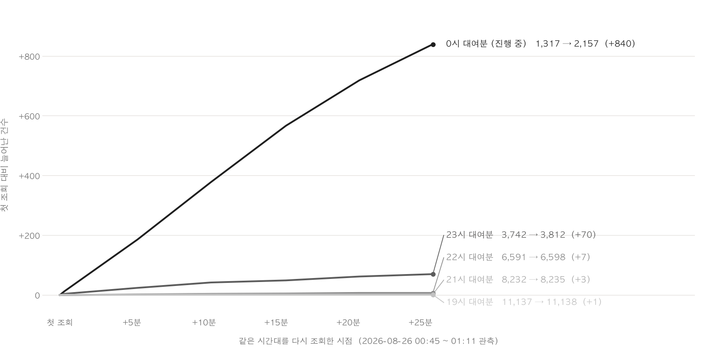
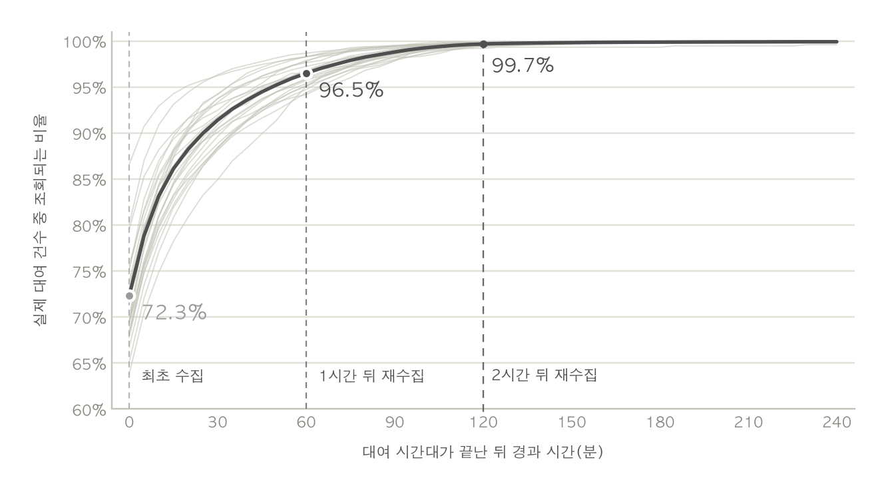
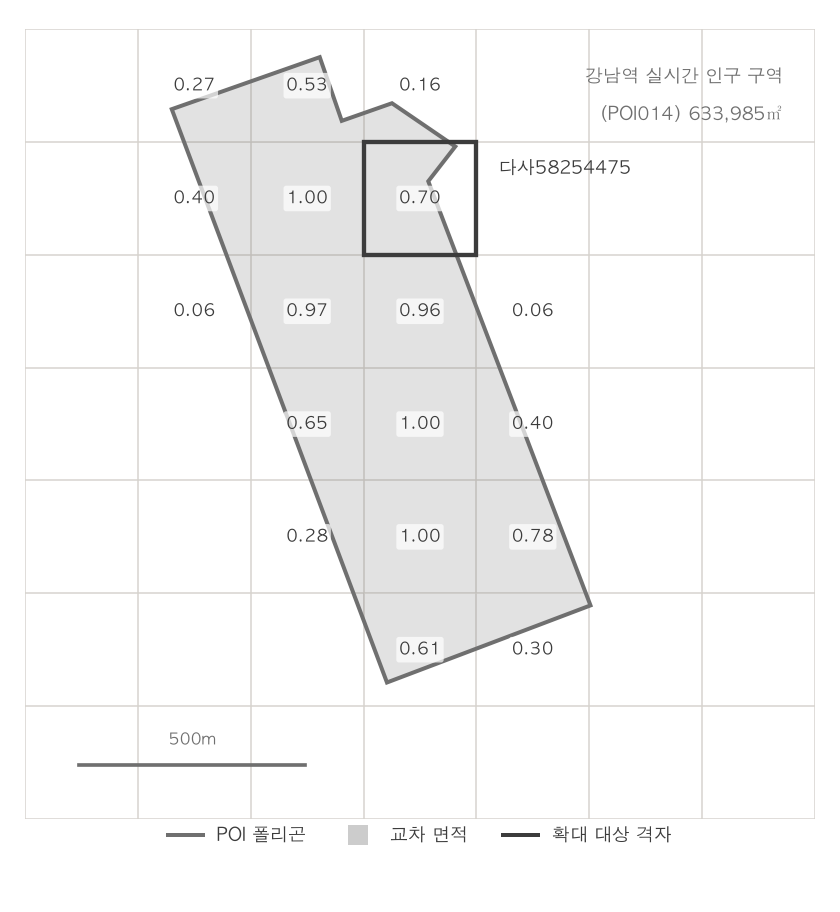
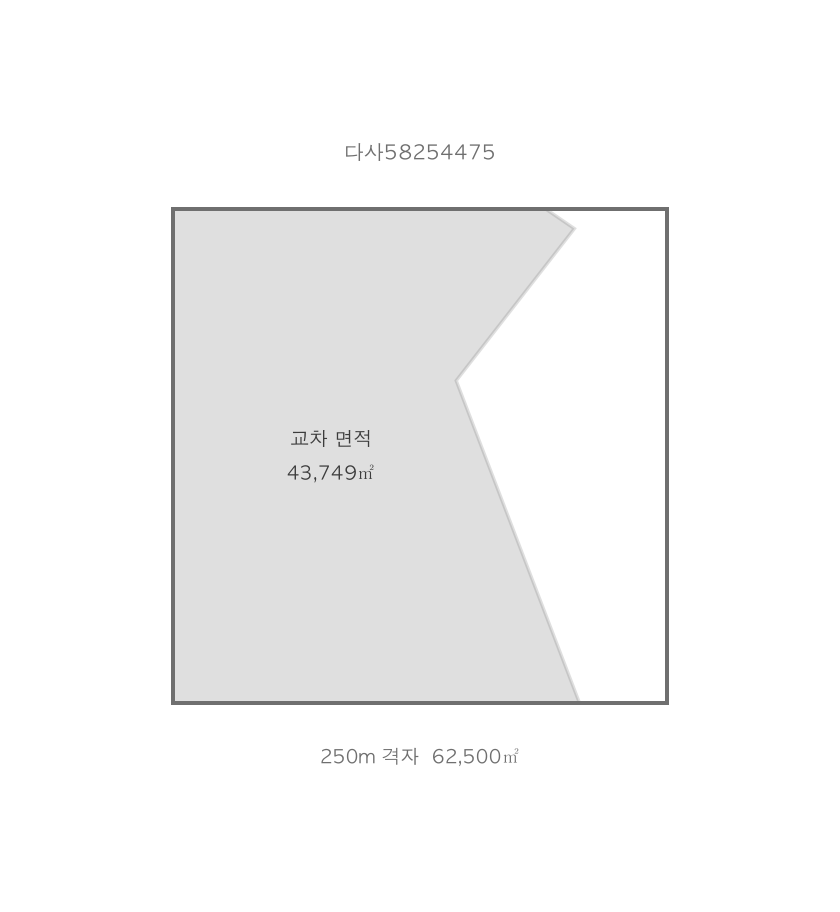
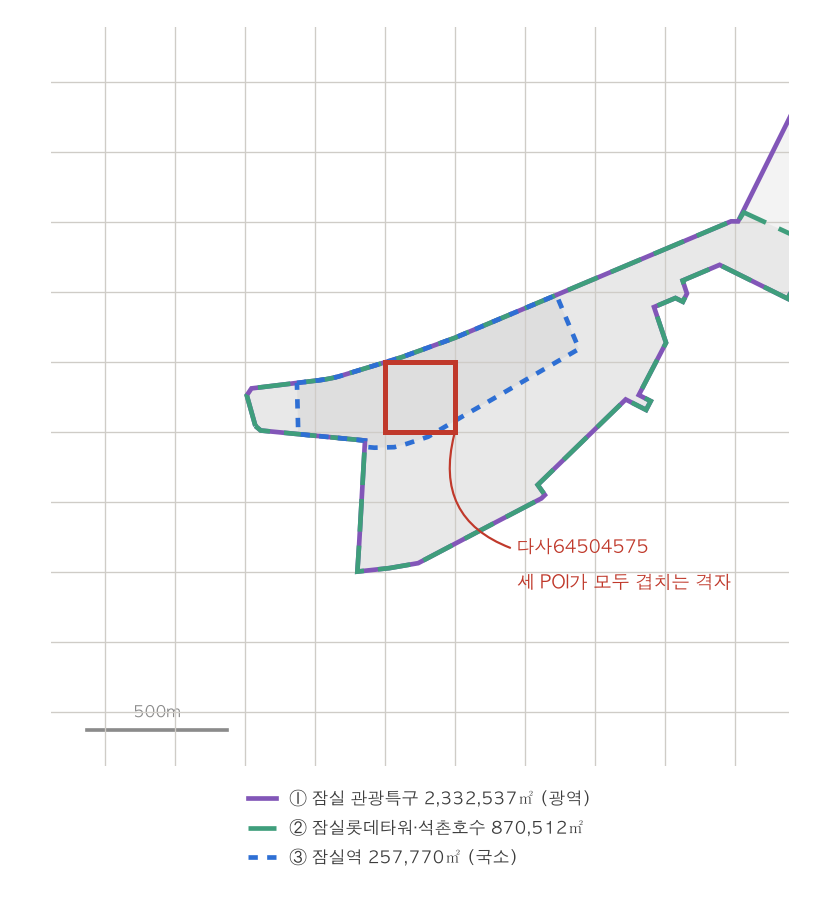
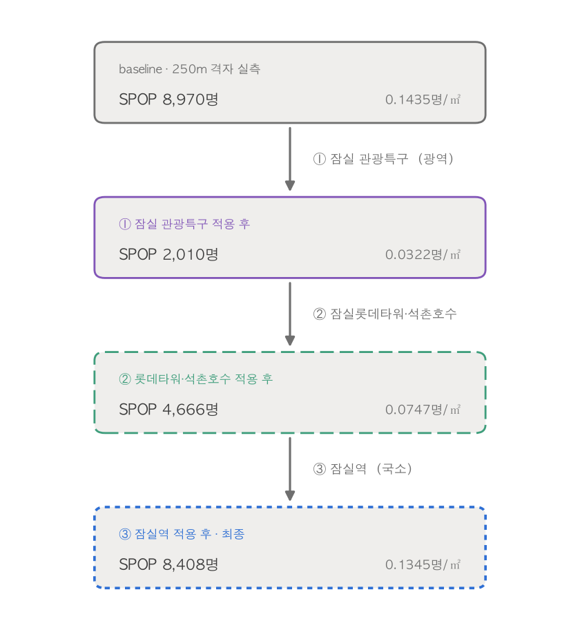

# 원천 데이터의 한계를 어떻게 보완할 것인가

## 목차
- [문제 상황](#문제-상황)
- [1. 서울시 공공자전거 따릉이 대여이력 정보 (OA-15182)](#1-서울시-공공자전거-따릉이-대여이력-정보-oa-15182)
- [2. 서울 생활인구(250m) (OA-22784)](#2-서울-생활인구250m-oa-22784)
- [3. 서울시 실시간 인구 데이터 (OA-21778)](#3-서울시-실시간-인구-데이터-oa-21778)

## 문제 상황
- 원천 데이터가 파이프라인이 요구하는 시공간적 단위에 정확히 맞춰서 제공되지 않습니다.

## 1. 서울시 공공자전거 따릉이 대여이력 정보 (OA-15182)

- **문제 상황:**
  - 따릉이 대여이력 API는 대여 시점을 기준으로 요청을 받지만, 데이터는 반납 시점을 기준으로 쌓이기 때문에 대여 후 아직 반납되지 않은 건은 조회 시점에 누락됩니다. (지연 도착 데이터 문제)
  - tbCycleRentData는 /{날짜}/{시} 경로로 대여 시각(RENT_DT) 기준 한 시간치를 주지만, 목록에는 반납이 완료된 기록만 올라옵니다.
  - 이 누락은 실패가 아니라 조회 시점에는 아직 존재하지 않았던 데이터라서 실패한 조각만 채우는 백필로는 회수되지 않습니다.

  | 참고 자료 | 시간대별 누락률 | 재호출 시 첫 조회 대비 늘어난 건수 |
  | :---: | :---: | :---: |
  | **이미지** |  |  |
  | **설명** | 대여 시간대마다 최초 수집에서 빠지는 비율입니다 | 같은 대여 시간대를 다시 조회할수록 건수가 늘어납니다 |

  ```
  # 서울시 공공자전거 대여이력 정보 API 호출 예시
  http://openapi.seoul.go.kr:8088/(인증키)/json/tbCycleRentData/1/5/(날짜)/(대여시각)
  ```

- **해결 방법:**
  - 수집기가 5분 주기로 현재 윈도우만 조회하는 것이 아니라, 과거의 윈도우(1시간 전, 2시간 전)도 함께 조회하도록 합니다.
  - 예시: 17시 05분 수집 → 17시대(현재), 16시대(T-1), 15시대(T-2) 데이터를 동시에 호출합니다.

- **효과:**
  - 15시에 대여해서 17시 30분에 반납한 자전거 기록이 15시대 API 응답에 뒤늦게 포함되더라도, 17시 수집에서 이 데이터를 포함할 수 있습니다.
  - 실제로 실제 대여 건수 대비 수집되는 비율이 최초 시점에는 평균 72.3%이었지만 1시간 뒤 재수집 시 96.5%, 2시간 뒤에는 99.7%까지 늘어나는 것을 확인하였습니다.

  | 참고 자료 | 실제 건수 대비 수집되는 비율 |
  | :---: | :---: |
  | **이미지** |  |
  | **설명** | 1시간 뒤 96.5%, 2시간 뒤 99.7%까지 채워집니다 |

## 2. 서울 생활인구(250m) (OA-22784)

- **문제 상황:**
  - 현재 날짜 기준의 4일 전의 자료만 제공되어서 현재 시점의 데이터를 알 수 없습니다.

- **해결 방법:**
  - nowcaster 모듈을 통해서 D-3 ~ D+3 구간의 빈 데이터를 추정합니다.
  - 4일 뒤에 실측 데이터가 들어오기 전까지의 공백을 과거의 동일 패턴으로 채우는 nowcasting을 매일(daily_population_and_events DAG) 수행합니다.

  - **동일 요일 패턴을 반영한 계산:** 실측 아카이브가 없는 기준일 전후 7일(D-3 ~ D+3)에 대해, 1~4주 전의 '같은 요일' 실측 데이터를 찾아 가중 평균(최근 주차부터 0.4/0.3/0.2/0.1)을 내어 추정합니다.
    - **가중치 부여 방식:** 최근의 인구 흐름과 이벤트 여파가 현재 시점의 패턴과 가장 유사할 것이라는 가정하에, 가장 가까운 과거인 1주 전에 가장 높은 가중치(40%)를 부여하고, 과거로 갈수록 가중치(30%, 20%, 10%)를 점진적으로 줄여서 반영합니다.
    - **예시:** 특정 기준일 화요일의 인구를 추정할 경우, 최근 트렌드 변화를 부드럽게 추종하도록 아래 표의 가중치를 곱하여 모두 더합니다.

      | 시점 (과거) | 사용 데이터 | 가중치 |
      | :--- | :--- | :---: |
      | 1주 전 | 1주 전 화요일 인구 실측치 | 0.4 (40%) |
      | 2주 전 | 2주 전 화요일 인구 실측치 | 0.3 (30%) |
      | 3주 전 | 3주 전 화요일 인구 실측치 | 0.2 (20%) |
      | 4주 전 | 4주 전 화요일 인구 실측치 | 0.1 (10%) |
    - **최종 추정 인구** = `(1주 전 × 0.4) + (2주 전 × 0.3) + (3주 전 × 0.2) + (4주 전 × 0.1)`  
    
  - **휴일 특수 처리:** 일요일이나 공휴일은 평일(출퇴근, 업무 등)과는 생활 인구 이동 패턴이 확연히 다르기 때문에, 데이터 왜곡 방지를 위해 평일과 휴일의 참조 대상을 아래 표와 같이 분리하여 처리합니다.

    | 추정 기준일 | 참조 데이터 대상 (과거 1~4주) | 적용 패턴 그룹 | 비고 |
    | :--- | :--- | :--- | :--- |
    | **일반 평일** (월~금) | 동일한 요일의 **평일 실측치** | 평일 패턴 풀 | 월요일 추정 시 과거 월요일만 참조 |
    | **주말** (토, 일) | 동일한 요일의 **주말 실측치** | 휴일 패턴 풀 | 일요일 추정 시 과거 일요일만 참조 |
    | **법정 공휴일** (추석 등) | 요일 무관, 가장 가까운 **휴일 실측치** | 휴일 패턴 풀 | 캘린더 API 연동 (휴일 플래그 관리) |
  - **3단 폴백 처리:** 데이터 누락으로 인해 1순위 가중 평균을 구할 수 없는 경우를 대비하여, 빈틈없이 값을 추정하기 위해 아래 표와 같이 3단계 폴백 전략을 순차적으로 적용합니다.

    | 적용 순서 | 조건 (데이터 상태) | 대체 적용 데이터 |
    | :---: | :--- | :--- |
    | **1단계** | 1~4주 전 데이터가 **존재**할 경우 | 1~4주 전 실측 데이터를 활용한 **가중 평균** |
    | **2단계** | 1~4주 전 데이터가 **모두 누락**된 경우 | 5~8주 전 실측 데이터 중 **가장 최근 값** |
    | **3단계** | 1~8주 전 데이터가 **모두 누락**된 경우 | 해당 격자 및 동일 요일의 **과거 전체 평균치** |

  - **실측 도착 시 자동 교체:** 4일이 지나 실제 생활인구 원천 데이터가 적재(Archive 승격)되면, 임시로 사용하던 추정치 파켓 파일(nowcast.parquet)을 즉시 삭제하여 자연스럽게 실측 데이터로 교체되도록 파이프라인이 구현되어 있습니다.

- **효과:**
  - 원천 데이터가 가진 4일간의 지연 공백을 효과적으로 메워, 분석 시점에 실시간으로 근접한 서울시 전역의 인구 분포 트렌드를 끊김 없이 파악하고 활용할 수 있게 됩니다.


## 3. 서울시 실시간 인구 데이터 (OA-21778)

- **문제 상황:**
  - 서울시 전역이 아닌 주요 121개 지점에 한정된 데이터를 제공합니다.
  - 반면 서울시 전역을 포괄하는 생활인구(250m 격자) 데이터는 실시간 현황을 반영하지 못합니다. 즉, 두 데이터는 공간적 커버리지와 시간적 최신성 사이에서 상충(Trade-off)하는 한계를 지닙니다.

- **해결 방법:**
  - 서울시 전역을 커버하는 **'250m 격자 생활인구 데이터'**와 121개 주요 POI의 **'실시간 인구 데이터'**를 공간적으로 합성하여 두 데이터의 한계를 상호 보완합니다.
  - 아래 예시는 모두 실제 데이터로 계산한 값입니다.

    | 구분 | 사용한 데이터 |
    | :--- | :--- |
    | 기존 격자 데이터 | 250m 생활인구 실제 관측값 **2026-08-11(월) 18시** |
    | 실시간 POI | 실시간 도시데이터 응답 **2026-08-25 18:00** (강남역: 78,000~80,000명, 남 48.6% / 여 51.4%, '약간 붐빔') |
    | POI 폴리곤 | `normalizer/data/poi_areas/seoul_121_poi_areas.shp` (지도 좌표계 변환 후 계산한 면적) |

  | 참고 자료 | 겹치는 구역 찾기 | 겹친 비율만큼 인구 섞기 |
  | :---: | :---: | :---: |
  | **이미지** |  |  |
  | **설명** | 격자망에 POI 폴리곤을 얹어 겹친 실제 면적(㎡)을 구합니다 | 겹친 비율을 반영해서 새로운 인구 밀도를 계산합니다 |

  - **STEP 1. 겹치는 구역 찾기:** 단순히 점(Point) 기준으로 맞추는 대신, 두 폴리곤이 지도 위에서 실제로 겹치는 **면적**을 기준으로 데이터를 합칩니다.
    - **사용 기술:** `Shapely`(공간 데이터 처리 도구)
    - **대상:** 서울시 전역 250m 크기의 네모난 격자(폴리곤) ↔ 121개 실시간 POI(폴리곤)
    - **계산 방식:** 두 영역이 겹치는 면적을 ㎡ 단위로 계산합니다.
    - **예시:** 강남역 POI(633,985㎡ = 격자 약 10개 분량)는 실제로 **20개 격자**에 걸쳐 있습니다. 격자 3개는 POI 안에 완전히 포함(비율 100%)되고, 나머지 17개는 일부분만 겹칩니다. 아래 STEP 2의 예시 격자(`다사58254475`)는 겹친 면적이 43,749㎡입니다.


  - **STEP 2. 겹친 비율에 따른 인구 밀도 보정:** 격자 전체 면적 중 실시간 POI와 겹치는 '면적 비율'을 가중치로 사용하여 두 데이터를 합성합니다.
    - **겹치지 않는 구역:** 기존 격자의 인구 밀도를 그대로 유지합니다.
    - **겹치는 구역:** 실시간 POI의 최신 인구 밀도를 반영합니다.

    ```
    겹친 비율(w) = 겹친 면적 / 62,500㎡ (격자 1개 넓이)
    새로운 밀도  = (1 - 겹친 비율) × 기존 격자 밀도 + 겹친 비율 × POI 밀도
    최종 인구수  = 새로운 밀도 × 62,500㎡
    ```

    - **실제 계산 예시:**
      - **초기 상태:** 겹친 비율 70% (`w = 0.7`), 기존 인구수 3,028명
      - **계산 과정:** `(0.3 × 기존 밀도) + (0.7 × 실시간 POI 밀도)`로 가중 평균을 구함
      - **보정 결과:** 실시간 현황을 70% 반영하여 최종 인구수가 **6,360명으로 상향**됨

    - **보정 방향 (양방향):**
      - 실시간 인구 밀도가 기존 데이터보다 **높으면 올리고, 낮으면 내립니다.**
      - 겹치지 않은 영역(위 예시의 30%)은 기존 인구가 그대로 유지되므로, 값이 극단적으로 널뛰는 왜곡을 방지합니다.

      | 격자 ID | 겹친 면적 | 겹친 비율(w) | 보정 전 | 보정 후 | 증감 | 해석 |
      | :--- | ---: | ---: | ---: | ---: | ---: | :--- |
      | 다사58254425 | 62,500㎡ | 1.000 | 7,149명 | 7,788명 | +8.9% | 완전히 포함 → 실시간 인구로 100% 대체 |
      | 다사58254475 | 43,749㎡ | 0.700 | 3,028명 | 6,360명 | +110.0% | 기존 데이터가 적게 예측했던 역세권 인구를 끌어올림 |
      | 다사58004425 | 40,800㎡ | 0.653 | 17,747명 | 11,246명 | -36.6% | 기존 데이터가 과대 예측했던 곳의 인구를 끌어내림 |
      | 다사58754375 | 12㎡ | 0.000 | 1,424명 | 1,425명 | +0.0% | 살짝만 스쳐 지나간 격자는 거의 원래 인구 유지 |
      | **20개 격자 합계** | 633,985㎡ | — | **129,692명** | **123,266명** | **-5.0%** | 전체 인구수는 엇비슷하지만, 세부 위치별 분포가 더 정확해짐 |

  - **STEP 3. 성별과 연령대 분배:** STEP 2에서 새롭게 구한 '총 인구수'를 남녀 및 세부 연령대별로 다시 쪼개어 줍니다. 이때 성별과 연령에 각각 다른 기준을 적용합니다.
    - **1. 성비(남/녀)는 '실시간 데이터'를 따릅니다:** 지금 당장 사람들이 모여 있는 성별 트렌드는 최신 POI 데이터를 그대로 반영합니다.
    - **2. 연령대는 '기존 격자 데이터'를 따릅니다:** 실시간 데이터가 주는 연령 정보는 넓은 범위의 평균값입니다. 이것을 그대로 덮어씌우면 같은 격자(동네) 고유의 세밀한 지역 특성이 다 지워져 버리기 때문에, 기존 데이터가 가진 연령대 비율을 보존합니다.

    - **분배 예시 (`다사58254475` 격자, 총 인구가 3,028명 → 6,360명으로 증가한 경우):**

      | 항목 | 보정 전 (기존 데이터) | 보정 후 | 출처 기준 |
      | :--- | ---: | ---: | :--- |
      | **남성 인구** | 1,349명 (44.6%) | **3,091명 (48.6%)** | 실시간 POI의 성비 반영 |
      | **여성 인구** | 1,679명 (55.4%) | **3,269명 (51.4%)** | 실시간 POI의 성비 반영 |
      | **남성 30~34세 비율** | 19.84% | **19.84%** | 해당 동네 고유의 연령 비율 유지 |
      | **여성 25~29세 비율** | 25.48% | **25.48%** | 해당 동네 고유의 연령 비율 유지 |
      
    - 이 방식을 통해 **총 인구수와 성비는 가장 최신의 실시간 상태**로 맞추면서도, **동네 고유의 특성(주거지, 상업지 등)은 훼손하지 않고** 안전하게 섞어냅니다.


  - **STEP 4. 여러 POI가 겹치는 경우:** 하나의 격자에 여러 개의 POI가 겹칠 경우, 범위가 아주 넓은 POI를 먼저 적용하고, 범위가 좁고 집중된 POI를 가장 나중에 덮어씁니다.
    - **예시 (`다사64504575`):** 잠실 일대에는 3개의 POI가 한꺼번에 겹치는 격자가 11개나 있습니다. 이 격자는 원래 인구 8,970명에서 출발합니다.

      | 참고 자료 | 중첩 현황 | 순서대로 덮어쓰기 |
      | :---: | :---: | :---: |
      | **이미지** |  |  |
      | **설명** | 한 구역(격자)에 3개의 POI가 동시에 겹칩니다 | 넓은 범위의 POI부터 좁은 범위의 POI 순으로 덮어씁니다 |

      | 덮어쓰는 순서 | POI 이름 | POI 넓이 | POI 인구 밀도 | 겹친 비율(w) | 덮어쓴 후 인구수 |
      | :---: | :--- | ---: | ---: | ---: | ---: |
      | ① | 잠실 관광특구 (넓은 범위) | 2,332,537㎡ | 0.0322명/㎡ | 1.000 | 2,010명 |
      | ② | 잠실롯데타워·석촌호수 | 870,512㎡ | 0.0747명/㎡ | 1.000 | 4,667명 |
      | ③ | 잠실역 (좁고 집중된 범위) | 257,770㎡ | 0.1358명/㎡ | 0.980 | **8,408명** |

    - 만약 순서를 반대로 해서 좁은 잠실역부터 적용하고 넓은 관광특구를 나중에 적용하면, 최종 인구수가 2,010명으로 뚝 떨어지게 됩니다. 넓은 범위의 다소 듬성듬성한 인구 밀도가 마지막에 덮어써져서, 잠실역 주변에 사람이 빽빽하다는 좁고 강한 신호가 통째로 지워져 버리기 때문입니다. 그래서 항상 넓은 범위의 POI부터 좁은 범위의 POI 순서로 일관되게 덮어씁니다.
    - 남녀 비율을 갱신할 때에도 **가장 마지막에 덮어쓴 좁고 집중된 POI**(위 예시에서는 잠실역)의 성비를 우선하여 채택합니다.

- **효과:**
  - **빈틈 없이 가장 최신의 인구 현황을 파악합니다.**   
  121개 주요 POI에만 있던 실시간 인구 정보가 서울시 전체의 격자망 위로 자연스럽게 퍼집니다.  

  - **어디에 사람이 몰려 있는지 훨씬 정확해집니다.**  
  강남역 주변의 총 인구수는 12만 명대로 엇비슷하게 유지되더라도, 세부 위치(격자)별로는 최대 2배 늘어나거나 크게 줄어드는 등 인구가 재배치됩니다. 같은 강남역 일대라도 번화가 한복판과 조금 떨어진 골목 중 어디에 사람이 몰렸는지 세밀하게 구분할 수 있습니다.
  - **공공자전거(따릉이) 수요 예측이 정교해집니다.**  
  따릉이 대여소는 세부 격자 단위로 나뉘어 있습니다. '지금 당장 이 좁은 구역에 몇 명이 있는가'가 정확해질수록, 어디에 따릉이가 더 필요할지 예측하고 재배치하는 데 큰 도움이 됩니다.
  - **현재뿐 아니라 미래 예측에도 똑같이 쓰입니다.**  
  한 번 계산해 둔 겹친 면적 비율을 활용하여 현재 시각과 향후 12시간 뒤의 예측 인구까지 동일한 규칙으로 부드럽게 보정합니다. 추론기는 복잡한 로직 추가 없이 시간대만 바꿔서 바로 가져다 쓸 수 있습니다.
