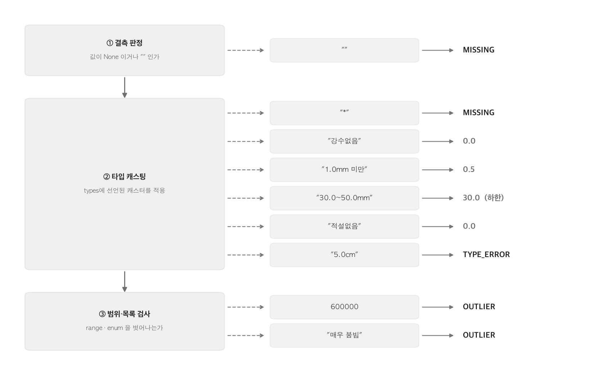
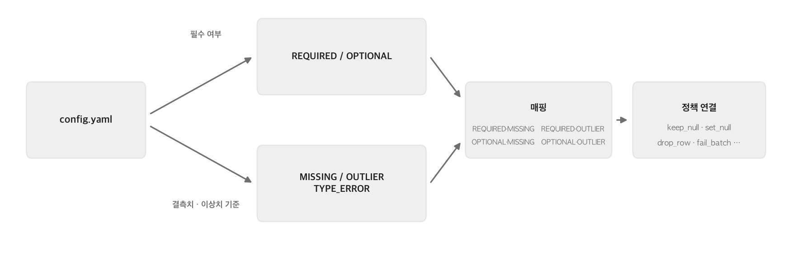
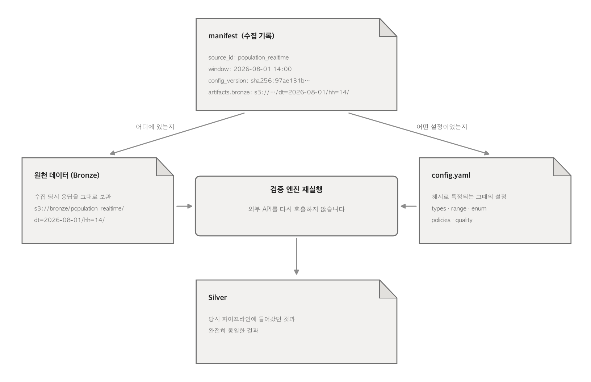

# 소스마다 다른 스키마를 어떻게 일관된 정책으로 수집할 것인가

## 목차
- [문제 상황](#문제-상황)
- [해결 방법](#해결-방법)
  - [1. 소스 지식을 코드에서 완전히 걷어내고 YAML 설정으로 옮깁니다.](#1-소스-지식을-코드에서-완전히-걷어내고-yaml-설정으로-옮깁니다)
  - [2. 모든 컬럼을 YAML에 설정한 기준으로 분류하고, 이를 바탕으로 검증 엔진이 일관된 정책을 적용합니다.](#2-모든-컬럼을-yaml에-설정한-기준으로-분류하고-이를-바탕으로-검증-엔진이-일관된-정책을-적용합니다)
  - [3. 설정 파일 오타는 먼저 걸러냅니다.](#3-설정-파일-오타는-먼저-걸러냅니다)
  - [4. 해시 값을 기록하여 언제든 데이터를 복원할 수 있습니다.](#4-해시-값을-기록하여-언제든-데이터를-복원할-수-있습니다)
- [효과](#효과)

## 문제 상황
- 소스마다 스키마가 다 달라서 코드를 수정하고 새로운 데이터를 붙이기 어렵습니다.
  > 생활인구는 비식별 마스킹 *을, 기상청은 "강수없음"·"1.0~4.9cm" 같은 범주 문자열을 결측·값으로 섞어 보냅니다. 이 차이를 코드에서 처리하면 소스가 늘 때마다 검증 로직에 `if source_id == ...` 분기가 쌓이고, 새 데이터를 붙일 때마다 이미 검증된 기존 소스의 코드까지 건드려야 합니다.

## 해결 방법 

### 1. 소스 지식을 코드에서 완전히 걷어내고 YAML 설정으로 옮깁니다.

- **스키마 선언 분리** — 컬럼마다 허용 타입(`types`)·필수 여부(`required`)·허용 범위/목록(`range/enum`)을 YAML에 선언하여, **파이썬 코드를 수정할 필요 없이 설정 파일만으로 검증 기준을 유연하게 관리합니다.**
  - **설정 예시 (`collector/sources/population_realtime.yaml`)**:
    ```yaml
    columns:
      AREA_NM:
        types: [str]
        required: true
      AREA_CONGEST_LVL:
        types: [str]
        enum: ["여유", "보통", "약간 붐빔", "붐빔"]
      AREA_PPLTN_MIN:
        types: [int]
        range: {min: 0, max: 500000}
    ```

### 2. 모든 컬럼을 YAML에 설정한 기준으로 분류하고, 이를 바탕으로 검증 엔진이 일관된 정책을 적용합니다.


- **컬럼 값의 상태 판정** — 엔진은 모든 컬럼의 값을 다음 3단계 순서로 판정하여, 문제가 발생한 단계에 따라 상태를 부여합니다.
  1. **결측(Null) 검사**: 값이 비어있다면 `MISSING`으로 분류합니다.
  2. **타입 캐스팅 및 타입 검사**: 선언된 타입과 맞지 않거나 변환에 실패하면 `TYPE_ERROR`로 분류합니다.
  3. **허용 범위(Range/Enum) 검사**: 값이 허용된 범위나 지정된 목록을 벗어나면 `OUTLIER`로 분류합니다.
  - **예외 표기는 전용 캐스터가 흡수** — 기상청의 "강수없음" 같은 특이한 문자열이나 마스킹(*)된 데이터는 전용 캐스터(`masked_float`, `precip`, `snow`)가 미리 파악하여 통일된 형태로 변환합니다. 이 덕분에 검증 엔진의 판정 경로는 여러 갈래로 찢어지지 않고 하나로 유지됩니다.
    - **캐스터 적용 예시 (`collector/sources/weather_short_term_forecast.yaml`)**:
      ```yaml
      columns:
        PCP:
          types: [precip]  # "강수없음", "30.0~50.0mm" 등 복잡한 기상청 강수량 문자열을 숫자(float)로 변환
        SNO:
          types: [snow]    # "적설없음", "1.0~4.9cm" 등 단위가 포함된 적설량 문자열을 숫자(float)로 변환
      ```
  - **판정 경로** — 소스마다 다르게 표기되는 값들이 세 관문 중 어디에서 어떤 상태로 갈라지는지 보여줍니다.

      


- **필수 여부(필수/일반)를 YAML에 설정** — 각 컬럼이 반드시 필요한 값인지(필수), 아니면 생략 가능한 값인지(일반)를 구분하여 YAML에 선언합니다.
  - **설정 예시 (`collector/sources/population_realtime.yaml`)**:
    ```yaml
    columns:
      AREA_NM:
        types: [str]
        required: true   # 필수 컬럼
      FCST_YN:
        types: [str]     # 생략 시 일반(optional) 컬럼
    ```  

- **(필수 여부-컬럼 상태)로 각 컬럼 값을 매핑합니다** — 컬럼의 필수/일반 여부와 상태 판정 결과를 교차해 필수-결측, 필수-이상, 일반-결측, 일반-이상 네 칸을 만듭니다. 특정 컬럼만 다르게 다뤄야 하면 `on_missing`·`on_outlier`로 그 칸의 기본값을 덮어씁니다.  

- **각 매핑마다 정책을 연결합니다** — 만들어진 네 칸마다 적용할 정책 이름을 소스 설정에 선언합니다. 엔진은 설정에 적힌 문자열을 레지스트리에서 함수로 조회해 실행할 뿐, 지금 다루는 데이터가 어떤 소스인지 전혀 알지 못합니다. (※ 같은 정책 이름을 두 번 등록하면 예외를 던져 조용한 덮어쓰기를 막습니다.)
  - **제공되는 7가지 기본 정책**:
    - `keep_null`: 원래 값이 결측치(null)였던 것을 그대로 유지합니다.
    - `set_null`: 값이 이상하거나 잘못되었을 때, 이를 결측치(null)로 강제 변환하여 저장합니다.
    - `fill_zero`: 결측치나 이상치를 0으로 채워 넣습니다.
    - `fill_default`: 스키마에 미리 지정해 둔 기본값(default)으로 채웁니다.
    - `clip_to_range`: 값이 허용 범위(range)를 벗어났을 때, 상한선이나 하한선으로 맞추어(clip) 저장합니다. (예: 0~100 범위인데 120이 들어오면 100으로 맞춤)
    - `drop_row`: 해당 데이터(행) 전체를 버립니다. 반드시 있어야 할 필수 값이 누락되었을 때 주로 사용합니다.
    - `fail_batch`: 데이터에 너무 치명적인 오류가 있어, 해당 수집 작업(배치) 전체를 즉시 중단하고 실패 처리합니다.
    - **(참고)** 레지스트리에 함수를 등록하는 방식이므로, 요구사항이 바뀌면 엔진의 핵심 코드 수정 없이도 새로운 정책을 추가하거나 기존 정책을 자유롭게 수정·삭제할 수 있습니다.
  - **전역 설정 예시 (`collector/sources/population_realtime.yaml`)**:
    ```yaml
    policies:
      required_missing: drop_row   # 필수 컬럼이 결측값이면 해당 데이터(행) 전체를 버림
      required_outlier: drop_row   # 필수 컬럼이 이상값이면 해당 데이터(행) 전체를 버림
      optional_missing: keep_null  # 일반 컬럼이 결측값이면 null 상태 그대로 통과시킴
      optional_outlier: set_null   # 일반 컬럼이 이상값이면 null로 값을 변경하여 저장함
    ```  

- **컬럼 단위의 예외 정책 덮어쓰기** — 위에서 연결한 네 칸의 규칙이 전역(Global) 정책으로 기본 적용되지만, **특정 컬럼만 예외적으로 다르게 처리**해야 할 경우 해당 컬럼 선언부에 `on_missing`이나 `on_outlier`를 지정하여 기본 정책을 덮어쓸 수 있습니다.
  - **개별 덮어쓰기 예시 (`collector/sources/population_realtime.yaml`)**:
    전체 정책으로는 "필수 컬럼 이상치 발생 시 행 버림(`drop_row`)"으로 설정해 두었더라도, `AREA_PPLTN_MIN` 컬럼에 한해서는 이상치가 들어와도 행 전체를 버리지 않고 "해당 값만 null로 치환(`set_null`)"하여 다른 정상 데이터들은 살리도록 개별 설정할 수 있습니다.
    ```yaml
    policies:
      required_outlier: drop_row   # 전역 정책: 필수 컬럼이 이상치면 해당 데이터(행) 전체를 버림
      # ...
    
    columns:
      AREA_PPLTN_MIN:
        types: [int]
        required: true
        range: {min: 0, max: 500000}
        on_outlier: set_null       # 개별 정책: 이 컬럼만 예외적으로 이상치를 null로 치환하고 행은 통과시킴
    ```
  


  
  
- **행 전체를 한 번 더 판단합니다** — 컬럼별 정책이 값을 고치고 나면, 그 행에 쌓인 이슈 목록을 통째로 보고 행을 남길지 버릴지 결정할 수 있습니다. `policies.row`에 이름을 적으면 동작하고, 적지 않으면 이 단계는 건너뜁니다.

  | 행 정책 | 동작 |
  | :--- | :--- |
  | `drop_if_any_required_issue` | 필수 컬럼에 이슈가 하나라도 있으면 행을 폐기 |
  | `drop_if_issue_count_exceeds` | 이슈 개수가 `max_issues`를 넘으면 행을 폐기 |
  | `keep_always` | 이슈가 있어도 항상 유지 |

  - **설정 예시**:
    ```yaml
    policies:
      required_missing: drop_row
      optional_missing: keep_null
      row: drop_if_issue_count_exceeds   # 컬럼 정책을 모두 거친 뒤 행 단위로 한 번 더 판단
      row_params: {max_issues: 3}        # 이슈가 4개 이상이면 그 행은 폐기
    ```
  - 컬럼 정책에서 이미 `drop_row`가 확정된 행은 행 정책을 호출하지 않습니다. 이미 결론이 난 행을 다시 판단하지 않기 위해서입니다.
  - `row_params`는 배치가 시작될 때 한 번만 파싱해 두고 모든 행이 재사용합니다.
  - 폐기된 행은 그냥 사라지지 않고 어떤 컬럼이 왜 문제였는지 이슈 전체와 함께 quarantine에 남습니다.

### 3. 설정 파일 오타는 먼저 걸러냅니다.

- **잘못된 설정의 조기 차단** — 네트워크를 타고 데이터를 수집하기 전에 설정을 먼저 검사해서, 문법이 틀렸거나 논리적으로 모순되는 설정이 있으면 그 자리에서 실행을 멈춥니다. 잘못된 설정 때문에 불필요한 API 호출 자원을 낭비하거나, 오염된 데이터가 파이프라인에 섞여 들어가는 것을 사전에 방지하기 위함입니다.
  - **오타/모순 설정 예시**:
    ```yaml
    columns:
      AREA_PPLTN_MIN:
        types: [int]
        range: {min: 0, max: 500000}
        enum: ["많음", "적음"]   # 에러 발생 숫자 범위(range)와 문자열 목록(enum)을 동시에 선언할 수 없음
    
    policies:
      required_missing: drrop_row  # 에러 발생 등록되지 않은 정책('drop_row'의 오타 )
    ```
  - **어떻게 걸러지는가?** — `Pydantic` 모델을 사용해 YAML 파일을 파이썬 객체로 읽어 들이는 과정(로드 시점)에서, 위와 같은 논리적 모순이나 오타(존재하지 않는 정책 이름)를 발견하면 즉시 에러(`ValidationError`)를 뿜고 수집 앱을 종료합니다. 쓸데없이 API를 호출하거나 잘못된 기준이 적용된 데이터가 DB에 들어가는 것을 원천 차단합니다.

### 4. 해시 값을 기록하여 언제든 데이터를 복원할 수 있습니다.

- 검사를 무사히 통과한 설정 파일은 해시값을 생성하여 수집 기록과 함께 저장합니다.
- 이로 인해 나중에 파이프라인에 문제가 생기거나 로직을 재검증해야 할 때, 보관되어 있는 **'원천 데이터(Raw)'**와 당시 사용된 **'해시(SHA256)'**만 조합하면 정제되어 파이프라인에 투입되었던 **'실버 데이터'**를 언제든 완벽하게 동일한 상태로 재현(복원)해 낼 수 있습니다.
  - **데이터 복원 시나리오 예시**:
    - **상황**: 과거(예: 8월 1일)에 수집한 데이터가 잘못된 정책 설정으로 인해 실버(Silver) 데이터 단계에서 오염되었음을 며칠 뒤 뒤늦게 발견했습니다.
    - **해결**: 
      1. S3나 로컬에 보관되어 있는 8월 1일 자 **원천 데이터(Raw JSON)**를 그대로 가져옵니다.
      2. 수집 기록(Manifest)에 적힌 8월 1일 당시의 **설정 파일 해시(SHA256)**를 확인하여, 정책 설정을 올바르게 수정한 새 버전을 준비합니다.
      3. 외부 API를 다시 호출할 필요 없이, 기존 원천 데이터(Raw)를 올바른 설정 버전에 다시 통과시키기만 하면 즉시 깨끗하게 정제된 **실버 데이터**를 재현하고 파이프라인을 복구할 수 있습니다.




# 효과 

- **유지보수 비용 감소**
  - 새로운 데이터 소스를 추가하거나 검증 기준을 변경할 때, 파이썬 검증 엔진 코드는 단 한 줄도 수정할 필요가 없습니다. 오직 YAML 설정 파일 한 장만 작성하거나 수정하면 됩니다.
  - 현재 10개 소스의 189개 컬럼이 **단 한 벌의 엔진 코드**를 공유하여 처리되고 있으며, 코드 내에 소스별로 하드코딩된 예외 처리(`if source_id == ...`) 분기는 **0건**입니다.

- **데이터 품질 추적**
  - 모든 검증 내역(어떤 정책이 적용되었는지, 컬럼별로 어떤 이슈가 발생했는지 등)이 수집 기록(Manifest)에 자동으로 상세하게 집계됩니다.
  - 특정 데이터 행이 파이프라인에서 왜 버려졌고 어떤 값이 문제였는지, 복잡한 코드를 뒤지지 않고도 **설정 파일과 수집 기록만 보면 즉시 추적**할 수 있습니다.

- **파이프라인 안정성 및 복원력**
  - 다양한 예외 캐스터(`precip`, `snow` 등), 그리고 기본 정책 매핑을 통해 **오염된 데이터가 시스템에 침투하는 것을 차단**합니다.
  - 원천 데이터(Raw)와 설정 파일 해시(Hash) 버전을 함께 관리하므로, 문제가 발생하더라도 언제든지 과거 데이터를 당시와 똑같은 상태로 안전하게 재현하고 복원할 수 있습니다.

