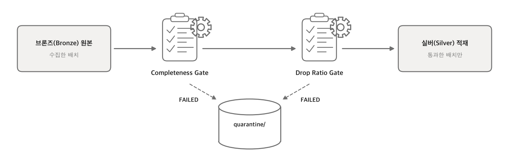

# 데이터 품질을 어떻게 관리할 것인가

## 목차
- [문제 상황](#문제-상황)
- [해결 방법](#해결-방법)
  - [1. 완결성과 폐기율, 두 개의 수치로 품질을 관리합니다.](#1-완결성과-폐기율-두-개의-수치로-품질을-관리합니다)
  - [2. 품질 규칙이 코드가 아니라 YAML에 있습니다.](#2-품질-규칙이-코드가-아니라-yaml에-있습니다)
  - [3. 품질 수치를 조합해 배치의 최종 상태를 정합니다.](#3-품질-수치를-조합해-배치의-최종-상태를-정합니다)
  - [4. 기준을 통과하지 못하면 실버(Silver) 데이터로 쓰지 않습니다.](#4-기준을-통과하지-못하면-실버silver-데이터로-쓰지-않습니다)
  - [5. 버린 데이터와 그 이유(통계)는 반드시 남깁니다.](#5-버린-데이터와-그-이유통계는-반드시-남깁니다)
- [효과](#효과)

## 문제 상황
- 오염되거나 누락된 데이터가 파이프라인에 섞여 들어가면 하위 서비스 전체의 신뢰도가 무너집니다.
> 수집된 데이터가 부분적으로 누락되거나 이상치로 오염되었을 때, 이를 걸러내지 않고 그대로 실버(Silver) 데이터로 흘려보내면 예측 모델이나 대시보드의 결과가 심각하게 왜곡됩니다. 

## 해결 방법

### 1. 완결성과 폐기율, 두 개의 수치로 품질을 관리합니다.

| 구분 | 영문명 | 개념 | 발생 원인 예시 | 측정 목적 |
| :--- | :--- | :--- | :--- | :--- |
| **완결성** | `missing_ratio` | 기대 건수 대비 수집되지 못하고 **누락된 데이터의 비율** | 네트워크 지연, API 서버 장애 | 데이터에 빈 구멍이 얼마나 많은지 파악 |
| **폐기율** | `drop_ratio` | 수집은 되었으나 검증을 통과하지 못해 **버려진 행(Row)의 비율** | 필수 값 누락, 허용 범위 이탈 | 데이터의 정확도(내실)가 얼마나 무너졌는지 파악 |

> **기대 건수는 어떻게 알아내는가?** — 데이터를 본격적으로 수집하기 전, **첫 번째 API 호출을 통해 해당 시간대에 준비된 '총 데이터 건수(Total Count)'를 서버에 먼저 물어보고** 이를 완결성 계산을 위한 척도(기대 건수)로 삼습니다.

### 2. 품질 규칙이 코드가 아니라 YAML에 있습니다.

- **데이터 품질 기준의 선언적 관리** — 각 소스마다 허용할 수 있는 결측률이나 폐기율 기준이 다릅니다. 이를 파이썬 코드에 `if` 문으로 하드코딩하지 않고, YAML 설정 파일의 `quality` 블록에 명시적으로 선언합니다.
  - **설정 예시 (`collector/sources/population_realtime.yaml`)**:
    ```yaml
    quality:
      max_drop_ratio: 0.05      # 행 폐기율이 5%를 초과하면 해당 배치 전체 실패 처리
      max_missing_ratio: 0.15   # 수집된 건수가 예상 건수 대비 15% 이상 누락되면 실패 처리
      allow_empty: false        # 빈 데이터(0건) 수집을 정상으로 인정하지 않음 (0건이면 실패)
    ```

### 3. 품질 수치를 조합해 배치의 최종 상태를 정합니다.

- **다각적 품질 평가** — 단일 수치로만 판단하지 않고, 수집 중 발생한 여러 지표(`missing_ratio`, `drop_ratio`, `allow_empty` 등)를 **종합적으로 조합하여 배치(Batch)의 최종 상태를 결정**합니다. 실제 파이프라인 엔진은 아래의 규칙표에 따라 상태를 부여합니다.

| 발생 조건 (Condition) | 최종 상태 (Status) | 실패 사유 (Failure Reason) | 비고 |
| :--- | :--- | :--- | :--- |
| 결측이나 폐기 없이 100% 완전 수집 | `SUCCEEDED` | - | 가장 이상적인 정상 상태 |
| 누락/폐기가 발생했으나 허용 한계치 이내 | `PARTIAL` | - | 일부 유실은 감수하고 정상(Silver) 데이터로 취급 |
| 데이터 0건 + `allow_empty=true` | `EMPTY` | - | 데이터가 없는 것이 정상인 소스라 빈 채로 통과 |
| 데이터 0건 + `allow_empty=false` | `FAILED` | `quality_gate` | 데이터가 필수인데 0건이라 품질 게이트에서 차단 |
| `drop_ratio` > `max_drop_ratio` | `FAILED` | `quality_gate` | 불량 데이터 비율이 너무 높아 품질 게이트에서 차단 |
| `missing_ratio` > `max_missing_ratio` | `FAILED` | `fetch_error` | 네트워크 통신 중 누락된 비율이 너무 높아 실패 |
| 개별 컬럼 정책에서 `FAIL_BATCH` 반환 | `FAILED` | `quality_gate` | 설정 파일에서 명시한 치명적 결함으로 배치 전체 폐기 |
| 전체 API 서버 장애 및 인증(`FATAL`) 오류 | `FAILED` | `fetch_error` | 외부 요인으로 수집 자체를 완전히 실패 |
| S3 스토리지 저장 실패 | `FAILED` | `storage_error` | 검증은 통과했으나 파일 저장소에 쓰는 데 실패 |

> [!NOTE]
> **실패 사유는 어디에 기록되나요?**
> 판정된 최종 상태(`Status`)와 실패 사유(`Failure Reason`)는 모두 **수집 기록(Manifest)과 시스템 로그에 자동으로 기록**됩니다. 이를 통해 수집 실패 시 복잡한 에러 트레이스를 분석할 필요 없이, 기록만 보고 즉각적인 원인 파악과 대응이 가능합니다.

### 4. 기준을 통과하지 못하면 실버(Silver) 데이터로 쓰지 않습니다.

- **품질 게이트(Quality Gate)** — 종합된 품질 수치가 YAML에 정의된 허용 기준을 하나라도 넘지 못하면(예: `drop_ratio`가 `max_drop_ratio` 초과), 해당 배치는 즉시 `FAILED (quality_gate)` 상태로 전환됩니다.
- 오염되거나 구멍 난 데이터 덩어리가 정제된 실버(Silver) 테이블에 병합되는 것을 품질 게이트가 차단합니다.



### 5. 버린 데이터와 그 이유(통계)는 반드시 남깁니다.

- **격리(Quarantine) 및 수집 기록(Manifest) 보존** — 품질 게이트에서 막혀 실버 테이블 진입에 실패한 데이터라 할지라도 무의미하게 삭제해버리지 않습니다.
- 수집했던 **원천 데이터(Raw)**는 스토리지(S3 등)에 그대로 보관되며, 어떤 품질 기준에 걸려서 버려졌는지(예: 결측치 초과)에 대한 상세한 사유와 수치 통계는 **수집 기록(Manifest)**에 남습니다.
- 이를 통해 장애 발생 시 코드를 뒤지지 않고 설정 파일과 기록만으로 원인을 파악하며, 필요 시 언제든 데이터를 추적하고 복원할 수 있습니다.

# 효과

- **오염된 데이터의 하류 유입 차단**
  - 품질 게이트를 통과한 배치만 실버(Silver) 데이터가 됩니다. 게이트에 걸린 배치는 상태만 `FAILED`로 바뀌는 것이 아니라 **실버 산출물 자체를 만들지 않으므로**, 하위 서비스가 수집 기록을 확인하지 않고 읽더라도 구멍 난 데이터를 집어갈 수 없습니다.
  - 예측 모델과 운영 대시보드가 "이 데이터를 믿어도 되는가"를 매번 되묻지 않고, **실버에 존재한다는 사실 자체를 신뢰의 근거**로 삼을 수 있습니다.

- **소스별 품질 기준을 코드 배포 없이 조율**
  - 소스마다 감당할 수 있는 결손의 성격이 다릅니다. 대여소 재고처럼 한 건도 빠지면 안 되는 소스는 `max_missing_ratio: 0.0`으로, 행사 정보처럼 없는 날이 정상인 소스는 `allow_empty: true`로 각각 다르게 조입니다.
  - 이 차이가 전부 YAML 한 줄이므로, 운영 중 기준을 조정할 때 **파이썬 코드 수정도 재배포도 필요하지 않습니다**. 현재 10개 소스가 같은 판정 엔진을 공유하면서 서로 다른 기준으로 통제되고 있습니다.

- **장애 원인의 자동 분류**
  - 실패 사유를 `fetch_error`와 `quality_gate`로 나눠 남기기 때문에, **"다시 돌리면 되는 장애"와 "설정·정책을 고쳐야 하는 장애"가 기록 시점에 이미 구분**됩니다.
  - `fetch_error`는 외부 API 응답이 덜 온 것이라 재시도로 회복될 여지가 있지만, `quality_gate`는 같은 원천 데이터로 몇 번을 다시 돌려도 결과가 같습니다. 담당자는 이 한 필드만 보고 재시도할지 기준을 손볼지 즉시 판단합니다.

- **질문에 수치로 답할 수 있는 가시성**
  - "오늘 오후 2시 데이터가 왜 비어있지?"라는 질문에, *"해당 시간대 응답에서 필수 컬럼 이상치로 행 폐기율 7%가 발생해, 품질 게이트(기준 5%)가 배치를 격리했습니다"* 라고 **코드를 뒤지지 않고 수집 기록만으로 답할 수 있습니다.**
  - 판정에 쓰인 수치와 원천 데이터가 함께 보존되므로, 기준을 완화한 뒤 그 시점의 데이터를 **당시 상태 그대로 재처리**하는 것도 가능합니다.
