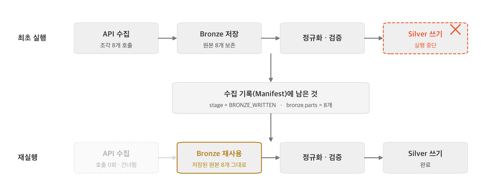

# 파이프라인을 어떻게 정해진 시간 내에 마칠 것인가

## 목차
- [문제 상황](#문제-상황)
- [해결 방법](#해결-방법)
  - [1. 한 번에 여러 개를 동시에 요청합니다](#1-한-번에-여러-개를-동시에-요청합니다)
  - [2. 마감 시간을 정해두고 스스로 멈춥니다](#2-마감-시간을-정해두고-스스로-멈춥니다)
  - [3. 요청 하나가 실패해도 나머지는 계속 받습니다](#3-요청-하나가-실패해도-나머지는-계속-받습니다)
  - [4. 중간에 꺼져도 이미 받은 원본은 다시 받지 않습니다](#4-중간에-꺼져도-이미-받은-원본은-다시-받지-않습니다)
- [효과](#효과)

## 문제 상황

데이터 수집부터 정제, 모델 추론, 긴급도 계산, 최종 재배치 경로 생성까지의 **전체 파이프라인을 5분 이내에 완료**해야 합니다. 외부 공공 API 서버의 응답 지연이나 일시적 장애가 전체 파이프라인의 마감 시간 초과로 이어지지 않도록 수집 단계에서 통제해야 합니다.

## 해결 방법

### 1. 한 번에 여러 개를 동시에 요청합니다 
  > 동시 요청 처리

- **동시 요청 개수 설정** — 수십, 수백 개의 데이터를 하나씩 차례대로 달라고 하면 시간이 너무 오래 걸립니다. 이를 해결하기 위해 설정 파일에 `concurrency`라는 옵션을 두어, 한 번에 4개나 8개씩 동시에 데이터를 요청하고 빠르게 받아옵니다.
  - **설정 예시 (`collector/sources/bike_rental_history.yaml`)**:
    ```yaml
    adapter: seoul_openapi
    adapter_params:
      concurrency: 4  # 한 번에 4개씩 동시에 요청하여 수집 시간을 크게 줄입니다.
    ```

### 2. 마감 시간을 정해두고 스스로 멈춥니다   
  > 제한 시간 방어

- **제한 시간(Time Budget) 두기** — 각 데이터마다 수집에 쓸 수 있는 '최대 허용 시간'이 정해져 있습니다. 외부 서버가 너무 느려져서 이 마감 시간을 넘길 것 같으면, 시스템은 남은 요청을 과감하게 포기하고 스스로 수집을 멈춥니다.
- 이를 통해 수집 단계에서 시간이 지체되어 다음 단계(모델 추론 등)가 5분 마감을 어기는 일이 없도록 막아줍니다.
  - **관련 구현 (`collector/config/schema.py`)**:
    기본적으로 YAML 설정에 명시하지 않아도, **해당 소스 수집 주기의 절반**(예: 5분 주기일 경우 2분 30초)을 최대 허용 시간으로 자동 계산합니다. 필요 시 `fetch.budget` 옵션으로 덮어쓸 수 있습니다.
    ```python
    def effective_fetch_budget(self) -> timedelta:
        """fetch.budget이 없으면 주기의 절반과 30분 중 작은 값을 기본 예산으로 쓴다."""
        if self.fetch and self.fetch.budget:
            return self.fetch.budget
        return min(self.schedule.interval / 2, timedelta(minutes=30))
    ```

### 3. 요청 하나가 실패해도 나머지는 계속 받습니다 
  > 부분 성공과 에러 분류

- **일부 실패가 전체 실패로 이어지지 않게 막습니다** — 특정 구역의 데이터를 가져오다 에러가 나더라도 전체 수집 프로세스가 멈추지 않습니다. 조각 하나가 실패했다고 해서 시스템을 바로 멈춰버리면 그나마 받을 수 있었던 나머지 데이터까지 전부 날아가기 때문입니다. 대신 에러가 발생하면 예외를 던지는 대신, 어떤 에러인지 '종류'만 분류해서 넘깁니다.

| 범주 | 해당하는 상황 | 대처 |
| :--- | :--- | :--- |
| **`일시적 에러 (TRANSIENT)`** | 서버 응답 지연, 일시적 접속 폭주 | 잠깐 기다렸다가 **다음 차례에 다시 시도**합니다. |
| **`영구적 에러 (PERMANENT)`** | 잘못된 주소, 없는 데이터 요청 | 다시 시도해도 안 되므로 **그 부분만 포기**하고 나머지는 마저 받습니다. |
| **`치명적 에러 (FATAL)`** | 인증키 만료, 권한 없음 | 전체가 다 실패할 게 뻔하므로 **수집을 즉시 중단**합니다. |

- **재시도는 실패한 것만, 정해진 횟수만큼 제한합니다** 
  - **횟수 및 간격**: 무한정 붙잡고 있지 않고 최대 3번까지만, 15초/30초 간격을 두고 재시도합니다.
  - **재시도 대상 필터링**: 이미 성공한 데이터나 어차피 다시 해도 안 될 '영구적 에러'는 즉시 제외합니다.
  - **효율적인 재시도**: 안 될 요청에 계속 매달리지 않고 **'일시적 에러'가 난 요청만 다시 시도**하므로, 불필요한 대기 시간 없이 전체 수집 지연을 막을 수 있습니다.

- **에러 규격 통일** — 제공처(서울시, 기상청 등)마다 에러를 반환하는 규격이 서로 다릅니다. 심지어 정상(HTTP 200) 응답을 반환하면서 본문에 에러 코드를 포함하는 경우도 있습니다. 어댑터는 이러한 각기 다른 에러 형태를 파싱하여, 앞서 정의한 3가지 공통 범주(TRANSIENT, PERMANANT, FATAL) 중 하나로 번역해 수집 엔진에 전달합니다.

- **개별 실패를 파이프라인 중단 대신 누락 지표로 처리** — 재시도 후에도 끝내 수집하지 못한 데이터는 에러를 발생시켜 프로세스를 멈추는 대신, 해당 배치의 **누락률(`missing_ratio`) 지표로 합산**됩니다. 합산된 누락률의 허용 여부는 다음 단계인 품질 검증(Quality Gate)에서 최종 판정합니다. 단, 전체 수집 불가 상태를 의미하는 '치명적 에러(FATAL)' 발생 시에는 예외적으로 즉시 수집을 중단합니다.

### 4. 중간에 꺼져도 이미 받은 원본은 다시 받지 않습니다 
  > 원본 데이터(Bronze) 재사용

- **받아둔 원본(Bronze) 유지** — 수집을 하다가 서버가 갑자기 꺼지거나 예상치 못한 문제로 시스템이 죽더라도, 이미 통신에 성공해서 저장해 둔 원본 데이터(Bronze) 조각들은 남아있습니다.
- **죽은 지점부터 재개** — 다시 수집을 시작할 때 처음부터 다시 요청하지 않습니다. 수집 기록에 남은 진행 단계를 확인해서, 원본을 이미 받아둔 실행이라면 **통신 요청을 하지 않고 저장된 원본을 그대로 읽어** 정규화·검증부터 이어갑니다. 이미 끝까지 완결된 시간대라면 아예 아무 일도 하지 않고 건너뜁니다.




# 효과

- **외부 서버 상태와 무관하게 5분 주기를 지킵니다**
  - 수집에 쓸 수 있는 시간이 애초에 정해져 있습니다. 따로 지정하지 않으면 수집 주기의 절반(5분 주기라면 2분 30초)을 넘기지 않고, 그 안에서 받을 수 있는 만큼만 받은 뒤 다음 단계로 넘깁니다. 외부 서버가 느려질 때 밀리는 것은 수집의 완성도이지 **파이프라인의 마감 시간이 아닙니다.**
  - 동시 요청은 그 제한 시간 안에 받아낼 수 있는 양 자체를 늘립니다. 기상청 단기예보는 하나씩 순차로 받으면 50.89초가 걸렸지만(실측), 4개씩 동시에 요청하도록 바꿔 크게 줄였습니다.

- **한 번의 실패가 전체 수집을 무너뜨리지 않습니다**
  - 조각 하나의 실패는 그 조각의 문제로 끝납니다. 에러를 세 범주로 나눠 다시 시도할 것과 즉시 포기할 것을 가르고, 끝내 받지 못한 것은 누락률이라는 **하나의 숫자로 합산**해 넘깁니다.
  - 덕분에 수집 결과가 '성공 아니면 실패'라는 이분법에서 벗어나 **'얼마나 받았는가'라는 정도의 문제**가 되고, 그 정도가 쓸 만한지는 다음 단계인 품질 검증이 판정합니다.

- **재시도 비용을 낮춥니다**
  - 실패한 실행을 다시 돌려도 이미 받아둔 원본은 다시 요청하지 않습니다. 통신 없이 저장된 원본을 읽어 중단된 지점부터 이어가므로, **재시도 비용이 최초 수집과 같지 않습니다.**


- **부하 조절이 코드가 아니라 설정입니다**
  - 동시 요청 개수와 제한 시간은 소스별 설정 파일 값입니다. 특정 기관의 서버가 느려지거나 호출 제한이 강해지면, **코드를 고치고 다시 배포할 필요 없이 그 소스의 숫자만 조입니다.**
