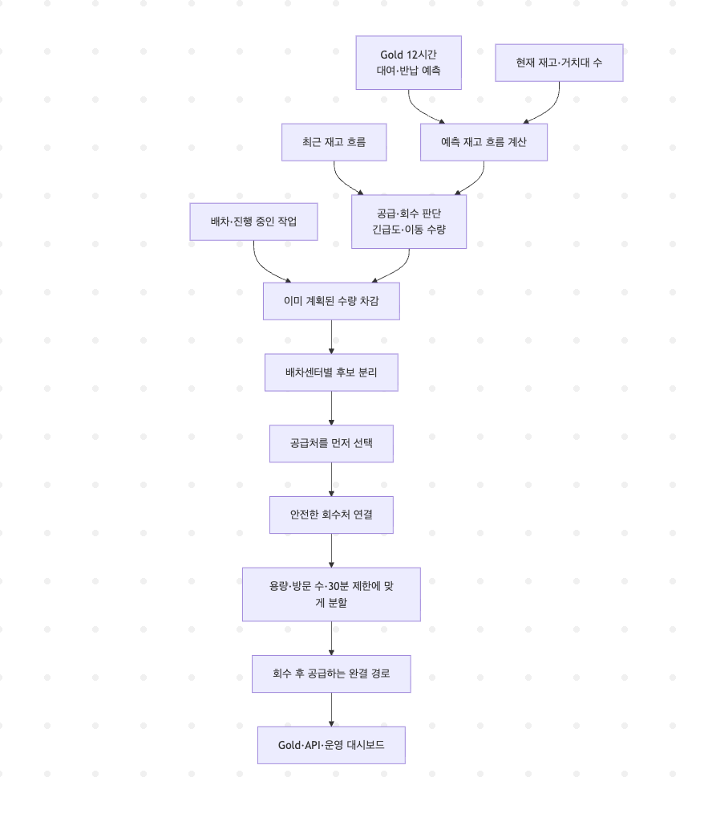

# 예측을 어떻게 실행 가능한 재배치 작업으로 바꿀 것인가

## 목차

- [문제 상황](#문제-상황)
- [해결 방법](#해결-방법)
  - [1. 12시간 예측을 운영 판단으로 바꿉니다](#1-12시간-예측을-운영-판단으로-바꿉니다)
  - [2. 점수와 실제 이동 수량을 분리합니다](#2-점수와-실제-이동-수량을-분리합니다)
  - [3. 트럭이 실행할 수 있는 완결 작업만 만듭니다](#3-트럭이-실행할-수-있는-완결-작업만-만듭니다)
  - [4. 진행 중인 작업을 다음 계산에 반영합니다](#4-진행-중인-작업을-다음-계산에-반영합니다)
- [설계를 어떻게 검증했는가](#설계를-어떻게-검증했는가)
  - [백테스트 결과](#백테스트-결과)
  - [해석 범위](#해석-범위)

## 문제 상황

- 수요를 예측하는 것만으로는 자전거를 옮길 수 없으므로, **지금 몇 대를 어디서 가져와 어디로 옮길지**까지 실행 가능한 작업으로 바꿔야 합니다.

## 해결 방법

이 프로젝트의 최종 결과는 대여소별 예측값이나 긴급도 점수에서 끝나지 않습니다. 향후 12시간의 대여·반납을 예측하고, 그중 2시간 보호 구간과 현재 재고로 이동 수량을 정합니다. 이후 진행 중인 작업을 제외하고 실제 트럭이 수행할 수 있는 회수·공급 경로를 만들어 Gold와 운영 화면에 게시합니다.



**AI 추론 결과 테이블 (예시: 12시 정각 기준)**

| 대상 시간대 | 대여소 | 예측 종류 | 최소 예측 (P10) | 평균 예측 (P50) | 최대 예측 (P90) |
| :--- | :--- | :--- | ---: | ---: | ---: |
| **+1시간** (12:00~13:00) | ST-2000 | 대여 (나감) | 5대 | **12대** | 20대 |
| **+1시간** (12:00~13:00) | ST-2000 | 반납 (들어옴) | 3대 | **8대** | 15대 |
| **+2시간** (13:00~14:00) | ST-2000 | 대여 (나감) | 7대 | **15대** | 25대 |
| **+2시간** (13:00~14:00) | ST-2000 | 반납 (들어옴) | 4대 | **10대** | 18대 |
| ... | ... | ... | ... | ... | ... |
| **+12시간** (23:00~00:00) | ST-2000 | 대여 (나감) | 0대 | **2대** | 5대 |
| **+12시간** (23:00~00:00) | ST-2000 | 반납 (들어옴) | 0대 | **1대** | 3대 |

이 모델 예측값을 바탕으로 시스템은 재고 흐름을 시뮬레이션하여 운영 판단을 내립니다.

### 1. 12시간 예측을 운영 판단으로 바꿉니다

모델이 게시한 값은 대여소별 향후 12시간의 대여·반납 건수입니다. 여기에 현재 재고를 더해 시간대별 예상 재고 흐름을 만들고, 정원의 20% 이하로 내려가면 `supply_needed`, 정원 이상으로 올라가면 `retrieval_needed`로 판단합니다.

이 판단을 바탕으로 트럭을 보낼 우선순위인 **긴급도 점수(Urgency Score)**를 계산합니다.

#### 🎯 긴급도 점수(Urgency Score)의 최종 공식
> **긴급도 점수 = ① 시급성(시간 가중치) × ② 심각도(규모)**

**① 시급성(시간 가중치)**
- **재고 흐름 시뮬레이션**: `(현재 재고) - (예측 대여) + (예측 반납)`을 12시간 뒤까지 계산합니다.
- **최초 위험 도달 시간 탐색**: 시뮬레이션 중 최초로 정원의 20% 이하가 되거나 정원을 초과하는 시간을 찾습니다.
- **가중치 부여**:
  - **30분 이내**에 도달 시: 초비상 상태로 간주하여 가중치 최고점을 부여합니다.
  - **그 이후**: 위험까지 남은 시간이 60분 늘어날 때마다 가중치를 절반으로 낮춥니다.

**② 심각도(규모)**
- 똑같이 30분 뒤에 바닥나더라도, 정원이 10대인 작은 대여소보다 정원이 50대인 대형 대여소가 비는 것이 피해가 큽니다.
- 따라서 정원 대비 부족/초과 규모를 계산하여 시급성에 곱해줍니다.

이렇게 "얼마나 빨리 위험해지나(시간) × 얼마나 심각하게 위험해지나(규모)" 두 가지를 합쳐 점수를 매기고, 가장 점수가 높은 곳부터 트럭을 출동시킵니다.

이 단계에서 각 대여소는 다음 세 값을 갖습니다.

- `rebalance_need_type_cd`: 공급 필요, 회수 필요, 정상 중 운영 판단
- `critical_remaining_min`: 위험 상태까지 남은 시간
- `urgency_score`: 같은 판단 안에서 처리 순서를 정하는 점수

### 2. 점수와 실제 이동 수량을 분리합니다

긴급도 점수는 트럭이 **'어디로 먼저 갈지(방문 순서)'**를 정할 뿐이며, 실제로 **'몇 대를 옮길지(이동 수량)'**는 현장의 빈 공간과 실물 자전거 수량에 맞춰 안전하게 따로 계산됩니다.

**AI는 12시간을 예측하지만, 트럭은 당장 '2시간'만 책임집니다**
이 시스템은 5분마다 계속 새롭게 돌면서 기사님에게 최신 경로를 다시 알려줍니다. 따라서 12시간 치 물량을 한 번에 무리해서 옮길 필요 없이, 정책이 정한 **2시간 보호 구간** 동안 바닥나거나 꽉 차지 않을 만큼의 최소 수량만 옮깁니다.

**공급과 회수의 철저한 분리 원칙**
- **채워줄 때 (공급)**: 2시간 내에 재고가 정원의 20% 밑으로 떨어지지 않을 만큼 채워줍니다. 단, **아무리 급해도 현재 눈앞에 비어있는 거치대 공간보다 많이 쑤셔 넣을 수는 없습니다.**
- **가져올 때 (회수)**: 남는 대여소에서 자전거를 뺏어올 때는 멀쩡한 대여소를 빈털터리로 만들지 않기 위해 훨씬 깐깐하고 보수적인 3대 원칙을 따릅니다.
  1. **현재 눈앞에 넘치는 것만**: AI가 미래에 들어올 것이라고 예측한 가상의 자전거는 무시하고, 오직 **현재 거치대를 초과해서 쌓여있는 실물 자전거**만 가져옵니다.
  2. **미래에도 계속 넘칠 곳만**: 트럭 출동 시간(30분 뒤)부터 2시간 보호 구간이 끝날 때까지 쭈욱 정원을 초과할 것으로 넉넉하게 예상되는 곳에서만 빼옵니다.
  3. **현재 재고를 넘지 않음**: 아무리 뺏어오더라도 현재 눈앞에 있는 재고량보다 많이 가져오겠다고 계획을 잡지 않습니다.

### 3. 트럭이 실행할 수 있는 완결 작업만 만듭니다

현장에 단순한 '부족/초과 대여소 목록'만 던져주는 것이 아니라, **'가장 시급하게 공급이 필요한 곳'을 먼저 고른 뒤 '어디서 자전거를 빼와서 채울지'를 짝지어주는 완성된 이동 경로(동선)**를 기사님께 바로 제공합니다.

1. **담당 구역 묶기**: 모든 대여소를 담당 배차센터(출발지)별로 그룹 지어줍니다.
2. **핵심 목적지 선정**: "가장 공급이 급한 1등 대여소"를 이번 운행의 메인 목적지로 콕 찍습니다.
3. **최적의 수거 장소 찾기**: 배차센터에서 출발해 메인 목적지로 가는 길목에 있으면서, 자전거가 남아도는 곳을 수거 장소(회수처)로 고릅니다.
4. **배달 동선 잇기**: 수거를 마친 트럭이 메인 목적지에 가장 먼저 들른 후, 동선상에 있는 다른 급한 곳들에도 자전거를 배분하도록 경로를 긋습니다.
5. **현실에 맞게 쪼개기**: 가장 자전거를 많이 옮길 수 있는 알짜 동선을 최종 선택하되, 한 번의 운행 시간이 30분을 넘기지 않도록 경로를 적절히 쪼개줍니다.

단, 위 과정을 거쳐 짠 경로라도 **다음 6가지 절대 규칙**을 하나라도 어기면 즉시 폐기하고 기사님께 보내지 않습니다.

- **빈 차로 출발**: 트럭은 반드시 센터에서 빈 차로 출발해 자전거를 먼저 싣고(수거), 그다음에 내려놓습니다(공급).
- **수량 일치**: 거둬들인 자전거 개수와 내려놓은 자전거 개수가 정확히 같아야 합니다.
- **트럭 용량 엄수**: 트럭 짐칸에는 자전거가 최대 20대까지만 들어갑니다. (항상 0~20대 유지)
- **최대 5곳 방문**: 기사님 피로도를 고려해 한 번의 경로로 방문하는 대여소는 5곳을 넘지 않습니다.
- **배차 건수 제한**: 5분 단위 스케줄이 돌 때마다, 각 센터당 최대 3개의 경로만 새로 내려보냅니다.
- **30분 수거 타임아웃**: 센터에서 출발해 **'마지막으로 자전거를 수거하는 시간'이 30분을 넘기면 안 됩니다.**

*(※ 왜 전체 배달 시간이 아니라 '마지막 수거 시간'만 30분으로 깐깐하게 제한할까요? 수거 지점에 너무 늦게 도착하면, 그사이에 다른 시민이 자전거를 빌려 가버려서 막상 기사님이 도착했을 때 허탕을 칠 수 있기 때문입니다. 트럭 이동 속도(시속 20km)와 상하차 시간(곳당 3분)을 계산해 이 30분 제한을 지킵니다.)*

### 4. 진행 중인 작업을 다음 계산에 반영합니다

시스템이 5분마다 계속 새 경로를 짜다 보면, **"어? 저기 자전거 남네? 가져와야지!" 하고 이미 기사님이 출동한 대여소에 또 다른 기사님을 중복해서 보내는 헛걸음**이 발생할 수 있습니다. 이를 막기 위해 다음 4가지 룰을 적용합니다.

- 한 번의 계획 안에서는 같은 회수 대여소를 여러 경로가 나눠 사용하지 않습니다.
- 이미 배차된 경로가 회수할 대여소는 새 후보에서 제외합니다.
- 완료된 뒤에도 120분 동안 같은 대여소에서 다시 회수하지 않습니다.
- 새 계산은 `proposed` 경로만 교체하고, 이미 배차·완료·취소된 경로와 방문 순서는 보존합니다.

운영자가 관제 대시보드에서 완료 버튼을 누르면, 이 기록들이 다음 5분 계산에 곧바로 들어가서 기사님들의 중복 출동을 막아주게 됩니다.

## 설계를 어떻게 검증했는가

여기까지는 5분마다 실행되는 운영 파이프라인의 설계입니다. 아래 내용은 파이프라인의 다음 단계가 아니라, 이 설계가 실제로 품절 시간을 줄이는지 과거 데이터로 확인한 오프라인 백테스트입니다.

대여이력과 실측 재고에는 서울시가 이미 수행한 재배치 결과도 섞여 있습니다. 그래서 시민의 대여·반납만으로 설명되지 않는 재고 변화를 기존 운영의 개입량으로 역산했습니다.

```text
기존 운영 개입량 = 다음 실측 재고 - (현재 실측 재고 - 시민 대여 + 시민 반납)
```

같은 시작 재고와 관측 요청 위에서 `추정한 기존 운영`, `평가 시작 이후 재배치 없음`, `우리 정책`을 각각 재생했습니다. 기존 운영의 정확한 작업 시각은 알 수 없어 구간의 시작·중간·끝에 작업했다고 가정한 범위로 비교했으며, 우리 정책에는 본문과 같은 트럭·용량·시간 제약을 적용했습니다.

### 백테스트 결과

**우리 정책은 과거 서울시의 기존 운영 방식(추정치)보다 38%나 적은 수량(399대)을 옮기고도, 대여소에 자전거가 텅 비어있는 '품절 시간'을 13.2% 더 줄이는 높은 효율을 달성했습니다.**

고정 배포 검증 10개 구간의 180분 결과를 같은 기준으로 비교하면 다음과 같습니다.

| 재생한 운영 | 비교 이동량 | 품절 대여소-분 | 재배치 없음 대비 |
| :--- | ---: | ---: | ---: |
| 재배치 없음 `no_rebalance` | 0대 | 52,593.8분 | 기준 |
| 추정한 서울시 기존 운영 | 644대 | 51,682.7~52,655.4분 | 0.1% 악화~1.7% 개선 |
| 우리 정책 | 399대 | 45,671.3분 | 13.162% 개선 |

기존 운영의 644대는 실제 차량 기록이 아니라, 시민의 대여·반납만으로 설명되지 않는 재고 변화에서 유입과 유출이 짝을 이루는 수량을 합산한 추정치입니다. 정확한 작업 시각도 알 수 없으므로 개입이 각 구간의 시작·중간·끝에 일어났다고 재생해 품절 시간을 범위로 계산했습니다.

같은 10개 구간에서 관측된 대여 요청 13,369건을 재생했을 때 미충족 요청도 59건에서 47건으로 줄었습니다. 정책 선택에 사용하지 않은 독립 검증 12개 구간에서도 19,740건을 재생한 결과, 미충족 요청은 131건에서 107건으로 줄고 품절 대여소-분은 50,116.3분에서 43,572.0분으로 13.058% 감소했습니다.

2026년 8월 25일 실시간 파이프라인에서도 33개 경로와 총 382대의 완결 이동 계획이 Gold와 운영 화면까지 게시됐습니다. 이 값은 정책 효과를 추가로 증명하는 수치가 아니라, 예측 결과가 실제 서비스 경로까지 연결된 것을 확인한 운영 기록입니다.

### 해석 범위

공개 대여이력에는 자전거가 없어서 시도하지 못한 잠재 수요가 없고, 실제 운영 차량의 경로·작업 시각도 없습니다. 따라서 기존 운영의 순개입량과 종료 재고는 재현할 수 있지만, 정확한 품절 시간은 시작·중간·끝 가정에 따른 범위로만 비교할 수 있습니다. 또한 위 수치는 고정된 과거 데이터를 재생한 **백테스트 결과**이므로, 서울시 기존 운영보다 실제 시민의 전체 수요를 일정 비율 더 충족했다고 해석할 수 없습니다.

이 문서의 수치와 평가 조건은 [재배치 시스템 point-in-time 백테스트](../ml/REBALANCING_BACKTEST.md), 게시 구조와 API 연결은 [Collector부터 Gold와 API까지의 매핑](../gold/source-target-mapping.md)에서 확인할 수 있습니다.
