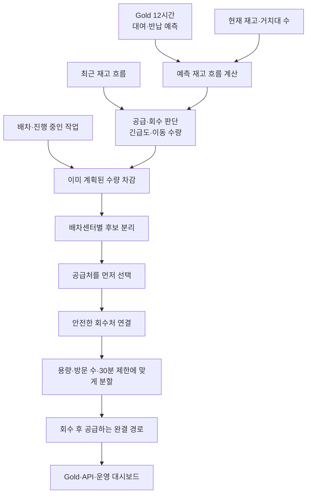

# 예측을 어떻게 실행 가능한 재배치 작업으로 바꿀 것인가

## 목차

- [문제 상황](#문제-상황)
- [해결 방법](#해결-방법)
  - [1. 12시간 예측을 운영 판단으로 바꿉니다](#1-12시간-예측을-운영-판단으로-바꿉니다)
  - [2. 점수와 실제 이동 수량을 분리합니다](#2-점수와-실제-이동-수량을-분리합니다)
  - [3. 트럭이 실행할 수 있는 완결 작업만 만듭니다](#3-트럭이-실행할-수-있는-완결-작업만-만듭니다)
  - [4. 진행 중인 작업을 다음 계산에 반영합니다](#4-진행-중인-작업을-다음-계산에-반영합니다)
- [설계를 어떻게 검증했는가](#설계를-어떻게-검증했는가)
  - [백테스트 결과](#백테스트-결과)
  - [해석 범위](#해석-범위)

## 문제 상황

- 수요를 예측하는 것만으로는 자전거를 옮길 수 없으므로, **지금 몇 대를 어디서 가져와 어디로 옮길지**까지 실행 가능한 작업으로 바꿔야 합니다.

## 해결 방법

이 프로젝트의 최종 결과는 대여소별 예측값이나 긴급도 점수에서 끝나지 않습니다. 향후 12시간의 대여·반납을 예측하고, 그중 2시간 보호 구간과 현재 재고로 이동 수량을 정합니다. 이후 진행 중인 작업을 제외하고 실제 트럭이 수행할 수 있는 회수·공급 경로를 만들어 Gold와 운영 화면에 게시합니다.



### 1. 12시간 예측을 운영 판단으로 바꿉니다

모델이 게시한 값은 대여소별 향후 12시간의 대여·반납 건수입니다. 여기에 현재 재고를 더해 시간대별 예상 재고 흐름을 만들고, 정원의 20% 이하로 내려가면 `supply_needed`, 정원 이상으로 올라가면 `retrieval_needed`로 판단합니다.

12시간 예측 전체에서는 위험 상태에 처음 도달하는 시각을 찾습니다. 예측이 시작되기 전 1시간은 최근 재고 흐름으로 보완합니다.

`urgency_score`는 모델이 직접 예측한 값이 아니라, 예측 결과를 운영 순서로 바꾼 점수입니다.

```text
긴급도 점수 = 위험까지 남은 시간의 시급성 × 정원 대비 부족·초과 규모
```

트럭 도착시간인 30분 안에 위험해지는 경우는 시간 가중치를 가장 높게 두고, 이후에는 위험까지 남은 시간이 60분 늘어날 때마다 시간 가중치를 절반으로 낮춥니다. 부족·초과량은 대여소 정원 대비 비율로 계산하므로 정원이 다른 대여소도 같은 기준으로 비교할 수 있습니다.

이 단계에서 각 대여소는 다음 세 값을 갖습니다.

- `rebalance_need_type_cd`: 공급 필요, 회수 필요, 정상 중 운영 판단
- `critical_remaining_min`: 위험 상태까지 남은 시간
- `urgency_score`: 같은 판단 안에서 처리 순서를 정하는 점수

### 2. 점수와 실제 이동 수량을 분리합니다

긴급도 점수는 **어느 대여소를 먼저 처리할지** 정하는 값이고, `bike_qty`는 **이번 실행에서 실제로 옮길 수 있는 수량**입니다. 점수가 높아도 안전하게 가져올 자전거가 없으면 이동량은 0이 될 수 있습니다.

실제 이동 수량 `bike_qty`는 12시간 전체를 한 번에 채우는 값이 아닙니다. 다음 5분 실행에서 사용할 수 있도록 정책이 정한 **2시간 보호 구간**을 기준으로 계산합니다.

공급이 필요한 대여소는 2시간 평균 예측 재고의 최저점이 정원의 20% 아래로 내려가지 않도록 필요한 수량을 계산합니다. 다만 현재 빈 거치 공간보다 많이 보내지는 않습니다.

회수 대여소는 더 보수적으로 정합니다.

- 현재도 정원을 초과한 수량만 회수 후보가 됩니다.
- 2시간 보호 구간과 출동시간 30분 뒤까지 보수적으로 계산해도 정원을 채우고 남아야 합니다.
- 현재 재고보다 많이 가져오지 않습니다.

미래 반납량만 믿고 아직 들어오지 않은 자전거를 미리 회수량으로 잡지 않기 위한 기준입니다.

### 3. 트럭이 실행할 수 있는 완결 작업만 만듭니다

회수 후보와 공급 후보를 따로 보여주는 데서 끝나면 현장에서는 다시 경로를 만들어야 합니다. 이 프로젝트는 **공급이 가장 시급한 대여소를 먼저 정하고, 그곳을 채울 수 있는 회수처를 연결하는 방식**으로 경로를 계산합니다.

1. 대여소를 소속 배차센터별로 나눕니다.
2. 공급 후보 중 긴급도가 가장 높은 대여소를 이번 경로의 기준점으로 잡습니다.
3. `센터 → 회수처 → 공급처`의 이동거리와 긴급도를 함께 고려해 회수처를 고릅니다.
4. 회수를 모두 마친 뒤 기준 공급처를 먼저 방문하고, 남은 공급처는 긴급도와 이동거리를 고려해 연결합니다.
5. 가능한 조합 중 실제 이동량이 가장 큰 완결 작업을 선택합니다. 큰 작업이 30분 회수 제한을 넘으면 실행 가능한 더 작은 작업으로 나눕니다.

이 과정에서 다음 조건을 하나라도 만족하지 못하면 `proposed` 경로로 게시하지 않습니다.

- 트럭은 배차센터에서 빈 상태로 출발해 회수한 뒤 공급합니다.
- 한 경로의 회수량 합계와 공급량 합계가 정확히 같습니다.
- 이동 중 적재량은 항상 0~20대입니다.
- 한 경로는 최대 5개 대여소를 방문합니다.
- 센터별로 한 번의 5분 실행에서 최대 3개 경로를 만듭니다.
- 마지막 회수 작업은 배차 후 30분 안에 실행할 수 있어야 합니다.

30분 기준은 직선거리 기준 시속 20km와 대여소당 작업시간 3분을 적용한 계획 제약입니다. 경로 전체의 종료 시간이 아니라, 아직 실제로 들어오지 않은 자전거를 회수 가능 수량으로 오래 잡아두지 않도록 **마지막 회수 작업까지의 시간**을 제한합니다.

### 4. 진행 중인 작업을 다음 계산에 반영합니다

5분마다 새 경로를 만들면 아직 끝나지 않은 작업과 같은 자전거를 다시 계획할 수 있습니다. 이를 막기 위해 다음 실행은 진행 중인 경로의 이동량을 현재 계획에서 차감합니다.

- 한 번의 계획 안에서는 같은 회수 대여소를 여러 경로가 나눠 사용하지 않습니다.
- 이미 배차된 경로가 회수할 대여소는 새 후보에서 제외합니다.
- 완료된 뒤에도 120분 동안 같은 대여소에서 다시 회수하지 않습니다.
- 새 계산은 `proposed` 경로만 교체하고, 이미 배차·완료·취소된 경로와 방문 순서는 보존합니다.

운영자는 `GET /routes`에서 작업을 확인하고 상태 변경 API로 배차·완료·취소를 기록합니다. 배차된 작업과 최근 완료된 회수 작업은 다음 5분 계획의 중복 방지 입력으로 다시 사용됩니다.

## 설계를 어떻게 검증했는가

여기까지는 5분마다 실행되는 운영 파이프라인의 설계입니다. 아래 내용은 파이프라인의 다음 단계가 아니라, 이 설계가 실제로 품절 시간을 줄이는지 과거 데이터로 확인한 오프라인 백테스트입니다.

대여이력과 실측 재고에는 서울시가 이미 수행한 재배치 결과도 섞여 있습니다. 그래서 시민의 대여·반납만으로 설명되지 않는 재고 변화를 기존 운영의 개입량으로 역산했습니다.

```text
기존 운영 개입량 = 다음 실측 재고 - (현재 실측 재고 - 시민 대여 + 시민 반납)
```

같은 시작 재고와 관측 요청 위에서 `추정한 기존 운영`, `평가 시작 이후 재배치 없음`, `우리 정책`을 각각 재생했습니다. 기존 운영의 정확한 작업 시각은 알 수 없어 구간의 시작·중간·끝에 작업했다고 가정한 범위로 비교했으며, 우리 정책에는 본문과 같은 트럭·용량·시간 제약을 적용했습니다.

### 백테스트 결과

**우리 정책은 재고 잔차로 역산한 기존 운영의 균형 이동량보다 38% 적은 399대를 옮기고, 재배치가 없을 때보다 품절 시간을 13.2% 줄였습니다.**

고정 배포 검증 10개 구간의 180분 결과를 같은 기준으로 비교하면 다음과 같습니다.

| 재생한 운영 | 비교 이동량 | 품절 대여소-분 | 재배치 없음 대비 |
| :--- | ---: | ---: | ---: |
| 재배치 없음 `no_rebalance` | 0대 | 52,593.8분 | 기준 |
| 추정한 서울시 기존 운영 | 644대 | 51,682.7~52,655.4분 | 0.1% 악화~1.7% 개선 |
| 우리 정책 | 399대 | 45,671.3분 | 13.162% 개선 |

기존 운영의 644대는 실제 차량 기록이 아니라, 시민의 대여·반납만으로 설명되지 않는 재고 변화에서 유입과 유출이 짝을 이루는 수량을 합산한 추정치입니다. 정확한 작업 시각도 알 수 없으므로 개입이 각 구간의 시작·중간·끝에 일어났다고 재생해 품절 시간을 범위로 계산했습니다.

같은 10개 구간에서 관측된 대여 요청 13,369건을 재생했을 때 미충족 요청도 59건에서 47건으로 줄었습니다. 정책 선택에 사용하지 않은 독립 검증 12개 구간에서도 19,740건을 재생한 결과, 미충족 요청은 131건에서 107건으로 줄고 품절 대여소-분은 50,116.3분에서 43,572.0분으로 13.058% 감소했습니다.

2026년 8월 25일 실시간 파이프라인에서도 33개 경로와 총 382대의 완결 이동 계획이 Gold와 운영 화면까지 게시됐습니다. 이 값은 정책 효과를 추가로 증명하는 수치가 아니라, 예측 결과가 실제 서비스 경로까지 연결된 것을 확인한 운영 기록입니다.

### 해석 범위

공개 대여이력에는 자전거가 없어서 시도하지 못한 잠재 수요가 없고, 실제 운영 차량의 경로·작업 시각도 없습니다. 따라서 기존 운영의 순개입량과 종료 재고는 재현할 수 있지만, 정확한 품절 시간은 시작·중간·끝 가정에 따른 범위로만 비교할 수 있습니다. 또한 위 수치는 고정된 과거 데이터를 재생한 **백테스트 결과**이므로, 서울시 기존 운영보다 실제 시민의 전체 수요를 일정 비율 더 충족했다고 해석할 수 없습니다.

이 문서의 수치와 평가 조건은 [재배치 시스템 point-in-time 백테스트](../ml/REBALANCING_BACKTEST.md), 게시 구조와 API 연결은 [Collector부터 Gold와 API까지의 매핑](../gold/source-target-mapping.md)에서 확인할 수 있습니다.
