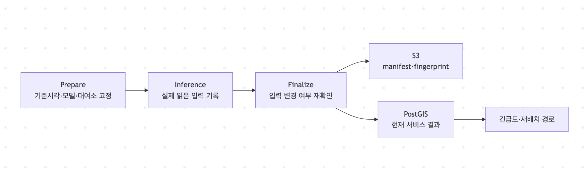

# 갱신 주기가 다른 데이터를 어떻게 한 시점의 결과로 게시할 것인가

## 목차

- [문제 상황](#문제-상황)
- [해결 방법](#해결-방법)
  - [Gold는 RDS만을 뜻하지 않습니다](#gold는-rds만을-뜻하지-않습니다)
  - [1. 계산에 사용할 입력을 실행 중에 바꾸지 않습니다](#1-계산에-사용할-입력을-실행-중에-바꾸지-않습니다)
  - [2. 게시 직전에 입력이 그대로인지 다시 확인합니다](#2-게시-직전에-입력이-그대로인지-다시-확인합니다)
  - [3. 같은 시점의 결과를 한 번에 게시합니다](#3-같은-시점의-결과를-한-번에-게시합니다)
  - [4. 재실행 결과를 구분합니다](#4-재실행-결과를-구분합니다)
- [효과](#효과)
- [저장 비용보다 정합성을 먼저 선택했습니다](#저장-비용보다-정합성을-먼저-선택했습니다)

## 문제 상황

- 재고는 5분마다 바뀌지만 날씨·기준정보·모델은 서로 다른 주기로 갱신되므로, 처리 중 최신값이 바뀌면 **서로 다른 시점의 데이터가 한 화면에 섞일 수 있습니다.**

예를 들어 추론을 시작할 때 선택한 대여소 목록과 게시할 때의 최신 대여소 목록이 다르면, 재고는 새 기준이고 예측은 이전 기준인 결과가 만들어질 수 있습니다. 모델이 실행 중 교체되는 경우에도 대여와 반납 예측이 서로 다른 모델 조합으로 계산될 수 있습니다.

## 해결 방법

### Gold는 RDS만을 뜻하지 않습니다

이 프로젝트에서 Gold publication은 검증된 결과를 서비스에 공개하는 **하나의 게시 단위**입니다. 저장 위치는 역할에 따라 나뉩니다.

| 저장 위치 | 보관하는 것 | 역할 |
| :--- | :--- | :--- |
| S3 | 사용한 입력, 계산 결과, fingerprint, publication manifest | 어떤 입력으로 만들었는지 재현하는 변경 불가 근거 |
| PostGIS/RDS | 대여소·재고·예측·날씨·긴급도·경로의 현재 결과 | API와 운영 화면이 빠르게 조회하는 현재 상태 |

따라서 Gold를 “RDS에 넣은 최신 행”으로만 보지 않습니다. S3의 게시 근거와 PostGIS의 현재 결과가 함께 맞아야 하나의 정상 publication입니다.

### 1. 계산에 사용할 입력을 실행 중에 바꾸지 않습니다

5분 실행은 먼저 `prepare` 단계에서 기준시각, 사용할 모델 버전, 대여소 기준정보를 URI와 SHA-256으로 고정합니다. 계산(추론) 도중에 "방금 업데이트된 최신 버전"으로 교체하는 것을 금지하며, 처음 시작할 때 고른 파일만 끝까지 사용합니다.

대여이력·생활인구·날씨처럼 추론 도중 선택하는 실제 입력도 읽은 파일의 URI와 SHA-256을 inference manifest에 기록합니다. 결과만 남기는 것이 아니라, 결과를 결정한 입력과 모델을 함께 남깁니다.

### 2. 게시 직전에 입력이 그대로인지 다시 확인합니다

파일을 준비할 때만 확인하면 그 뒤 기준정보나 선행 publication이 바뀔 수 있습니다. Finalize는 DB lock 안에서 준비 단계가 고정한 dependency와 현재 `publication_state`를 다시 비교합니다.

- 입력 URI의 실제 bytes가 기록한 SHA-256과 같은지 확인합니다.
- 선행 publication의 기준시각·수정 번호·fingerprint가 그대로인지 확인합니다.
- 준비 이후 대여소 기준정보나 서비스 대상이 바뀌었으면 새 값을 섞지 않고 실패합니다.
- 입력 manifest와 그 안의 fingerprint까지 실제 bytes를 따라가며 확인합니다.

이 실패는 정상적인 방어입니다. 바뀐 입력을 기준으로 `prepare`부터 새로 실행해야 하며, 이전 값과 새 값을 임의로 조합해 게시하지 않습니다.

### 3. 같은 시점의 결과를 한 번에 게시합니다

실시간 Finalize는 다음 네 결과를 같은 plan과 기준시각으로 게시합니다.

- 대여소 정보 `station`
- 현재 재고 `station_stock`
- 12시간 대여·반납 예측 `station_demand_forecast`
- 대여소가 사용할 날씨 예보 `weather_forecast`

네 결과와 `gold_meta.publication_state`는 하나의 DB transaction 안에서 함께 바뀝니다. 중간에 constraint나 검증이 실패하면 대상 테이블과 publication 상태가 모두 rollback되므로, 재고만 새 값이고 예측은 이전 값인 중간 상태를 공개하지 않습니다.

긴급도는 같은 기준시각의 station·stock·demand manifest를 입력으로 받고, 재배치 경로는 그 긴급도 manifest를 다시 정확히 고정합니다. API도 공통 기준시각과 freshness가 맞지 않으면 서로 다른 결과를 조합하지 않고 오류나 빈 결과로 상태를 드러냅니다.

### 4. 재실행 결과를 구분합니다

같은 작업을 다시 실행했다고 항상 새 Gold를 만드는 것은 아닙니다.

| 재실행 상황 | 처리 |
| :--- | :--- |
| 같은 version·같은 fingerprint | 이미 게시된 동일 결과이므로 변경하지 않음 |
| 현재보다 오래된 기준시각 | 과거 결과가 현재값을 덮지 않도록 `stale` 처리 |
| 같은 version·다른 fingerprint | 같은 이름의 결과가 달라진 계약 위반으로 실패 |
| 같은 기준시각의 정정 데이터 | 더 큰 `revision_no`일 때만 새 publication 허용 |
| 게시 중 DB 오류 | 대상 데이터와 publication 상태를 함께 rollback |

입력 파일, 선행 publication, 계산 설정을 정렬된 canonical 문서로 만들고 SHA-256을 계산하기 때문에 같은 논리 시각과 입력으로 재실행하면 실행한 시각이나 위치와 무관하게 같은 fingerprint와 manifest를 만듭니다.

## 효과

이 구조로 다음 상황을 구분할 수 있습니다.

- **재현:** 특정 재배치 경로가 어떤 재고·예측·모델·설정에서 나왔는지 S3 근거를 따라 확인
- **정합성:** API가 서로 다른 기준시각의 재고와 예측을 한 응답에 섞지 않음
- **안전한 재실행:** 과거 실행이나 동일 실행이 현재 결과를 덮어쓰지 않음
- **장애 격리:** 새 publication이 실패하면 직전 정상 Gold를 그대로 유지
- **수정 추적:** 같은 시각의 정정 데이터도 revision으로 원본과 구분

## 저장 비용보다 정합성을 먼저 선택했습니다

PostGIS에는 서비스가 사용하는 현재 결과만 유지합니다. 대여이력과 과거 재고·예측 전체를 함께 쌓으면 API 조회에는 불필요한 이력이 중복되고, 현재값을 고르는 조건과 인덱스도 복잡해집니다. 이력과 재현 근거는 S3가 맡고 PostGIS는 현재 projection에 집중하도록 역할을 나눴습니다.

저장 비용 감소는 이 선택의 부수 효과입니다. 핵심 이유는 **이력을 버리는 것**이 아니라, 변경 불가능한 근거와 빠른 현재 조회를 서로 다른 저장소에 맡기면서 하나의 publication 계약으로 묶는 것입니다.

정확한 필드와 검증 규칙은 [Gold publication byte contract](../gold/publication-contract-v1.md), Loader 단계와 재실행 방식은 [Loader와 Gold publication 구조](../loader/implementation-plan.md), 테이블 관계는 [Gold/PostGIS ERD](../gold/target-erd.md)에서 확인할 수 있습니다.
